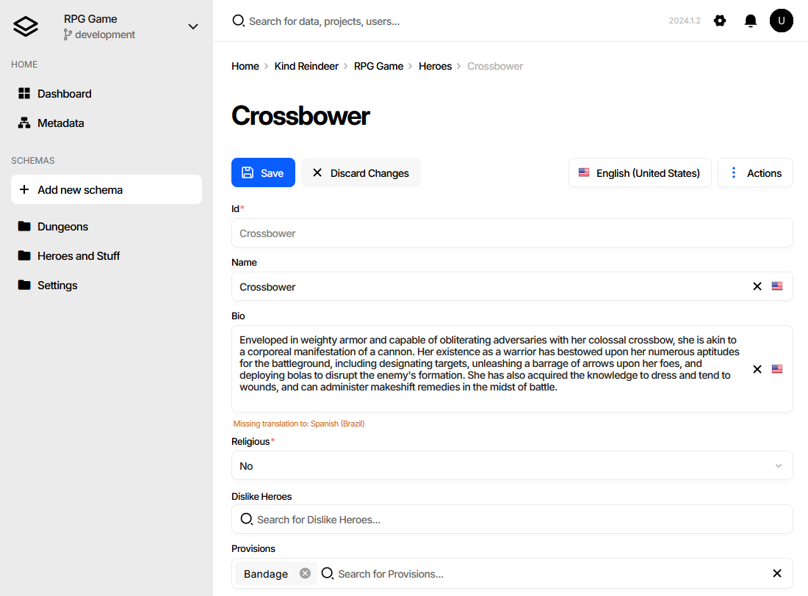
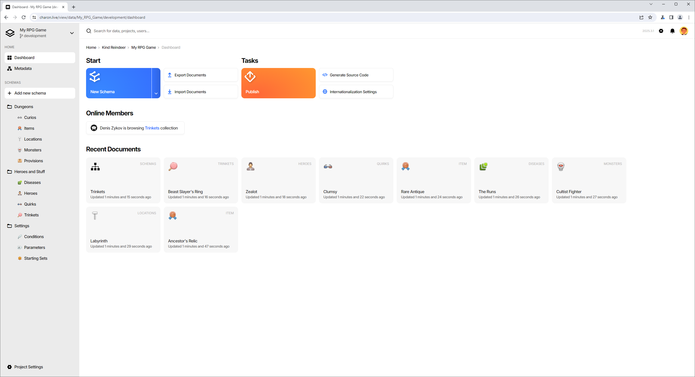
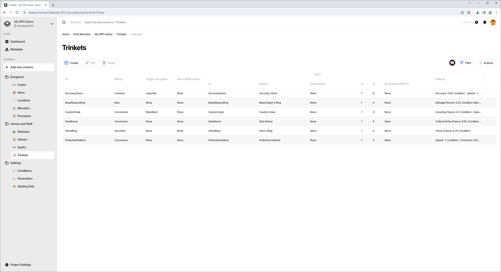
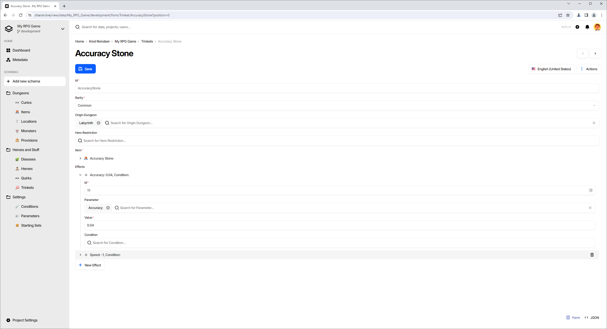
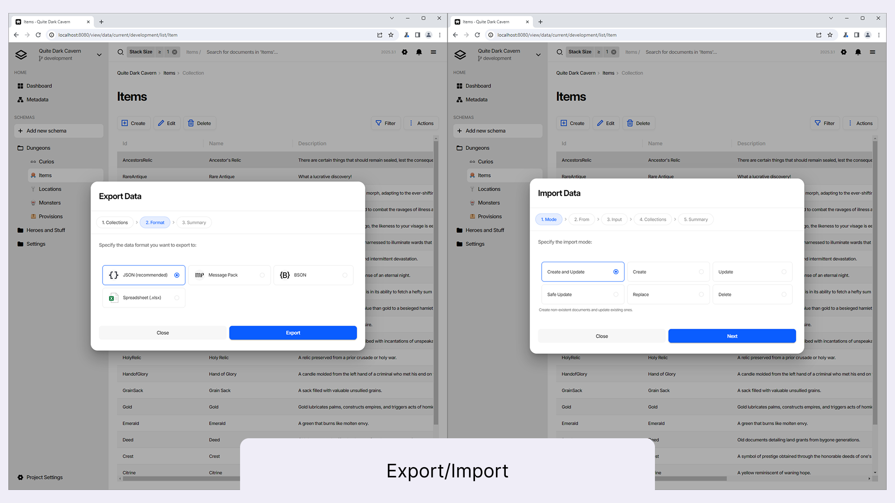

Charon - Game Data Editor
=========================

  

[Documentation](https://gamedevware.github.io/charon/) [[PDF]](https://gamedevware.github.io/charon/pdf/documentation.pdf)   • [Discord](https://discord.gg/2quB5vXryd) • [Website](https://www.gamedevware.com/) • [Changelog](https://www.gamedevware.com/changelog) • [Issues](https://github.com/gamedevware/charon/issues)  
  
Plugins 
-------
  
[](https://gamedevware.github.io/charon/unity/overview.html)
[](https://gamedevware.github.io/charon/unreal_engine/overview.html)  

[[Unity Asset Store]](https://gamedevware.github.io/charon/unity/overview.html) [[Unity OpenUPM]](https://openupm.com/packages/com.gamedevware.charon/) [[Unreal Engine Marketplace]](https://gamedevware.github.io/charon/unreal_engine/overview.html)  

Standalone
----------

[How to start with custom game engine](https://gamedevware.github.io/charon/standalone/overview.html) → [C#](https://gamedevware.github.io/charon/gamedata/working_with_csharp_code_7_3.html) • [TypeScript](https://gamedevware.github.io/charon/gamedata/working_with_type_script_code.html)  

Summary
=======

Charon is a powerful data-driven game development tool designed to streamline the creation and management of static game data within your game. 
It allows both developers and game designers to efficiently model and edit game entities such as characters, items, missions, quests, and more, directly within the Unity/Unreal Engine/Browser environment. 
Charon simplifies the process of data manipulation, offering a user-friendly interface and automatic source code generation, which significantly reduces development time and minimizes manual coding errors.
Charon also offers support for working with text in multiple languages, with easy loading and unloading of translated text. 

With Charon, game developers can focus on creating engaging gameplay experiences without worrying about the technical details of managing game data. 
It is available in three deployment variants, including a [standalone/offline](https://gamedevware.github.io/charon/standalone/overview.html) application, [web](https://gamedevware.github.io/charon/web/overview.html) application, [Unity](https://gamedevware.github.io/charon/unity/overview.html) and [Unreal Engine](https://gamedevware.github.io/charon/unreal_engine/overview.html) plugins.  

Why Choose Charon?
==================

Charon replaces traditional spreadsheets or config files with an in-game database, 
offering a structured and efficient way to manage game data. It allows developers to focus on creating engaging gameplay 
experiences without worrying about the technical details of data management.

Is It Free?
===========
The offline version, CLI and plugins are completely free and have no restrictions. 
They are distributed under a free license and allow you to distribute tools along with the game for modding games.  

The online version, which allows working in large teams on shared game data, requires a subscription.

What is Charon
==============

It is a .NET 8 console application that can be used as a command-line tool for performing CRUD operations with your game data, or as an HTTP Server to provide a UI for modeling and editing your game data. There are plugins for [Unity](https://gamedevware.github.io/charon/unity/overview.html) and [Unreal Engine](https://gamedevware.github.io/charon/unreal_engine/overview.html) that provide a more integrated experience while using Charon.  
As with any .NET application, it can be launched as is on Windows, macOS and Linux and via `dotnet`.

How it works
============

  

[Unity](https://gamedevware.github.io/charon/unity/overview.html) or the [Unreal Engine](https://gamedevware.github.io/charon/unreal_engine/overview.html) plugin provides a more natural experience of interacting with game data. Check out the corresponding plugin page for more information on getting started.

To get started with standalone Charon, you’ll need the following:  
- The `dotnet` runtime [installed](https://dotnet.microsoft.com/en-us/download).  
- Use [standalone](https://www.nuget.org/packages/dotnet-charon/) tool, which you can install globally using the command:  
  ```bash  
  dotnet tool install dotnet-charon --global  
  ```
Once set up, follow these steps:
- Create an empty `gamedata.json` file or use `dotnet charon INIT gamedata.json` command.
- Launch the Charon tool by running:
  ```bash  
  dotnet charon gamedata.json
  ```
  This command starts an HTTP server and automatically opens the Charon UI in your default web browser.
- Use the intuitive web-based UI to design and edit your game data.
- After editing, utilize Charon’s source code generator to produce language/engine-specific source code for your game data.
- Integrate the generated source code into your game project. This allows you to load the `gamedata.json` file into your game in a structured and type-safe way, ensuring seamless and error-free data usage.

Browser-based UI
================



    
    

C# Code Example
===============
```cs
using System.IO;

using var fileStream = File.OpenRead("gamedata.json"); // or .gdjs
var gameData = new GameData(fileStream, new Formatters.GameDataLoadOptions { Format = Formatters.Format.Json });

var heroes = gameData.Heroes.AsList // -> IReadOnlyList<Hero>
// or
var heroById = gameData.AllHeroes.Find("Arbalest"); // -> Hero | null
```

C++ Code Example
================
```cpp
#include "UGameData.h"

TSoftObjectPtr<UGameData> GameDataPtr = TEXT("/Game/Content/GameData");
auto GameData = GameDataPtr.LoadSynchronous(); // -> UGameData*

auto Heroes = GameData->Heroes; // -> TMap<FString,UHero*>
auto HeroById = GameData->Heroes.Find(TEXT("Arbalest")); // -> UHero**
```

TypeScript Code Example
=======================
```ts
import { GameData } from './game.data';
import { Formatters } from './formatters';

// Node.js
import { readFileSync } from 'fs';
const gameDataStream = readFileSync(gameDataFilePath);

// Blob or File
const gameDataStream = gameDataFileBlob.arrayBuffer();

// XMLHttpRequest (XHR)
// gameDataRequest.responseType -> "arraybuffer"
const gameDataStream = gameDataRequest.response;

const gameData = new GameData(gameDataStream, {
  format: Formatters.GameDataFormat.Json
});

let heroes = gameData.heroes; // -> readonly Hero[]
let hero = gameData.heroesAll.find("Arbalest"); // -> Hero | undefined
```

Haxe Code Example
=================
```haxe
import GameData;
import Formatters;
import haxe.io.Path;
sys.io.File;

var input = File.read("RpgGameData.gdjs"); // or .json
var options = new GameDataLoadOptions();
options.format = GameDataFormat.Json;
var gameData = new GameData(input, options);

var allHeroes = gameData.heroesAll.list // -> ReadOnlyArray<Hero>
var heroById = gameData.heroesAll.get("Arbalest"); // -> Hero
```

License
=======
* Generated Code - MIT  
* Plugins: 
  * Unreal Engine - MIT  
  * Unity - Unity Asset Store License  
* Charon - CC BY-ND - can freely use and can redistribute, as long as it is passed along unchanged and in whole.
