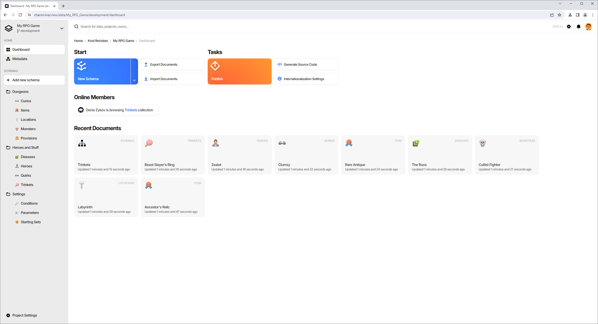
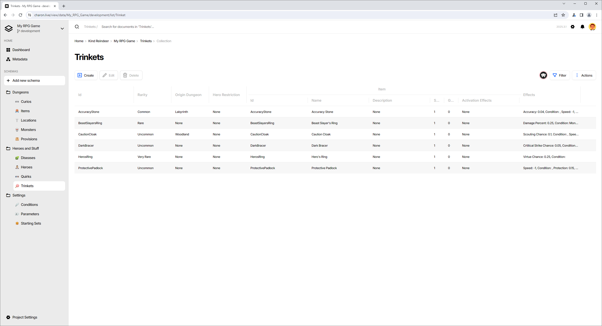
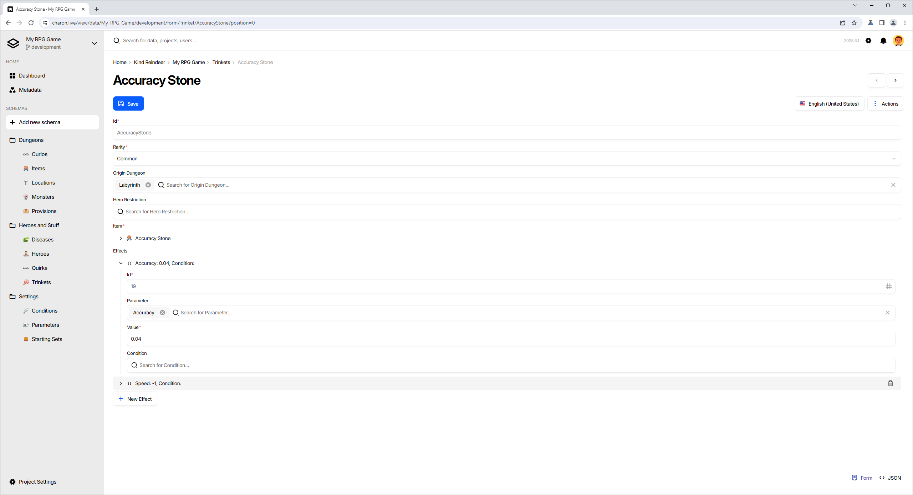
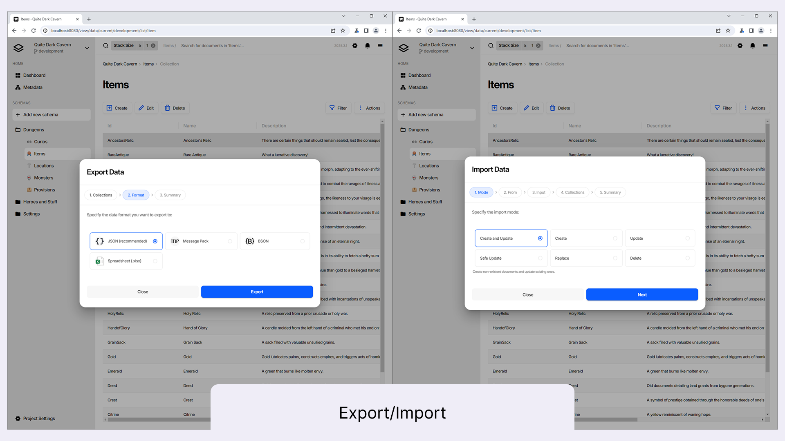

Charon — Data-Driven Game Design, Done Right
=============================================


[Documentation](https://gamedevware.github.io/charon/) [[PDF]](https://gamedevware.github.io/charon/pdf/documentation.pdf) • [Discord](https://discord.gg/2quB5vXryd) • [Website](https://www.gamedevware.com/) • [Changelog](https://www.gamedevware.com/changelog) • [Issues](https://github.com/gamedevware/charon/issues)

Plugins
-------

[](https://gamedevware.github.io/charon/unity/overview.html)
[](https://gamedevware.github.io/charon/unreal_engine/overview.html)

[[Unity Asset Store]](https://gamedevware.github.io/charon/unity/overview.html) [[Unity OpenUPM]](https://openupm.com/packages/com.gamedevware.charon/) [[Unreal Engine Marketplace]](https://gamedevware.github.io/charon/unreal_engine/overview.html)

Standalone
----------

[How to start with a custom engine](https://gamedevware.github.io/charon/standalone/overview.html) → [C#](https://gamedevware.github.io/charon/gamedata/working_with_csharp_code_7_3.html) • [TypeScript](https://gamedevware.github.io/charon/gamedata/working_with_type_script_code.html) • [Haxe](https://gamedevware.github.io/charon/gamedata/working_with_haxe_code.html)

---

The Problem Every Game Team Knows
==================================

You start with a spreadsheet. A few hundred rows, a handful of tabs. It works.

Six months later, that spreadsheet is a 40-tab monster. A designer tweaks a formula in column AQ and silently breaks the loot table that references it. A programmer hardcodes an item ID in three places — then the designer renames the item. A build fails at 2 AM because someone pasted the wrong value into the wrong cell.

Sound familiar?

**This is what happens when game data outgrows its tools.** And it happens on every project, at every scale, in every genre.

---

What is Data-Driven Game Design?
=================================

Data-driven game design is the practice of separating *what your game does* from *what values it uses*. Instead of baking numbers, strings, and logic into code, you define a structured data model — characters, items, quests, abilities — and let designers own that layer entirely.

Done well, it means:
- A designer can tune a boss's health pool without waiting for a programmer
- Deleting a quest automatically flags every item that references it as broken
- Adding a new language is a data operation, not a code deployment
- Your entire game balance can be reviewed, diffed, and rolled back like source code

**Charon is the tool that makes this possible** — a visual editor, a code generator, and a data pipeline in one package.

---

Who Is Charon For?
==================

### Game Designers

You shouldn't need to open a code editor to change a damage value. Charon gives you a structured, validated interface that looks like a proper tool — not a makeshift spreadsheet. Define your own schemas, fill in the data, and trust that the engine will get the right values.

- Catch broken references before the build catches them for you
- See all items of a type in one list, not scattered across 12 tabs
- Work alongside programmers without stepping on each other

### Programmers

You shouldn't be writing boilerplate to parse JSON. Charon reads your data schema and generates type-safe code in your language — so instead of `data["hero"]["stats"]["hp"]`, you write `gameData.Heroes.Find("Arbalest").Stats.Hp`. That's it.

- No more magic strings or silent null dereferences from stale IDs
- Data loading, validation, and localization handled by generated code
- Fits into CI/CD: diff game data, validate on every commit, patch between versions

---

How It Works
============

Charon follows a simple cycle: model → edit → generate → ship.

**1. Define your schema**

Describe what a `Hero`, `Item`, or `Quest` looks like — its fields, types, and relationships. Charon enforces these relationships across the entire dataset.

**2. Edit your data**

Launch the editor (`charon gamedata.json`) and get a full web UI running locally. Or use the Unity/Unreal plugin and never leave your engine.

**3. Generate type-safe code**

One command produces ready-to-use classes in C#, C++, TypeScript, or Haxe — with full IDE support and zero runtime reflection.

**4. Load and iterate**

Import the generated code and data file into your project. Designers keep editing; programmers keep building. The pipeline handles the rest.

---

Quick Start
===========

Install the standalone version (requires [.NET runtime](https://dotnet.microsoft.com/en-us/download)):

```bash
dotnet tool install dotnet-charon --global
```

Initialize a new game data file and open the editor:

```bash
charon INIT gamedata.json
charon gamedata.json
```

Your browser opens with the full editing UI. When you're ready, generate code for your engine:

```bash
charon GENERATE CSHARP --dataBase gamedata.json --outputDirectory ./Generated
```

---

Code Examples
=============

### C#

```cs
using var fileStream = File.OpenRead("gamedata.json");
var gameData = new GameData(fileStream, new Formatters.GameDataLoadOptions { Format = Formatters.Format.Json });

var heroes = gameData.Heroes.AsList;               // -> IReadOnlyList<Hero>
var hero   = gameData.AllHeroes.Find("Arbalest");  // -> Hero | null
```

### C++ (Unreal Engine)

```cpp
#include "UGameData.h"

TSoftObjectPtr<UGameData> GameDataPtr = TEXT("/Game/Content/GameData");
auto GameData = GameDataPtr.LoadSynchronous();  // -> UGameData*

auto Heroes  = GameData->Heroes;                            // -> TMap<FString, UHero*>
auto HeroById = GameData->Heroes.Find(TEXT("Arbalest"));   // -> UHero**
```

### TypeScript

```ts
import { GameData } from './game.data';
import { Formatters } from './formatters';

const gameDataStream = readFileSync(gameDataFilePath);
const gameData = new GameData(gameDataStream, { format: Formatters.GameDataFormat.Json });

let heroes = gameData.heroes;                        // -> readonly Hero[]
let hero   = gameData.heroesAll.find("Arbalest");   // -> Hero | undefined
```

### Haxe

```haxe
import GameData;
import Formatters;

var input = sys.io.File.read("gamedata.gdjs");
var options = new GameDataLoadOptions();
options.format = GameDataFormat.Json;
var gameData = new GameData(input, options);

var heroes = gameData.heroesAll.list;             // -> ReadOnlyArray<Hero>
var hero   = gameData.heroesAll.get("Arbalest"); // -> Hero
```

---

Editor Screenshots
==================

| Dashboard | Document Collection |
| --- | --- |
|  |  |

| Data Entry Form | Import Tools |
| --- | --- |
|  |  |

---

Pricing & Licensing
====================

Charon is free to use offline and in production — including for shipped games.

| Version | Best For | Cost |
| --- | --- | --- |
| **Community** | Solo devs, indie teams, CI/CD pipelines, modding | **Free** (Open License) |
| **Professional** | Collaborative teams, cloud hosting, shared editor | **Subscription** |

> **Modding support:** The free Community version can be distributed with your game. Let your players build mods with the same tools you used to build the game.

---

Architecture at a Glance
=========================

- Built on **.NET 8** — fast, cross-platform, no external dependencies
- Runs on **Windows, macOS, and Linux** as a CLI tool or HTTP server
- Native plugins for **Unity** and **Unreal Engine** embedded directly in your editor
- REST API and CLI for full **CI/CD pipeline** integration
- Extensible via **React or Angular plugins** for custom property editors

---

License
=======

- Generated Code — **MIT**
- Unreal Engine Plugin — **MIT**
- Unity Plugin — **Unity Asset Store License**
- Charon — **CC BY-ND** (free to use and redistribute unchanged)