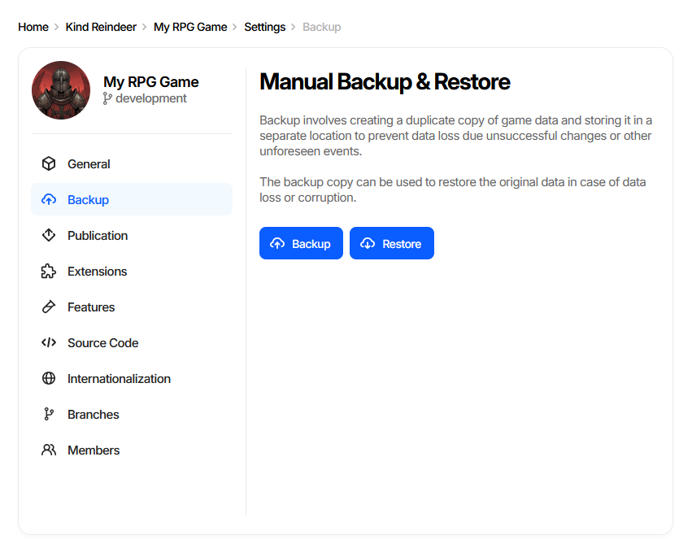
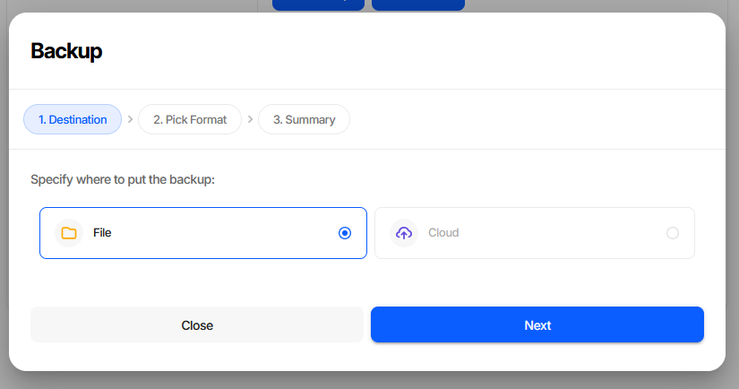
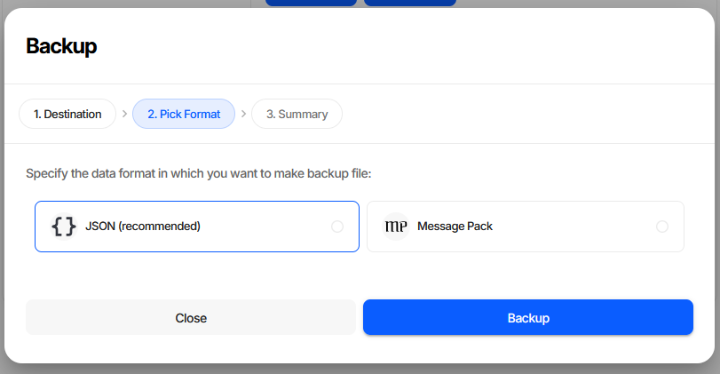
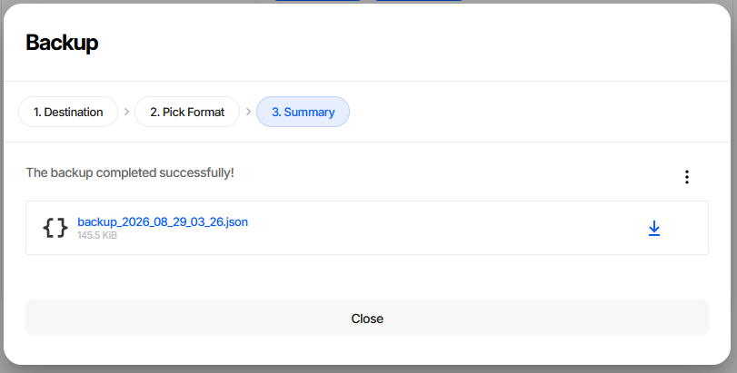
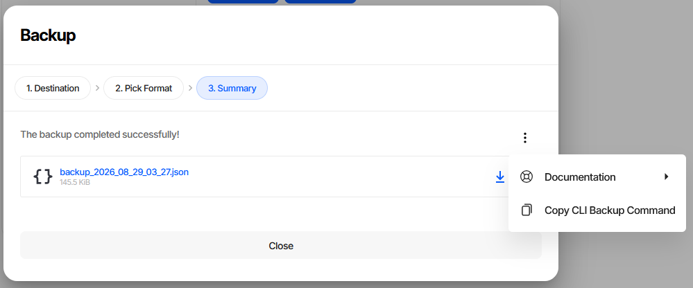
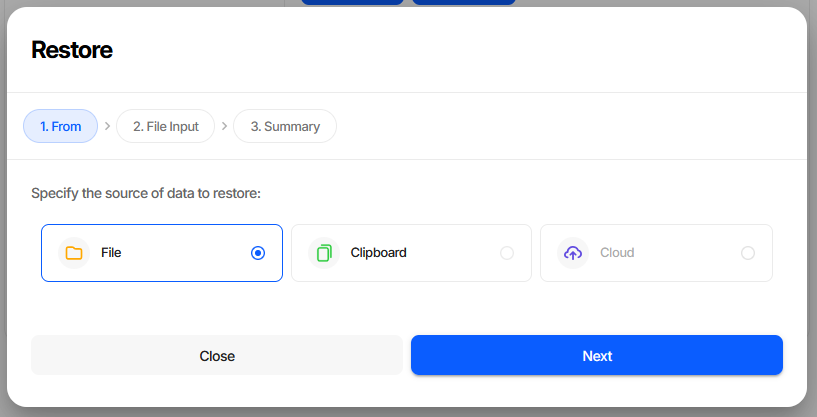
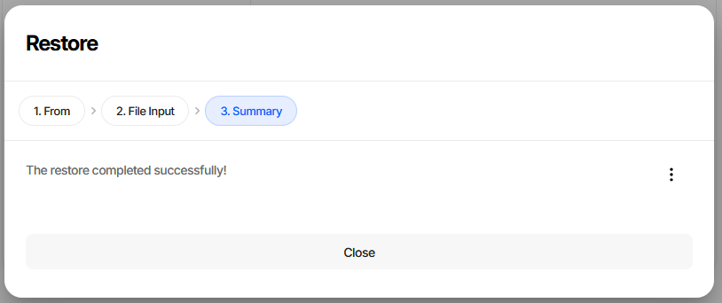

Backup and Restore
==================

Charon can create a full snapshot of a game data file and restore it later. Backups capture
the complete state of the database - all documents, schemas, project settings, and metadata -
in a single portable file.

Both operations are available from the editor UI and from the CLI. The UI is the quickest way to take
a snapshot before a risky change; the CLI is what you schedule and run from a build server.

.. contents:: On this page
   :local:
   :depth: 2

----

Where Backup and Restore Live
-----------------------------

Open **Project Settings** → **Backup**. The **Manual Backup & Restore** card holds both buttons.

The page is part of every edition - standalone, the Unity and Unreal Engine plugins, and the web
editor. Both buttons require the **Administrator** permission and stay disabled for every other role;
see :doc:`Roles and Permissions <../web/permission_and_roles>`.

----

Creating a Backup
-----------------

**Backup** opens a three-step wizard.

Step 1. Destination
^^^^^^^^^^^^^^^^^^^

**File** downloads the snapshot through the browser. **Cloud** is shown but not selectable.

Step 2. Pick Format
^^^^^^^^^^^^^^^^^^^

+------------------+----------------------------------------------------------------------+
| Format           | When to use                                                          |
+==================+======================================================================+
| JSON             | Default. Readable and diffable, so a backup can be inspected or      |
| *(recommended)*  | committed to version control alongside the data it snapshots.        |
+------------------+----------------------------------------------------------------------+
| Message Pack     | Compact binary. Noticeably smaller files for large databases, at the |
|                  | cost of not being human-readable.                                    |
+------------------+----------------------------------------------------------------------+

Both formats restore identically, so the choice only affects file size and readability.
**Backup** on this step starts the process.

Step 3. Summary
^^^^^^^^^^^^^^^

The snapshot is offered as a download, named after the date and time it was taken and annotated
with its size. Nothing is written until you click the link.

The **⋮** menu has **Copy CLI Backup Command**, which puts the CLI equivalent of this backup on the
clipboard - the fastest way to turn a manual snapshot into a scheduled one.

**CLI equivalent**

.. code-block:: bash

   # Local file
   dnx dotnet-charon -- DATA BACKUP \
       --dataBase gamedata.json \
       --output backup.json \
       --outputFormat json

   # Remote project
   dnx dotnet-charon -- DATA BACKUP \
       --dataBase "https://charon.live/view/data/MyGame/develop/" \
       --output backup.msgpack \
       --outputFormat msgpack \
       --credentials "$CHARON_API_KEY"

.. warning::
   ``--outputFormat`` is **not** inferred from the ``--output`` file name; it defaults to ``json``.
   So ``--output backup.msgpack`` without a matching ``--outputFormat msgpack`` writes JSON into a
   file named ``.msgpack`` - and ``DATA RESTORE``, which *does* infer the format from the extension,
   then fails to read that file back. Always pass ``--outputFormat`` explicitly.

What is included
^^^^^^^^^^^^^^^^

- All document collections (user data, schema definitions, project settings).
- ``ToolsVersion``, ``RevisionHash``, and ``ChangeNumber`` file-level fields.

What is **not** included
^^^^^^^^^^^^^^^^^^^^^^^^

- User accounts, API keys, and access control settings (server edition - managed separately).
- Binary resource files (images, audio) attached to documents via Asset Path properties.

----

Restoring from a Backup
-----------------------

.. warning::
   Restore **replaces all content** in the target database, from both the UI and the CLI. The
   operation is not incremental - the entire existing state is overwritten. Confirm you are targeting
   the correct project and branch before starting.

**Restore** opens a three-step wizard.

Step 1. From
^^^^^^^^^^^^

**File** reads a previously downloaded backup. **Clipboard** accepts pasted JSON text, which is
useful for a snapshot kept in a ticket or a chat message. **Cloud** is shown but not selectable.

Step 2. File Input
^^^^^^^^^^^^^^^^^^

Browse for the backup file. The step is labelled **Clipboard Input** and shows a text box instead
when *Clipboard* was chosen on step 1; pasted text must be a valid JSON object.

+------------------+--------------------------------------+
| Format           | Accepted extensions                  |
+==================+======================================+
| JSON             | ``.json``, ``.gdjs``                 |
+------------------+--------------------------------------+
| Message Pack     | ``.msgpack``, ``.gdmp``, ``.msgpkg`` |
+------------------+--------------------------------------+
| BSON             | ``.bson``, ``.gdbs``                 |
+------------------+--------------------------------------+

A file with any other extension is rejected on this step, before anything is sent to the server.
**Restore** on this step starts the process.

Step 3. Summary
^^^^^^^^^^^^^^^

On success the **⋮** menu offers **Copy CLI Restore Command**. On failure the step shows the server's
error message and the data is left untouched.

**CLI equivalent**

.. code-block:: bash

   # Local file
   dnx dotnet-charon -- DATA RESTORE \
       --dataBase gamedata.json \
       --input backup.json

   # Remote project
   dnx dotnet-charon -- DATA RESTORE \
       --dataBase "https://charon.live/view/data/MyGame/develop/" \
       --input backup.msgpack \
       --credentials "$CHARON_API_KEY"

``--inputFormat`` defaults to ``auto``, which - unlike ``DATA BACKUP`` - *is* taken from the input
file's extension. Pass ``json``, ``msgpack`` or ``bson`` explicitly when the file has no extension or
carries a name that does not match its contents.

----

Backup vs Export
----------------

Choose the right tool for the job:

+---------------------------+-------------------------------------+--------------------------------------------+
|                           | ``DATA BACKUP``                     | ``DATA EXPORT``                            |
+===========================+=====================================+============================================+
| **Purpose**               | Full snapshot for disaster recovery | Filtered slice for runtime or tooling      |
+---------------------------+-------------------------------------+--------------------------------------------+
| **Format**                | JSON / MessagePack                  | JSON / BSON / MessagePack / XLSX           |
+---------------------------+-------------------------------------+--------------------------------------------+
| **Includes schemas**      | Always                              | Optional (``--schemas Schema``)            |
+---------------------------+-------------------------------------+--------------------------------------------+
| **Strips unused data**    | No                                  | Yes - ``--mode publication`` strips unused |
|                           |                                     | languages                                  |
+---------------------------+-------------------------------------+--------------------------------------------+
| **Restorable**            | Yes, via ``DATA RESTORE``           | Partially - via ``DATA IMPORT``            |
+---------------------------+-------------------------------------+--------------------------------------------+

Use **Backup** when you need a full, restorable point-in-time snapshot.
Use **Export** when preparing data for the game runtime or for external tools.

----

Scheduled Automated Backups
-----------------------------

.. tab-set::

   .. tab-item:: Linux / macOS (cron)

      .. code-block:: bash

         # Daily at 02:00
         0 2 * * * dnx dotnet-charon -- DATA BACKUP \
             --dataBase /var/game/gamedata.json \
             --output /backups/gamedata_$(date +\%Y\%m\%d).msgpack \
             --outputFormat msgpack

   .. tab-item:: GitHub Actions

      .. code-block:: yaml

         - name: Backup game data
           run: |
             dnx dotnet-charon -- DATA BACKUP \
               --dataBase "${{ secrets.CHARON_DB_URL }}" \
               --output backups/gamedata_${{ github.run_id }}.msgpack \
               --outputFormat msgpack \
               --credentials "${{ secrets.CHARON_API_KEY }}"

         - name: Upload artifact
           uses: actions/upload-artifact@v4
           with:
             name: gamedata-backup
             path: backups/

----

Pre-Publish Safety Snapshot
-----------------------------

Take a backup immediately before publishing so that a known-good restore point exists:

.. code-block:: bash

   # 1. Snapshot
   dnx dotnet-charon -- DATA BACKUP \
       --dataBase gamedata.json \
       --output pre_publish_backup.json \
       --outputFormat json

   # 2. Validate
   dnx dotnet-charon -- DATA VALIDATE \
       --dataBase gamedata.json \
       --validationOptions checkRequirements checkReferences \
       --output err

   # 3. Publish
   dnx dotnet-charon -- DATA EXPORT \
       --dataBase gamedata.json \
       --mode publication \
       --output StreamingAssets/gamedata.json \
       --outputFormat json

.. tip::
   The same three steps run from the UI as **Project Settings → Backup**, the
   :doc:`Publish <../gamedata/publication>` wizard's collections review, and **Publish** itself.

See also
--------

- :doc:`DATA BACKUP Command <commands/data_backup>`
- :doc:`DATA RESTORE Command <commands/data_restore>`
- :doc:`Importing and Exporting Data <import_export>`
- :doc:`Publishing Game Data <../gamedata/publication>`
- :doc:`Roles and Permissions <../web/permission_and_roles>`
- :doc:`CI/CD Integration <cicd>`
- :doc:`Patch and Diff Workflow <patch_diff>`
