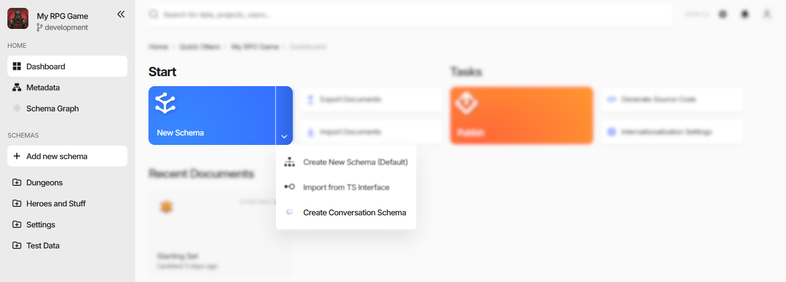
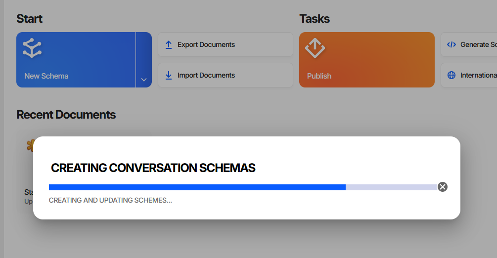

Custom Actions
==============

A **custom action** is an entry an extension adds to one of Charon's menus. Clicking it either calls a function
the package exports, or navigates to a :doc:`custom page <custom_pages>` the package declares.

Actions are how an extension does work that is not tied to editing one value: generating schemas, running a
bulk change, exporting into a format of your own, opening a tool. The function receives a context object with
the host's services, so it can read and write game data, show dialogs and wizards, report progress, and
navigate.

.. contents:: On this page
   :local:
   :depth: 2

----

Declaring an Action
-------------------

.. code-block:: json

  "config": {
    "customActions": [
      {
        "name": "Create Conversation Schema",
        "functionName": "createConversationSchema",
        "location": "new-schema-menu",
        "icon": "emoji/speech_balloon"
      }
    ]
  }

.. list-table::
   :header-rows: 1
   :widths: 22 78

   * - Field
     - Meaning
   * - ``name``
     - The menu entry's text. Required.
   * - ``location``
     - Which menu it goes in. Required, one of the four below.
   * - ``functionName``
     - The function exported from the package entry point to call. Mutually exclusive with ``pageId``.
   * - ``pageId``
     - The id of a page in this same package's ``customPages``. Clicking navigates there instead of calling
       anything. Mutually exclusive with ``functionName``.
   * - ``icon``
     - Optional icon reference, ``<set>/<name>`` - ``svg/`` for Charon's own icons, ``emoji/`` for an emoji by
       short name, ``material/`` for a Material icon. Defaults to ``svg/extensions``.
   * - ``tooltip``
     - Optional hover text.

Exactly one of ``functionName`` and ``pageId`` must be set. Declaring both makes Charon use ``pageId`` and warn;
declaring neither leaves an entry that does nothing but log a warning when clicked.

The named function must be exported from the module Charon loads - the file ``main`` points at. Bundlers
tree-shake exports that nothing imports, so keep a reference to it; the example packages assign it to ``window``
for exactly that reason.

.. code-block:: typescript

  export { createConversationSchema } from './schema.validation/migrate.schema.ts';

  // keeps the bundler from dropping it
  (window as any).createConversationSchema = createConversationSchema;

----

Where Actions Appear
--------------------

.. list-table::
   :header-rows: 1
   :widths: 30 70

   * - ``location``
     - Where it shows up
   * - ``new-schema-menu``
     - The dropdown of the **New Schema** button on the project dashboard, below the built-in entries.
   * - ``document-action-menu``
     - The ``Actions`` menu of the :doc:`document form <../../gamedata/document_form>`, below the separator.
   * - ``document-list-action-menu``
     - The ``Actions`` menu of a :doc:`document collection <../../gamedata/filling_documents>`, below the
       separator.
   * - ``side-navigation-menu``
     - A permanent entry in the left side navigation.

**Create Conversation Schema** in the screenshot sits under **New Schema** next to Charon's own
**Create New Schema (Default)** and **Import from TS Interface**, and creates a schema already configured to use
the package's :doc:`schema editor <implementing_schema_editor>`.

Grouping Side Navigation Entries
^^^^^^^^^^^^^^^^^^^^^^^^^^^^^^^^

A ``side-navigation-menu`` action whose ``name`` contains a ``/`` is filed under a section: ``Tools/Schema
Graph`` puts **Schema Graph** into a **Tools** section of the side navigation. A name without a ``/`` sits in the
top group with **Dashboard** and **Metadata**.

----

The Action Context
------------------

The function is called with one argument, whose shape follows the ``location`` it was declared for:

.. list-table::
   :header-rows: 1
   :widths: 32 68

   * - Context
     - Extra fields beyond ``services``
   * - ``NewSchemaActionContext``
     - none
   * - ``DocumentActionContext``
     - ``documentControl`` - the ``RootDocumentControl`` of the document open in the form
   * - ``DocumentListActionContext``
     - ``schema`` of the listed collection, and ``selection``
   * - ``SideNavigationActionContext``
     - none

``selection`` reports the grid's current rows: ``selected`` holds the ids, ``changed`` emits the ids added and
removed by each change, and ``isAllSelected`` is true when the user chose *select all* for the whole filtered
collection. In that case treat the selection as "every document in the current view" - ``selected`` can be empty
while it is true, because the rows were never all loaded.

Every context carries ``services``, and every field of it is optional. The host populates only what makes sense
where the action was triggered, so check before use:

.. code-block:: typescript

  export async function createConversationSchema(context: ExtensionActionContext) {
      const progressRef = context.services.ui?.dialog?.showProgress({
          title: 'Creating Conversation Schemas',
          progressMode: 'determinate',
          cancellable: true,
          closedHandler: () => abortController.abort()
      });
      ...
  }

The services themselves - game data, dialogs, wizards, notifications, navigation, persisted UI state - are
described in :doc:`Host Services <host_services>`.

----

Reporting Progress
------------------

Anything that takes more than a moment should say so. ``services.ui.dialog.showProgress`` returns a handle with
``update(percent, message)``, ``setFaulted()``, and ``close(delayMs?)``:

With ``cancellable: true`` the dialog gets a close button, and ``closedHandler(cancelled)`` fires when the user
uses it - abort the work there rather than letting it run on invisibly. The pattern the examples follow is to
report success through the snack bar, and on failure to mark the dialog faulted and let it close itself a few
seconds later:

.. code-block:: typescript

  try {
      await doTheWork(progressRef, abortController.signal);
      context.services.ui?.snackBar?.saveSucceed();
      progressRef?.close();
  } catch (error) {
      if (abortController.signal.aborted) { return; }
      context.services.ui?.snackBar?.saveFailed(error);
      progressRef?.setFaulted();
      progressRef?.close(3000);
  }

----

See also
--------

- :doc:`UI Extensions <overview>`
- :doc:`Custom Pages <custom_pages>`
- :doc:`Host Services <host_services>`
- :doc:`Implementing a Schema Editor <implementing_schema_editor>`
- :doc:`Filling Documents <../../gamedata/filling_documents>`
- :doc:`Editing a Document <../../gamedata/document_form>`
- `charon-conversation-editor (GitHub) <https://github.com/gamedevware/charon-extensions/tree/main/src/charon-conversation-editor>`_
