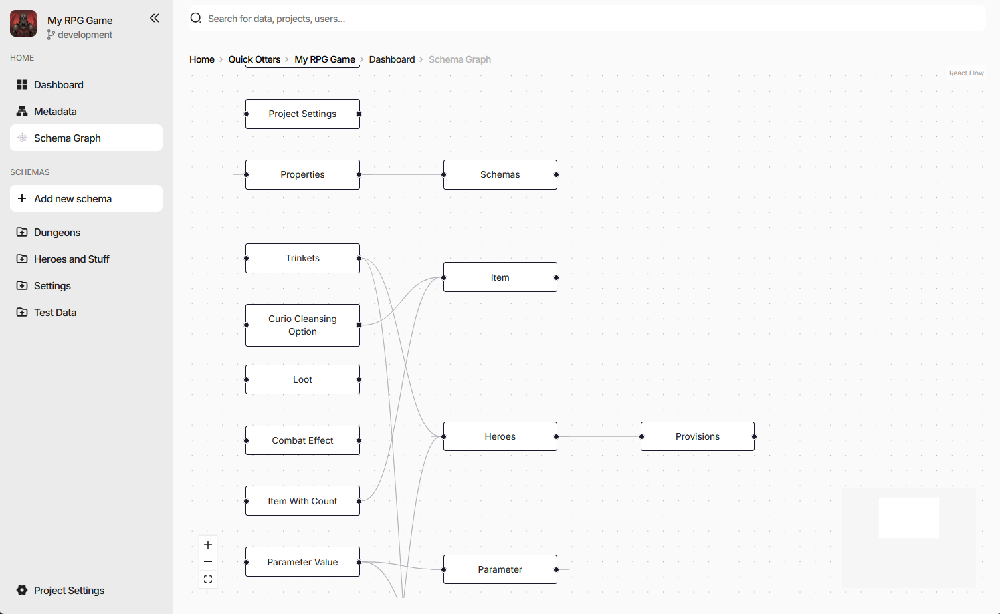

Custom Pages
============

A **custom page** is a page of the editor supplied by an extension. It has its own route, its own breadcrumb,
and its own place in the browser history, and it is not tied to a document or a schema - which makes it the
place for anything that looks at the project as a whole: a dashboard, a report, a graph of the data model, an
importer with a UI of its own.

The screenshot is the ``charon-schema-graph`` example - a diagram of every schema in the project and the
references between them, reached from a **Schema Graph** entry the same package added to the side navigation.

.. contents:: On this page
   :local:
   :depth: 2

----

Declaring a Page
----------------

.. code-block:: json

  "config": {
    "customPages": [
      {
        "id": "ext-schema-graph",
        "selector": "ext-schema-graph-page",
        "title": "Schema Graph",
        "breadcrumb": "Schema Graph"
      }
    ],
    "customActions": [
      {
        "name": "Schema Graph",
        "location": "side-navigation-menu",
        "pageId": "ext-schema-graph",
        "icon": "emoji/spider_web"
      }
    ]
  }

.. list-table::
   :header-rows: 1
   :widths: 22 78

   * - Field
     - Meaning
   * - ``id``
     - Identifies the page and becomes a URL segment. Must be unique across every extension installed in the
       project. Required.
   * - ``selector``
     - The custom element Charon mounts at that route. Required.
   * - ``title``
     - Browser tab title, and the breadcrumb text when ``breadcrumb`` is absent. Required.
   * - ``breadcrumb``
     - Breadcrumb text, when it should differ from the title.

A page on its own is reachable only by URL. To give it a way in, pair it with a
:doc:`custom action <custom_actions>` that names it through ``pageId`` - most often in the
``side-navigation-menu``, as above, but the document and collection ``Actions`` menus work the same way. The
``pageId`` must name a page in the same package.

Pages live under ``/ext/<package-name>/<page-id>``, and everything after the page id is left for the page
itself, so deep links into a page's own tabs, steps, or detail views are just longer paths.

----

The Page Element
----------------

Charon creates the element by its ``selector``, sets ``context`` on it, and appends it to the working area. As
with a :doc:`schema editor <implementing_schema_editor>`, the property is assigned before ``connectedCallback``,
so render from whichever happens second:

.. code-block:: typescript

  export default class SchemaGraphPageElement extends HTMLElement {
      private _context?: ExtensionPageContext;
      private _root?: Root;

      get context() { return this._context!; }
      set context(value: ExtensionPageContext) {
          if (Object.is(value, this._context)) {
              return;
          }
          this._context = value;
          this.render();
      }

      public connectedCallback() { this.render(); }
      public disconnectedCallback() { this.unmount(); }
  }

  customElements.define('ext-schema-graph-page', SchemaGraphPageElement);

Clean up in ``disconnectedCallback``. A page is unmounted whenever the user navigates away, which happens far
more often than for a field editor.

----

The Page Context
----------------

``ExtensionPageContext`` carries the same ``services`` as an :doc:`action context <custom_actions>`, plus what
the URL said:

.. list-table::
   :header-rows: 1
   :widths: 25 75

   * - Field
     - Meaning
   * - ``params``
     - Query string parameters of the current URL.
   * - ``restOfRoute``
     - Path segments after the page id, empty when there are none.
   * - ``services``
     - Game data, dialogs and wizards, notifications, navigation, persisted UI state - see
       :doc:`Host Services <host_services>`.

``restOfRoute`` is what makes a page's internal state bookmarkable: read it on mount to restore a tab or a
selection, and write it back through ``services.navigation.customPage`` as the user moves around.

.. code-block:: typescript

  context.services.navigation?.customPage(
      'charon-schema-graph',   // package
      'ext-schema-graph',      // page id
      ['Item'],                // becomes /ext/charon-schema-graph/ext-schema-graph/Item
      { zoom: '1.5' }          // becomes ?zoom=1.5
  );

The same call navigates to a page declared by *any* installed extension, not only the caller's own - which is
how one extension can hand off to another. The rest of the navigation service reaches Charon's own screens:
``dashboard()``, ``settings(section?)``, ``documentCollection(schemaName)``, ``documentForm(schemaName, id)``,
and ``back()``.

----

Persisting Page State
---------------------

Pages are unmounted on navigation, so anything the user arranged - a zoom level, a collapsed group, a chosen
layout - is gone unless it is stored. ``services.ui.state`` persists state scoped to the extension package, at a
layer you choose: the browser tab, the browser, the project, or the workspace, each of those either personal or
shared with the team. See :doc:`Host Services <host_services>`.

----

See also
--------

- :doc:`UI Extensions <overview>`
- :doc:`Custom Actions <custom_actions>`
- :doc:`Host Services <host_services>`
- :doc:`Implementing a Schema Editor <implementing_schema_editor>`
- `charon-schema-graph (GitHub) <https://github.com/gamedevware/charon-extensions/tree/main/src/charon-schema-graph>`_
