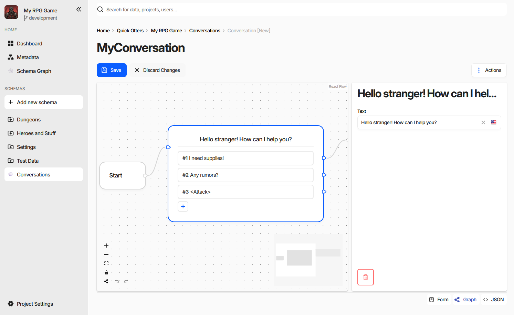

Implementing ``CharonSchemaEditorElement``
==========================================

A **schema editor** replaces the entire document form for one schema. Where a
:doc:`property editor <implementing_property_editor>` is handed a single value, a schema editor is handed the
whole document and decides how all of it is presented - as a node graph, a timeline, a board, a map, whatever
the data actually is.

The screenshot is the ``charon-conversation-editor`` example: dialogue lines are nodes on a canvas, the links
between them are edges, and the selected node's fields are in the panel on the right. Underneath it is an
ordinary document - the nodes are entries of an embedded document collection - which is why the host's ``Save``,
``Discard Changes``, and the ``Form`` and ``JSON`` view modes keep working next to it.

.. contents:: On this page
   :local:
   :depth: 2

----

Declaring the Editor
--------------------

A schema editor is a ``customEditors`` entry with ``type: ["Schema"]``. ``dataTypes`` is meaningless here and is
left out:

.. code-block:: json

  "config": {
    "customEditors": [
      {
        "id": "ext-conversation-editor",
        "selector": "ext-conversation-editor",
        "name": "Conversation Editor",
        "type": ["Schema"]
      }
    ]
  }

A schema uses it when its :doc:`Specification <../../gamedata/schemas/specification>` contains
``editor=ext-conversation-editor``. Nothing else opts in - the same editor serves every schema whose
specification names it, and a project can have several schema editors installed at once.

Because a schema editor usually needs the document laid out a particular way - specific properties, specific
data types - packages rarely ask the user to write that specification by hand. They ship a
:doc:`custom action <custom_actions>` in the ``new-schema-menu`` that creates the schema, its properties, and the
``editor=`` specification in one step. That is what **Create Conversation Schema** does in the example.

Once a document of such a schema is opened, the editor appears as the **Graph** view mode in the bottom right
corner of the form, alongside **Form** and **JSON**. The mode is absent for every other document.

----

The Element Contract
--------------------

.. code-block:: typescript

  export declare interface CharonSchemaEditorElement {
      documentControl: RootDocumentControl;
  }

Charon creates the element by its ``selector``, sets ``documentControl`` on it, and appends it to the page. The
setter runs **before** ``connectedCallback``, so mount your framework on whichever of the two comes second:

.. code-block:: typescript

  export default class ConversationEditorElement extends HTMLElement implements CharonSchemaEditorElement {
      private _documentControl?: RootDocumentControl<ConversationTree>;
      private _root?: Root;

      get documentControl() { return this._documentControl!; }
      set documentControl(value: RootDocumentControl<ConversationTree>) {
          if (Object.is(value, this._documentControl)) {
              return;
          }
          this._documentControl = value;
          this.render();
      }

      public connectedCallback() { this.render(); }
      public disconnectedCallback() { this.unmount(); }
  }

The control can be replaced while the element is alive - navigating to the next document with the ``‹`` and ``›``
buttons does exactly that - so re-render on assignment rather than only on connect, and drop subscriptions to
the previous control.

``RootDocumentControl`` is generic over the document shape, so declaring your own interface for the schema you
target gives the whole editor typed access to the document's properties.

----

Working with the Document
-------------------------

``RootDocumentControl`` is a ``DocumentControl`` with the schema attached:

.. list-table::
   :header-rows: 1
   :widths: 30 70

   * - Member
     - Purpose
   * - ``schema``
     - The full :doc:`schema <../../gamedata/schemas/schema>` - properties, data types, id generator, display
       text template.
   * - ``controls``
     - Child controls by property name. A ``Document`` property gives a ``DocumentControl``, a document
       collection gives a ``DocumentCollectionControl``, a reference collection gives a
       ``ReferenceCollectionControl``, everything else a ``ValueControl``.
   * - ``value`` / ``setValue`` / ``patchValue``
     - The document as data, and the two ways to write it back.
   * - ``valueChanges`` / ``statusChanges``
     - Streams to bind your own state to.
   * - ``getByPath``
     - A control by JSON Pointer, for editors that address the document by path.
   * - ``errors`` / ``status`` / ``addValidators``
     - Validation state, shared with the host's error counter.
   * - ``readOnly`` / ``disabled`` / ``dirty`` / ``touched``
     - UI state, also shared with the host.
   * - ``services``
     - The document-scoped host services, below.

Collections are edited through the collection control rather than by replacing the array: ``append``,
``insertAt``, ``swap``, ``removeAt``, and ``remove`` keep the child controls, their validation, and the host's
change tracking intact. Adding a node to a graph is an ``append``; dragging one node before another is a
``swap``.

.. note::
   A schema editor never saves. It edits controls; the host's ``Save`` button writes the document, and only the
   fields that actually changed. The same applies to ``Discard Changes``, which resets the controls under you -
   another reason to render from ``valueChanges`` rather than from a copy taken once at mount.

Read-Only Documents
^^^^^^^^^^^^^^^^^^^

Honour ``readOnly`` and ``disabled``. The host hides its own editing buttons when the game data is read-only or
the user lacks permission, but it cannot stop a custom canvas from letting people drag things around - and edits
made in that state are lost. See
:doc:`When the Form Is Read-Only <../../gamedata/document_form>`.

----

Document Services
-----------------

``documentControl.services`` carries what the host can offer for the document being edited. Every field is
optional - check before use:

.. list-table::
   :header-rows: 1
   :widths: 30 70

   * - Service
     - What it gives you
   * - ``validationProvider``
     - ``getDocumentValue(path, 'base' | 'starting' | 'current')`` for comparing against the server state or the
       state at the start of the session, plus ``listDocuments``, ``listLocalDocuments``, and ``findDocument``
       for validators that need to look elsewhere.
   * - ``translationLanguage``
     - ``primaryLanguage$``, ``languages$``, ``currentLanguage$``, and ``selectLanguage`` - so an editor showing
       localized text follows the language the rest of the form is on.
   * - ``gameData``
     - The project-wide :doc:`game data service <host_services>` - querying, importing, exporting, validating.
   * - ``undoRedo``
     - The host's undo/redo history, below.
   * - ``ui.state``
     - Persisted UI state scoped to this document or its schema - see :doc:`Host Services <host_services>`.
   * - ``ui.dialog`` / ``ui.snackBar``
     - Dialogs, wizards, and notifications.

Undo and Redo
^^^^^^^^^^^^^

The host's :kbd:`Ctrl/⌘+Z` and :kbd:`Ctrl/⌘+Y` drive the same ``UndoRedoService`` your editor sees, so changes
made through the controls are undone by the toolbar and the keyboard without any work on your side. Reach for
the service only when an interaction is not a plain control write:

- ``push({ redo, undo }, batcher?)`` records a step of your own - a node moved on the canvas, a layout
  recalculated. The optional ``batcher`` receives the previous entry and the milliseconds since it was pushed;
  returning that same object by reference merges the two into one undo step, which is how a drag becomes one
  step instead of forty.
- ``barrier()`` forces the next change to start a new step, ending any automatic batching.
- ``clear()`` throws the history away.

.. warning::
   Do not maintain a private undo stack. Two histories over one document diverge as soon as the user presses
   the toolbar button instead of yours.

----

Development
-----------

A schema editor is harder to iterate on inside Charon than a property editor, so both example packages ship a
development harness: ``main.tsx`` detects ``import.meta.env.MODE === 'development'``, builds a stub
``documentControl`` over a sample document, persists it to ``localStorage``, and mounts the element standalone.
``npm run dev`` then gives the editor in a browser with no Charon at all, and the same bundle is what gets
packed for release.

Wrap the editor in an error boundary. An exception thrown while rendering a canvas takes the whole form down
otherwise, and the user is left with a blank page and a console message.

When the editor does need to run inside Charon, build it, ``npm pack`` it, and use **Upload NPM Package...** on
the :doc:`Extensions settings page <overview>`.

----

See also
--------

- :doc:`UI Extensions <overview>`
- :doc:`Implementing a Property Editor <implementing_property_editor>`
- :doc:`Custom Actions <custom_actions>`
- :doc:`Host Services <host_services>`
- :doc:`Editing a Document <../../gamedata/document_form>`
- :doc:`Schema <../../gamedata/schemas/schema>`
- `charon-conversation-editor (GitHub) <https://github.com/gamedevware/charon-extensions/tree/main/src/charon-conversation-editor>`_
