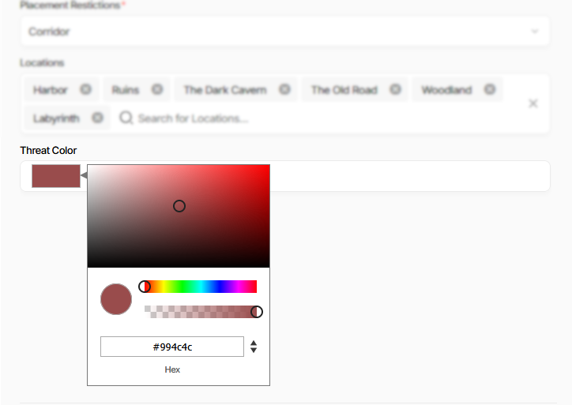
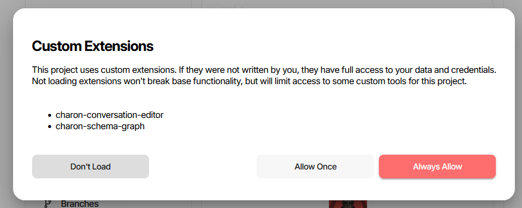
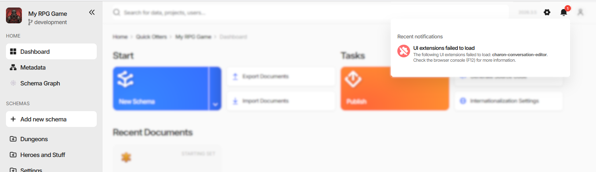

UI Extensions
=============

An **extension** is a package of your own code that Charon loads into the editor at runtime. It can replace the
editor of a single field, replace the whole document form with a graph or a node editor, add entries to Charon's
menus, and add pages of its own to the side navigation.

Extensions are **Web Components** packaged as **NPM modules**. Nothing about them is framework-specific - React,
Angular, Vue, or plain JavaScript all work - and they are installed per project, so everyone working on that
project gets the same set.

.. contents:: On this page
   :local:
   :depth: 2

----

What an Extension Can Add
-------------------------

.. list-table::
   :header-rows: 1
   :widths: 22 48 30

   * - Kind
     - What it replaces or adds
     - Declared in ``package.json``
   * - **Property editor**
     - The input for one field of a document form.
     - ``config.customEditors``, ``type: ["Property"]``
   * - **Grid editor**
     - The cell editor for the same property in the collection grid.
     - ``config.customEditors``, ``type: ["Grid"]``
   * - **Schema editor**
     - The entire editing view of a document - see
       :doc:`Implementing a Schema Editor <implementing_schema_editor>`.
     - ``config.customEditors``, ``type: ["Schema"]``
   * - **Custom action**
     - A menu entry in one of four places in the UI - see :doc:`Custom Actions <custom_actions>`.
     - ``config.customActions``
   * - **Custom page**
     - A routed, bookmarkable page of its own - see :doc:`Custom Pages <custom_pages>`.
     - ``config.customPages``

A property editor is the smallest of these and the usual starting point. The colour picker below is one - the
field is an ordinary ``Text`` property, and the extension supplies the swatch and the picker popup:

Whatever the kind, the extension gets the host's services along with it: game data queries, dialogs and wizards,
notifications, navigation, and persisted UI state. See :doc:`Host Services <host_services>`.

----

How Extensions Are Declared
---------------------------

Everything Charon needs to know about a package is in its ``package.json``, under ``config``:

.. code-block:: json

  {
    "name": "charon-color-picker",
    "version": "1.0.24",
    "main": "main.js",
    "config": {
      "customEditors": [
        {
          "id": "ext-color-picker-hex",
          "selector": "ext-color-picker-editor",
          "name": "Color Picker (Hex)",
          "specification": "format=hex",
          "type": ["Property", "Grid"],
          "dataTypes": ["Text", "Integer"]
        }
      ]
    }
  }

- ``id`` is how the editor is referenced from a schema or property, and must be unique across every extension
  installed in the project.
- ``selector`` is the custom element name the package registers with ``customElements.define``.
- ``name`` is what the user sees when picking the editor.
- ``dataTypes`` limits which :doc:`data types <../../gamedata/datatypes/list>` the editor is offered for.
- ``specification`` is extra configuration in ``URLSearchParams`` form. It is merged into the property's
  :doc:`Specification <../../gamedata/schemas/specification>` when the editor is picked, which is how one
  custom element can back three entries - ``format=hex``, ``format=hsla``, ``format=rgba``.
- ``icon`` is optional and takes a Charon icon reference, ``<set>/<name>``: ``svg/`` for Charon's own icons,
  ``emoji/`` for an emoji by its short name (``emoji/speech_balloon``), ``material/`` for a Material icon. The
  default is ``svg/extensions``.

The full JSON schema for the ``config`` section, including custom actions and custom pages, is
`package.json.schema.json <https://github.com/gamedevware/charon-extensions/blob/main/package.json.schema.json>`_
in the examples repository. Point your editor at it for completion and validation while writing.

Choosing an Editor for a Property
^^^^^^^^^^^^^^^^^^^^^^^^^^^^^^^^^

Installed editors appear in the **Data Type** picker of the property form, nested under the data types they
declared in ``dataTypes``. Picking one writes ``editor=<id>`` into the property's
:doc:`Specification <../../gamedata/schemas/specification>`, together with whatever the extension declared in
its own ``specification`` field.

A **Schema** editor is selected the same way but on the schema, by putting ``editor=<id>`` into the schema's
Specification. An extension that ships a schema editor usually creates the schema for you through a
:doc:`custom action <custom_actions>` instead of asking you to type that in.

----

Installing an Extension
-----------------------

Open **Project Settings** → **Extensions**. Each row is an NPM package name and a version; leave the version
empty to track the latest published one. The name field completes against the configured registry as you type.

Press **Update** to save the list. The status icon at the end of each row says what happened:

.. list-table::
   :header-rows: 1
   :widths: 40 60

   * - Status
     - Meaning
   * - Loaded
     - The package was downloaded and its code is running. The tooltip names the exact version.
   * - Extension not declared in project settings
     - The package is present on the server but not in this project's list.
   * - Extension package not found
     - No such package in the registry.
   * - No compatible version available
     - The requested version does not exist, or is not compatible with this Charon build.
   * - Failed to download from registry
     - The registry was unreachable or rejected the request.
   * - Package exceeds size limit
     - The archive is larger than the server allows.
   * - Invalid or corrupted package archive
     - The ``.tgz`` could not be unpacked.

**Re-Check** asks the server whether newer versions of the installed packages are available. **Upload NPM
Package...** takes a ``.tgz`` built locally with ``npm pack`` and installs it into the server's extension folder
- convenient while developing, but the upload is per installation, so other users of a shared project will not
get it. Publish to a registry for anything the team relies on.

The list itself is stored in the project settings inside the game data, so it travels with the data and applies
to everyone who opens the project.

----

Consent and Trust
-----------------

Extension code runs inside the editor with the same access as the editor itself - your game data and your
credentials. Charon therefore asks before loading anything, the first time a project's extension list is seen:

- **Don't Load** - the editor starts without them. Nothing else breaks; only the extensions' own features are
  missing.
- **Allow Once** - loads them for this session and asks again next time.
- **Always Allow** - remembers the decision for that exact set of packages. A green tick next to a name in a
  later prompt means it was part of a previously allowed set.

Both allow buttons stay disabled for a few seconds so the dialog cannot be clicked through by accident. The
remembered decision is tied to the list of package names: adding or removing an extension makes Charon ask
again. **Allow loading these extensions without asking again** on the settings page is the same decision, and
clearing it brings the prompt back.

.. warning::
   Install extensions the way you would install a dependency into your build: from a source you trust, at a
   version you have looked at. A malicious extension can read everything you can read and act as you.

----

When an Extension Fails to Load
-------------------------------

A failure is reported in the notifications area and does not stop the editor:

The browser console (:kbd:`F12`) carries the actual error. Common causes:

- **the package could not be fetched or unpacked** - the row's status icon on the settings page says which of
  those it was;
- **an id or selector collision** - two installed packages declare the same editor ``id``, the same element
  ``selector``, or the same page ``id``. Charon refuses to load the second one and logs which package it
  conflicted with;
- **the entry point threw** while registering its custom elements;
- **a missing export** - a custom action naming a ``functionName`` that the bundle does not export is skipped,
  with a warning naming the function;
- **a dangling page reference** - a custom action naming a ``pageId`` that is not in the same package's own
  ``customPages`` produces a link that does not resolve.

If nothing loads at all, check that the ``uiExtensions`` feature is enabled for your installation and that the
consent prompt was not answered with **Don't Load**.

----

Packaging and Publishing
------------------------

Build the package, then produce an archive:

.. code-block:: bash

   npm run build
   npm pack

That writes a ``.tgz`` next to the build output, ready for **Upload NPM Package...**. To publish for the whole
team instead:

.. code-block:: bash

   npm publish

Remove ``"private": true`` first, and make sure ``main`` points at the built entry file. Any ``.css`` file listed
in the package's ``files`` array is fetched and injected by Charon along with the code, which is how a bundled
stylesheet reaches the page.

Versions are resolved when the project loads, so publishing a new version rolls out to everyone with an empty
version field the next time they open the editor. Pin a version in the settings row when you need that not to
happen.

----

Examples
--------

The `charon-extensions repository <https://github.com/gamedevware/charon-extensions/>`_ holds the type
definitions and four complete example packages:

.. list-table::
   :header-rows: 1
   :widths: 32 68

   * - Package
     - What it demonstrates
   * - ``charon-extensions``
     - The API contract itself - every interface described in these pages.
   * - ``charon-logical-toggle``
     - The simplest property editor, in React.
   * - ``charon-color-picker``
     - A property editor in Angular, including the zoneless setup.
   * - ``charon-conversation-editor``
     - A full schema editor with a node graph, plus a custom action that creates its schema.
   * - ``charon-schema-graph``
     - A custom page with a side-navigation entry.

Two scaffolders generate a ready-to-build property editor package:

.. code-block:: bash

   node src/create-charon-react-extension/index.js my-extension
   node src/create-charon-angular-extension/index.js my-extension

----

See also
--------

- :doc:`Implementing a Property Editor <implementing_property_editor>`
- :doc:`Implementing a Schema Editor <implementing_schema_editor>`
- :doc:`Custom Actions <custom_actions>`
- :doc:`Custom Pages <custom_pages>`
- :doc:`Host Services <host_services>`
- :doc:`Creating a Custom Editor with React <creating_react_extension>`
- :doc:`Creating a Custom Editor with Angular <creating_angular_extension>`
- `Example Projects (GitHub) <https://github.com/gamedevware/charon-extensions/>`_
