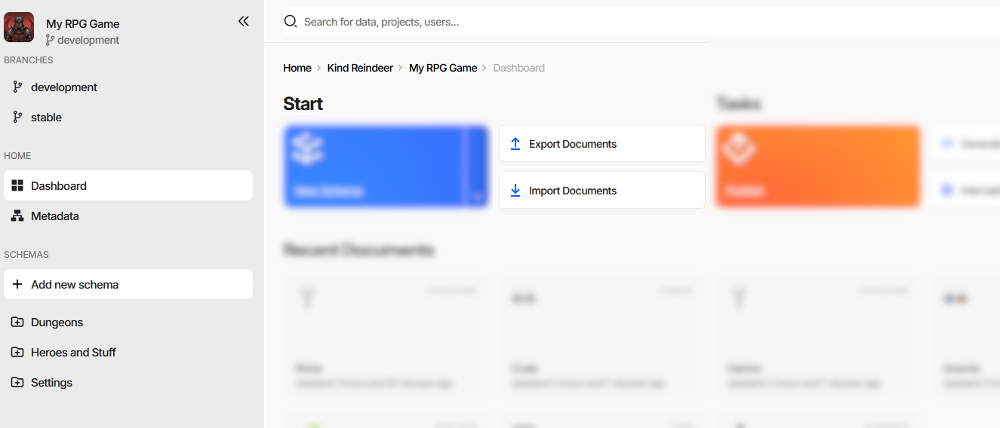
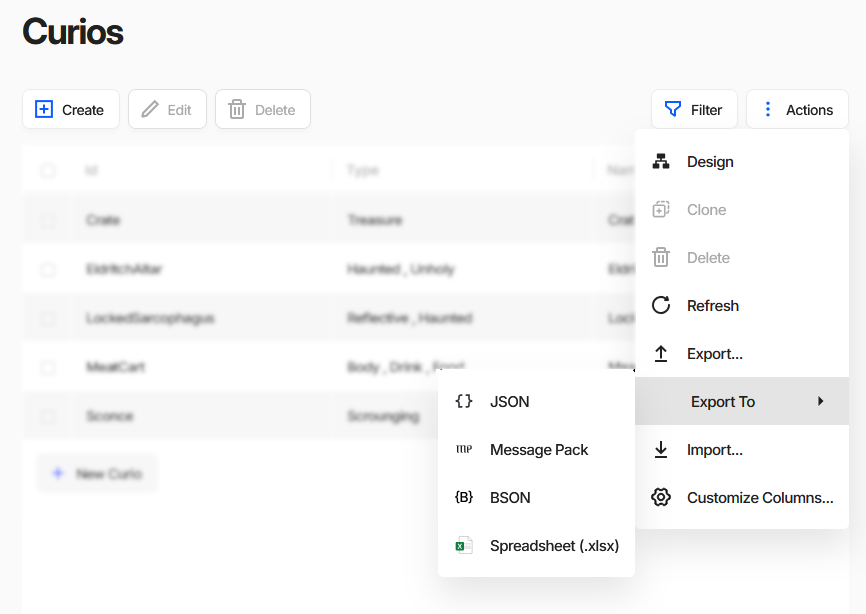
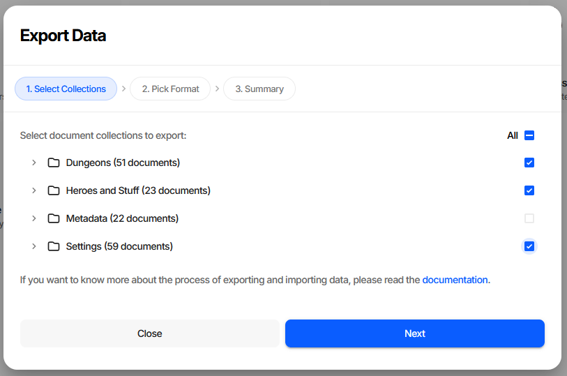
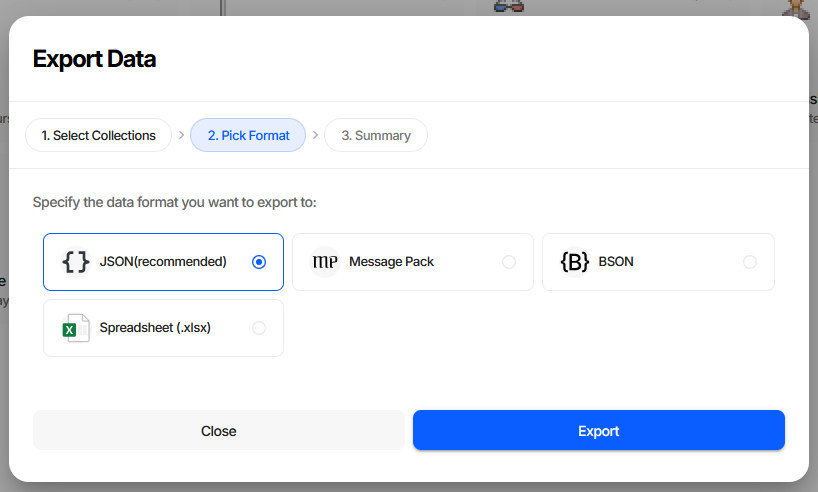
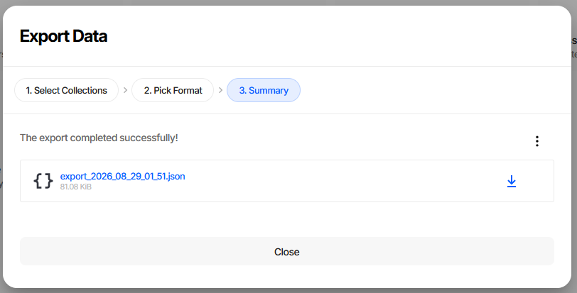
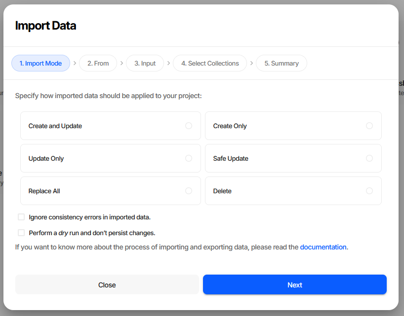
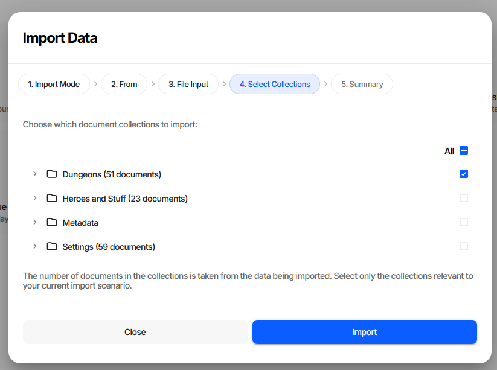
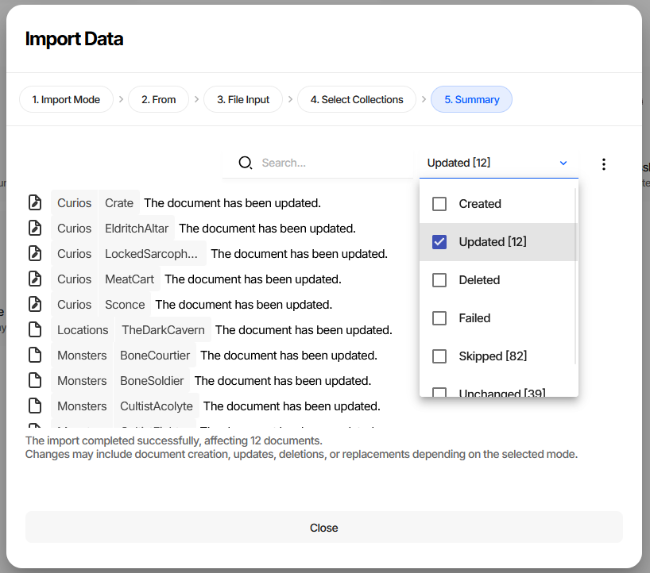
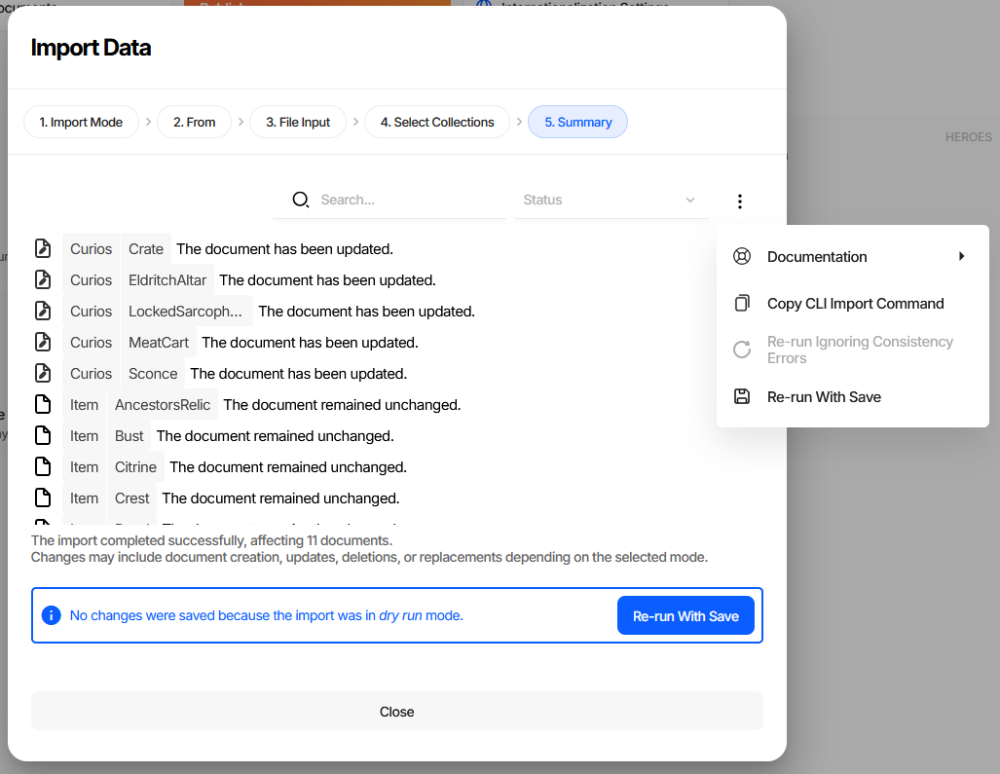
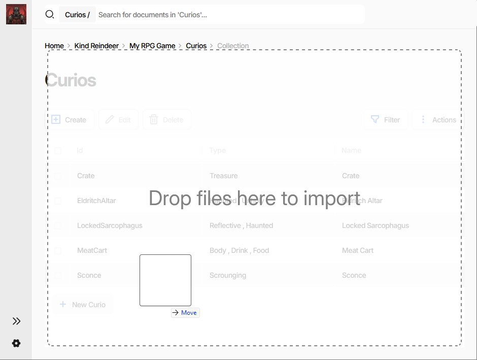

============================
Importing and Exporting Data
============================

Export writes documents out of a project into a file; import reads them back in. The round trip is how game
data leaves the editor for version control, bulk edits in external tools, or a script, and how externally
produced data gets in.

Both directions are wizards in the editor, and both have a CLI equivalent for automation. See
:doc:`CI/CD <cicd>` for pipeline examples.

.. note::
   Export is not :doc:`publication <../gamedata/publication>`. An export is a full-fidelity copy that Charon
   can read back. A publication strips everything the game does not need and is meant for the generated
   code, not for re-import.

.. contents:: On this page
   :local:
   :depth: 2

----

Where Import and Export Live
============================

Both operations have two entry points.

The **Start** panel on the dashboard works on the whole project:

**Export Documents** and **Import Documents** open the wizards with nothing preselected, so you choose the
collections inside. **Import Documents** is disabled when the data source is read-only.

A document list has the same two operations scoped to one collection, in its **Actions** menu:

**Export...** and **Import...** open the same wizards with the current collection already selected.
**Export To** skips the wizard entirely - see `Quick Export Without the Wizard`_.

----

Exporting Data
==============

Step 1. Select Collections
--------------------------

Collections are shown as a tree, grouped into folders, each with its document count. The **All** checkbox at
the top toggles everything, and shows a dash when the selection is partial. Expand a folder to pick
individual collections. At least one is required to continue.

The **Metadata** folder holds the project's schema definitions. Leave it ticked when the file should
describe its own structure, untick it to export documents alone.

Step 2. Pick Format
-------------------

+---------------------+----------------------------------------------------------------------+
| Format              | When to use                                                          |
+=====================+======================================================================+
| JSON                | Default. Readable, diffable, and accepted by every external tool.    |
| *(recommended)*     | Keep it unless you have a reason not to.                             |
+---------------------+----------------------------------------------------------------------+
| Message Pack        | Compact binary. Smaller and faster to parse, not human-readable.     |
+---------------------+----------------------------------------------------------------------+
| BSON                | Binary JSON, for pipelines that already speak it.                    |
+---------------------+----------------------------------------------------------------------+
| Spreadsheet (.xlsx) | One sheet per collection, for review or editing by people who do not |
|                     | work in JSON. Round-trips back through import.                       |
+---------------------+----------------------------------------------------------------------+

Step 3. Summary
---------------

The file is offered as a download, named ``export_<year>_<month>_<day>_<hour>_<minute>.<extension>`` and
annotated with its size. The download arrow next to it turns into a green check once you have taken it.

The **⋮** menu holds **Copy CLI Export Command**, which puts the exact CLI equivalent of the choices you
just made on the clipboard, and a **Documentation** submenu linking to this page and the command reference.

.. tip::
   The wizard remembers the collections and format you picked last time, so a repeated export is
   **Next**, **Next**, **Export**.

**CLI equivalent**

.. code-block:: bash

   dnx dotnet-charon -- DATA EXPORT \
     --dataBase "gamedata.json" \
     --schemas Item Character \
     --output "items.json" \
     --outputFormat json

Key parameters:

- ``--schemas`` - collections to export. Supports wildcards (``*Item*``) and exclusion (``!Deprecated``).
  Omit it to export everything.
- ``--properties`` - narrows the export to specific properties. There is no equivalent in the wizard, which
  always exports whole documents.
- ``--outputFormat`` - ``json``, ``bson``, ``msgpack`` or ``xlsx``.

See :doc:`DATA EXPORT <commands/data_export>` for the full parameter list.

Quick Export Without the Wizard
-------------------------------

**Export To** in a collection's **Actions** menu downloads that collection immediately in the chosen format -
JSON, Message Pack, BSON or Spreadsheet - with no steps to click through. It is the fast path when you just
want the current collection on disk.

----

Importing Data
==============

Step 1. Import Mode
-------------------

The mode decides how incoming documents meet the ones already in the project.

+--------------------+---------------------+-------------------------------------------------------------+
| Mode               | ``--mode`` value    | Effect                                                      |
+====================+=====================+=============================================================+
| Create and Update  | ``createAndUpdate`` | Default. Creates documents that do not exist yet, updates   |
|                    |                     | the ones that do.                                           |
+--------------------+---------------------+-------------------------------------------------------------+
| Create Only        | ``create``          | Creates new documents. Existing documents are never         |
|                    |                     | touched.                                                    |
+--------------------+---------------------+-------------------------------------------------------------+
| Update Only        | ``update``          | Updates existing documents. Nothing new is added.           |
+--------------------+---------------------+-------------------------------------------------------------+
| Safe Update        | ``safeUpdate``      | Updates existing documents without adding, removing or      |
|                    |                     | reordering embedded documents. The mode to use when the     |
|                    |                     | document structure must survive intact - imported           |
|                    |                     | translations, for example.                                  |
+--------------------+---------------------+-------------------------------------------------------------+
| Replace All        | ``replace``         | Replaces the collection with the imported documents.        |
|                    |                     | Everything currently in it is removed.                      |
+--------------------+---------------------+-------------------------------------------------------------+
| Delete             | ``delete``          | Deletes the documents listed in the file. Nothing is        |
|                    |                     | created or updated.                                         |
+--------------------+---------------------+-------------------------------------------------------------+

.. warning::
   **Replace All** removes every document in the selected collections that is not in the file. Run it as a
   dry run first.

Two checkboxes on this step change how the import behaves:

- **Ignore consistency errors in imported data** - drops the integrity checks and keeps only the repairs.
  See `Validation During Import`_ for exactly what this trades away.
- **Perform a dry run and don't persist changes** - runs the entire import, produces the full report, and
  writes nothing. Worth doing before any import you have not run before.

Step 2. From
------------

Choose **File** to pick a file from your device, or **Clipboard** to paste JSON text directly into the
wizard.

Step 3. File Input / Clipboard Input
------------------------------------

For **File**, browse to the file. Accepted formats are JSON (``.json``), Message Pack (``.msgpack``), BSON
(``.bson``) and Spreadsheet (``.xlsx``); anything else is rejected on this step with an *Unknown file
format* error. For **Clipboard**, paste a JSON object into the text area - it is checked as valid JSON when
you leave the field.

Step 4. Select Collections
--------------------------

The same collection tree as in the export wizard, with one difference worth knowing: the document counts
come from **the file being imported**, not from the project. Charon reads the file's structure to build this
list, which doubles as a sanity check - in the screenshot above, **Metadata** carries no count because the
file contains no schema definitions.

If the file cannot be read, this step shows *Failed to peek into imported data* with the server error, plus
**Retry** and **Ignore and Continue**. Continuing is valid - the import itself may still succeed - but you
lose the ability to narrow the collection list.

Step 5. Summary
---------------

Every affected document is listed with its status, searchable by name and filterable by status. The filter
carries counts, so the shape of the import is visible before you read a single row - the screenshot above is
filtered to the 12 updated documents out of a run that also skipped 82 and left 39 unchanged.

+-----------+------------------------------------------------------------------------------+
| Status    | Meaning                                                                      |
+===========+==============================================================================+
| Created   | The document did not exist and was added.                                    |
+-----------+------------------------------------------------------------------------------+
| Updated   | An existing document was changed.                                            |
+-----------+------------------------------------------------------------------------------+
| Deleted   | The document was removed - ``delete`` or ``replace`` mode.                   |
+-----------+------------------------------------------------------------------------------+
| Failed    | The document was rejected. The row carries the reason.                       |
+-----------+------------------------------------------------------------------------------+
| Skipped   | The mode did not apply to this document - a new document in ``update`` mode, |
|           | for instance.                                                                |
+-----------+------------------------------------------------------------------------------+
| Unchanged | The document matched what was already stored.                                |
+-----------+------------------------------------------------------------------------------+

An import that finishes entirely as *Unchanged* usually means the file matched the project exactly, not that
something went wrong.

After a dry run the report is the same, with a banner making clear that nothing was written and a
**Re-run With Save** button to commit the same import for real:

The **⋮** menu offers:

- **Copy CLI Import Command** - the CLI equivalent of this import, ready for a build script.
- **Re-run Ignoring Consistency Errors** - retries without integrity checks. Available only when the run
  actually produced failures and the checks were on, which is why it is greyed out above.
- **Re-run With Save** - re-runs a dry run for real. Available only after a dry run.

Faster Paths
------------

Dragging a data file onto a document list - the grid turns into a *Drop files here to import* target -
opens the import wizard with the file, the collection and **Create and Update** already filled in, so it
starts at *Select Collections*:

Pasting a JSON array of documents while a document list is focused does the same with the clipboard text.
Neither shortcut is a way to write data without seeing the report - both still finish on the summary step.

**CLI equivalent**

.. code-block:: bash

   dnx dotnet-charon -- DATA IMPORT \
     --dataBase "gamedata.json" \
     --schemas Item \
     --input "items.json" \
     --inputFormat auto \
     --mode safeUpdate \
     --dryRun

Key parameters:

- ``--inputFormat`` - ``auto`` by default, detected from the file extension.
- ``--mode`` - see the table above.
- ``--dryRun`` - the CLI equivalent of *Perform a dry run*. Drop it to persist the changes.
- ``--output`` - where the import report goes. Without it the report is discarded **and the command fails if
  any document failed to import**, which is what makes an import usable as a CI step.

See :doc:`DATA IMPORT <commands/data_import>` for the full parameter list.

----

Validation During Import
========================

Imported documents pass through the same validation engine as documents edited in the UI, but the profile
differs between the wizard and the command line - and the two defaults are opposites.

+--------------------------------+-----------------------------------------------------------------------+
| Situation                      | Checks and repairs applied                                            |
+================================+=======================================================================+
| Import wizard, default         | ``repair``, ``repairRequiredWithDefaults``, and all six integrity     |
|                                | checks: ``checkRequirements``, ``checkFormat``, ``checkUniqueness``,  |
|                                | ``checkReferences``, ``checkSpecification``, ``checkConstraints``     |
+--------------------------------+-----------------------------------------------------------------------+
| Import wizard, *Ignore         | ``repair``, ``repairRequiredWithDefaults``, ``deduplicateIds``,       |
| consistency errors* checked    | ``resolveConflictingUnions`` - **no integrity checks**                |
+--------------------------------+-----------------------------------------------------------------------+
| ``DATA IMPORT``, default       | ``repair``, ``repairRequiredWithDefaults``, ``deduplicateIds``,       |
|                                | ``resolveConflictingUnions`` - **no integrity checks**                |
+--------------------------------+-----------------------------------------------------------------------+

.. warning::
   ``DATA IMPORT`` defaults to repairs without integrity checks. A file with dangling references or missing
   required values is accepted quietly, and the problem surfaces later as an error count in the editor or a
   failure in the game. Whenever the input is not fully trusted, ask for the checks explicitly:

   .. code-block:: bash

      dnx dotnet-charon -- DATA IMPORT \
        --dataBase "gamedata.json" \
        --input "items.json" \
        --validationOptions repair repairRequiredWithDefaults \
                            checkRequirements checkFormat checkUniqueness \
                            checkReferences checkSpecification checkConstraints

   Following the import with a ``DATA VALIDATE`` run achieves the same thing in two steps.

To go the other way in the UI - accept data that fails the checks - tick *Ignore consistency errors in
imported data*, or use **Re-run Ignoring Consistency Errors** on the summary once you have seen what failed.

.. note::
   Schema definitions are always validated in full. The relaxed profiles apply to documents only.

See :doc:`Validation <validation>` for what each flag does.

----

Working with Exported Data
==========================

Modifying Exported Data
-----------------------

Exported data can be edited by hand or with a script. A single value with `yq`:

.. code-block:: bash

   yq -i '.Collections.Item[0].Damage = 5' items.json

The same file can be converted to another format, restructured, or generated from a spreadsheet, as long as
what comes back matches the expected shape.

Creating Data from Scratch
--------------------------

Data files can be authored externally and imported, provided they conform to the required structure: a
``Collections`` object holding an array of documents per schema.

.. code-block:: json

   {
     "Collections": {
       "Item": [
         { "Id": "BronzeSword", "Name": "Bronze Sword", "Damage": 4 }
       ]
     }
   }

See :doc:`Game Data Structure <game_data_structure>` for the full format specification.

Document Identification
-----------------------

- Omit ``Id`` and one is generated.
- Provide ``Id`` if the document is referenced elsewhere in the data.
- Use a temporary identifier of the form ``_ID_<UNIQUE>`` when a document needs to be referenced by another
  document in the same file - including itself, as in a tree node pointing at its own parent. Every
  occurrence of the same placeholder resolves to the same generated identifier across the whole import.

Partial Updates
---------------

In the update modes documents need not be complete. A file containing only the identifier and the changed
properties is enough:

.. code-block:: json

   [
     { "Id": "IronSword", "Damage": 10 }
   ]

Everything not mentioned keeps its current value.

See also
========

- :doc:`Validation <validation>`
- :doc:`Publishing Game Data <../gamedata/publication>`
- :doc:`Internationalization (i18n) <internationalization>`
- :doc:`Game Data Structure <game_data_structure>`
- :doc:`CI/CD <cicd>`
- :doc:`DATA EXPORT <commands/data_export>`
- :doc:`DATA IMPORT <commands/data_import>`
