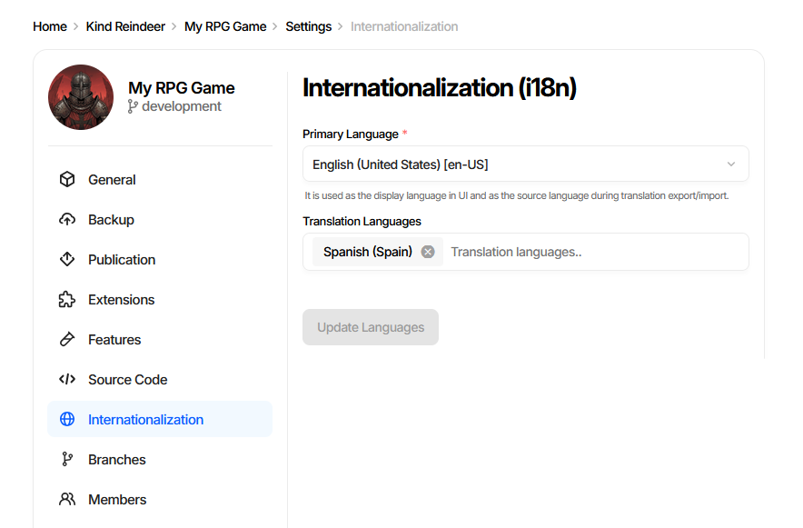
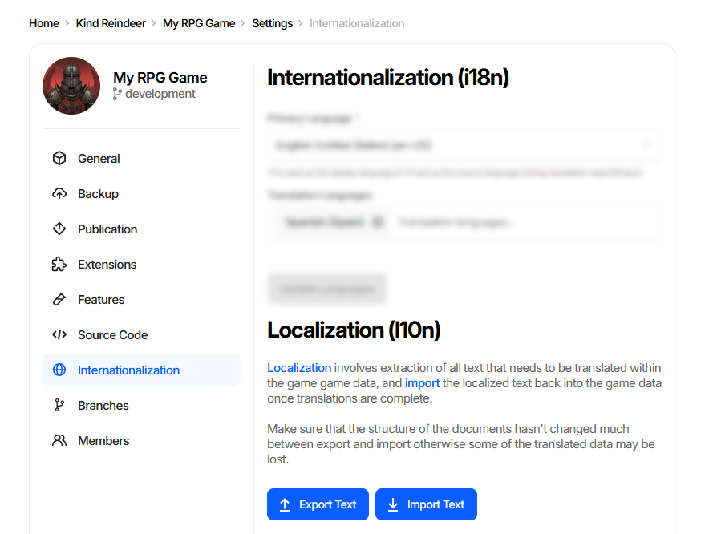
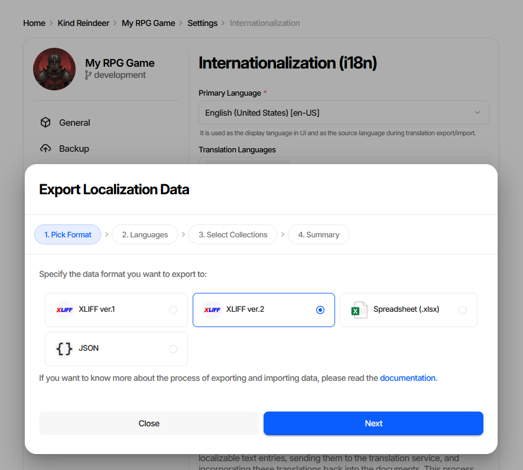
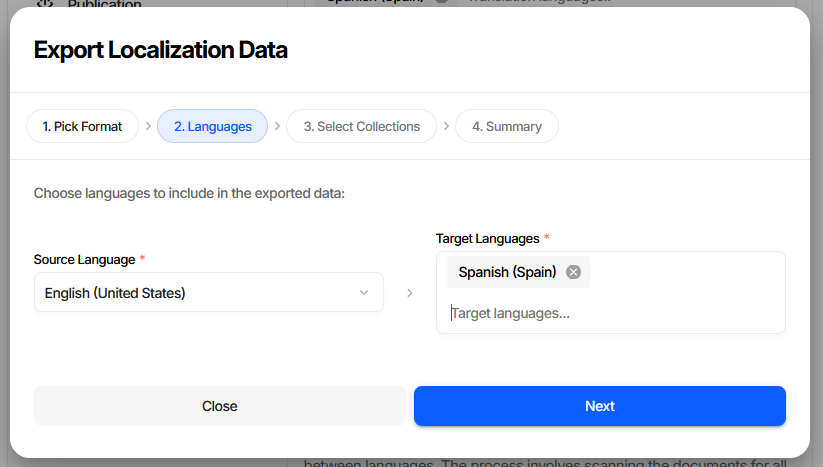
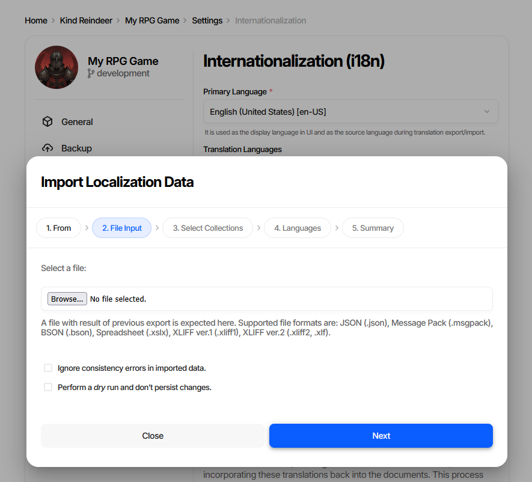
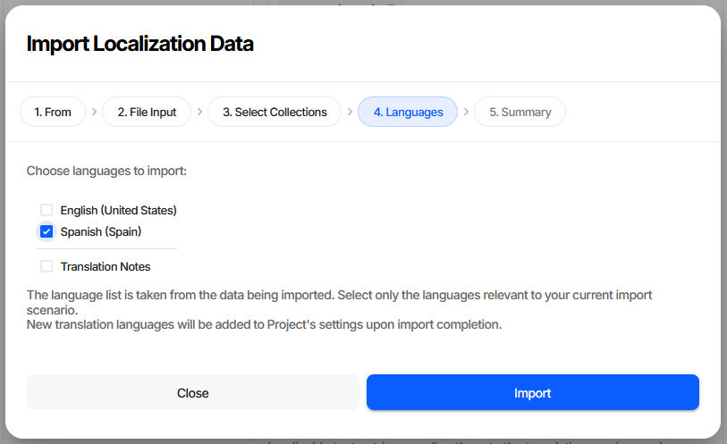
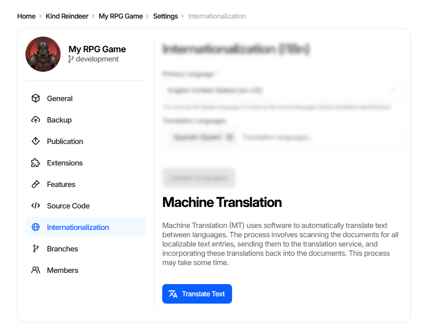
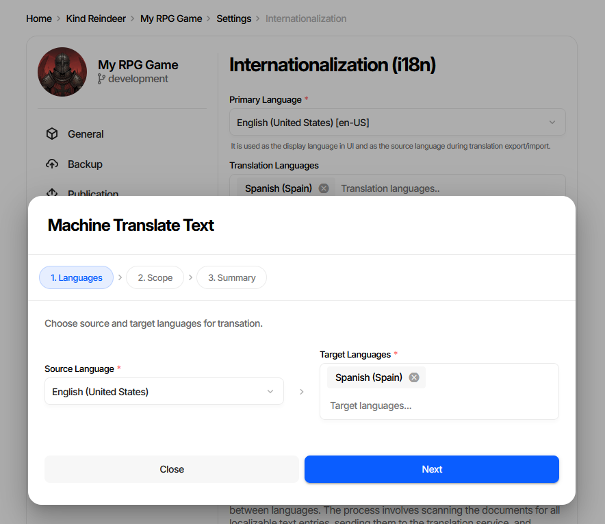
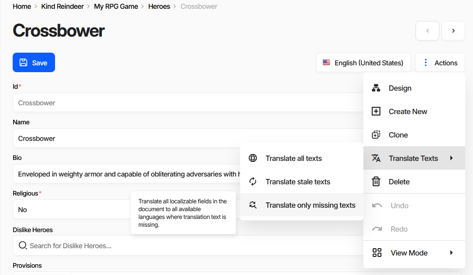

===========================
Internationalization (i18n)
===========================

Charon supports localization by enabling text data to be stored in multiple languages using the :doc:`Localized Text <../gamedata/datatypes/all/localized_text>` data type. This allows game data to be exported for translation, modified externally, and imported back after localization.

Supported interchange formats are `XLIFF <https://en.wikipedia.org/wiki/XLIFF>`_ (XML Localization Interchange File Format) version 1 and 2, `XLSX <https://en.wikipedia.org/wiki/Office_Open_XML>`_ spreadsheets and `JSON <https://www.json.org/json-en.html>`_. These formats are suitable for translation workflows involving external tools or localization teams.

Overview
========

Everything related to translation lives on one page: **Settings** → **Internationalization**. It has three
sections, which also correspond to the three stages of a localization workflow:

- **Internationalization (i18n)** - which languages the project has.
- **Localization (l10n)** - export text for translators, import it back.
- **Machine Translation** - optional automatic pre-translation, when the feature is enabled.

Every action on this page has a CLI counterpart except machine translation, so the same workflow can be
automated in a CI/CD pipeline. See :doc:`CI/CD <cicd>`.

Common use cases include:

- Managing multi-language game content.
- Sending text data to third-party localization vendors.
- Automating translation pipelines with CLI tools.

Configuring Languages
=====================

Open **Settings** → **Internationalization** and use the first card to declare the project's languages.

- **Primary Language** - the language content is authored in. It is the display language in the UI and the
  default source language for translation export and import.
- **Translation Languages** - the target languages. Start typing in the field and pick a language from the
  autocomplete; remove one with the cross button on its chip.
- **Update Languages** - saves the change. The button stays disabled until something is modified.

Adding a language does not create any text - it makes the language available as a slot on every
:doc:`Localized Text <../gamedata/datatypes/all/localized_text>` field and as a target in the export, import
and machine translation wizards.

.. note::
   Removing a translation language hides its text from the UI. Export the language before removing it if
   the translated content still matters.

**CLI equivalent**

List the configured languages (the primary language always comes first):

.. code-block:: bash

   dnx dotnet-charon -- DATA I18N LANGUAGES \
     --dataBase "gamedata.json" \
     --output out --outputFormat table

Add target languages:

.. code-block:: bash

   dnx dotnet-charon -- DATA I18N ADDLANGUAGE \
     --dataBase "gamedata.json" \
     --languages "es-ES" "fr-FR"

Language values are `BCP 47 <https://en.wikipedia.org/wiki/IETF_language_tag>`_ tags, e.g. ``en-US``,
``es-ES``, ``fr``.

Localization (l10n)
===================

The **Localization (l10n)** card is the entry point for the export/import round trip.

- **Export Text** - collects every localizable text entry and writes it to a file for translators.
- **Import Text** - reads a translated file back into the game data.

.. warning::
   Keep the document structure stable between export and import. If schemas and documents change
   significantly in the meantime, some translated entries can no longer be matched and will be lost.

Exporting Translatable Text
===========================

Click **Export Text** to open the **Export Localization Data** wizard.

Step 1. Pick Format
-------------------

+---------------------------+--------------------------------------------------------------------+
| Format                    | When to use                                                        |
+===========================+====================================================================+
| XLIFF ver.2               | Default choice for professional translation tools and vendors.     |
+---------------------------+--------------------------------------------------------------------+
| XLIFF ver.1               | Older tools that do not accept XLIFF 2.                            |
+---------------------------+--------------------------------------------------------------------+
| Spreadsheet (.xlsx)       | Translators working directly in Excel or Google Sheets.            |
+---------------------------+--------------------------------------------------------------------+
| JSON                      | Custom scripts and in-house translation pipelines.                 |
+---------------------------+--------------------------------------------------------------------+

Step 2. Languages
-----------------

Pick the **Source Language** (the text translators will read, usually the primary language) and one or more
**Target Languages**. Existing translations for the target languages are included in the file, so translators
see what is already done.

Step 3. Select Collections
--------------------------

Limit the export to specific document collections, or leave everything selected to export all localizable
text. Narrowing the scope keeps vendor files small when only part of the content changed.

Step 4. Summary
---------------

Review the choices and start the export. The resulting file is downloaded through the browser.

**CLI equivalent**

.. code-block:: bash

   dnx dotnet-charon -- DATA I18N EXPORT \
     --dataBase "gamedata.json" \
     --sourceLanguage en-US \
     --targetLanguage fr \
     --output "en_fr_texts.xliff" \
     --outputFormat xliff

Key parameters:

- ``--sourceLanguage`` - language of the original text.
- ``--targetLanguage`` - language the content is translated into.
- ``--schemas`` - optional list of schemas, matching the *Select Collections* step.
- ``--outputFormat`` - ``xliff`` (alias of ``xliff2``), ``xliff1``, ``xslx`` or ``json``.

See :doc:`DATA I18N EXPORT <commands/data_i18n_export>` for the full parameter list.

Importing Translated Data
=========================

Click **Import Text** to open the **Import Localization Data** wizard.

Step 1. From
------------

Choose where the translated data comes from - a **File** on your device, or the **Clipboard** for pasted
JSON text.

Step 2. File Input
------------------

Browse for the file returned by the translators. Accepted formats are JSON (``.json``), MessagePack
(``.msgpack``), BSON (``.bson``), Spreadsheet (``.xslx``), XLIFF ver.1 (``.xliff1``) and XLIFF ver.2
(``.xliff2``, ``.xlf``).

Two options are available on this step:

- **Ignore consistency errors in imported data** - accepts data that fails validation. Useful for
  work-in-progress translations.
- **Perform a dry run and don't persist changes** - runs the whole import and reports what would happen
  without writing anything. Always worth doing before the first import of a vendor's file.

Step 3. Select Collections
--------------------------

Restrict the import to specific collections, if the file covers more than you want to update.

Step 4. Languages
-----------------

The language list is read from the file being imported, not from project settings. Tick only the languages
relevant to this import - typically the target language alone, leaving the source language untouched.
**Translation Notes** carries translator comments back into the data. Languages that are not yet in project
settings are added automatically when the import completes.

Step 5. Summary
---------------

Review and run the import.

**CLI equivalent**

.. code-block:: bash

   dnx dotnet-charon -- DATA I18N IMPORT \
     --dataBase "gamedata.json" \
     --input "en_fr_translated.xliff" \
     --inputFormat xliff \
     --languages fr \
     --dryRun

Key parameters:

- ``--inputFormat`` - ``auto`` by default, detected from the file extension.
- ``--languages`` - languages to import; ``*`` imports all languages found in the file.
- ``--validationOptions None`` - the CLI equivalent of *Ignore consistency errors*.
- ``--dryRun`` - the CLI equivalent of *Perform a dry run*. Drop it to persist the changes.

See :doc:`DATA I18N IMPORT <commands/data_i18n_import>` for the full parameter list.

Machine Translation
===================

Machine translation pre-populates target language fields as a **first draft** for translators to review. It
speeds up the initial pass on large amounts of text but does not replace professional translation for final
copy.

The feature is available in the cloud and server editions and is enabled per-project by an Administrator.
When it is off, the **Machine Translation** card is not shown.

Translating the Whole Project
-----------------------------

**Translate Text** opens the **Machine Translate Text** wizard.

Step 1 selects the **Source Language** and **Target Languages**. Step 2 selects the scope:

+-----------------------------+------------------------------------------------------------------------+
| Scope                       | Effect                                                                 |
+=============================+========================================================================+
| Translate all texts         | Overwrites every target text, including reviewed translations.         |
+-----------------------------+------------------------------------------------------------------------+
| Translate stale texts       | Retranslates entries whose primary language text changed after the     |
|                             | translation was made, plus missing ones.                               |
+-----------------------------+------------------------------------------------------------------------+
| Translate only missing texts| Fills empty entries only, never touching existing translations.        |
+-----------------------------+------------------------------------------------------------------------+

Step 3 shows progress. A project-wide translation scans all documents and may take a while; the progress bar
on the settings card reflects the running operation.

Translating a Single Document
-----------------------------

The same three scopes are available for one document from the document form's **Actions** menu →
**Translate Texts**.

This is the fast path when a designer edits one document's primary text and wants the other languages
refreshed immediately.

.. note::
   Machine translation has no CLI command. For automated pipelines, use the export/import workflow with an
   external translation service.

Working with Translation Teams
==============================

The standard human-translation workflow with Charon:

1. Designers fill the **primary language** for all content.
2. Optionally run **Machine Translation** with *Translate only missing texts* to give translators a draft to
   edit instead of a blank file.
3. **Export Text** in XLIFF ver.2 for each target language, or run:

   .. code-block:: bash

      dnx dotnet-charon -- DATA I18N EXPORT \
          --dataBase "gamedata.json" \
          --sourceLanguage en-US --targetLanguage fr \
          --output en_fr.xliff --outputFormat xliff

4. Send the ``.xliff`` file to your localization vendor or translation management system
   (Crowdin, Lokalise, POEditor, or any XLIFF-compatible tool).
5. Receive the translated file back from the vendor.
6. **Import Text** with *Perform a dry run* first, then again without it, or run:

   .. code-block:: bash

      dnx dotnet-charon -- DATA I18N IMPORT \
          --dataBase "gamedata.json" \
          --input en_fr_translated.xliff \
          --languages fr

7. Repeat for each target language. CI/CD scripts can automate steps 3 and 6 for continuous localization
   pipelines.

Best Practices
==============

- Use **XLIFF** for integration with professional translation software or localization platforms.
- Use **Spreadsheet (.xlsx)** when working with translators familiar with spreadsheet tools.
- Always run a **dry run** before importing a vendor's file into production data.
- Export a language before removing it from **Translation Languages**.
- Keep schema changes and translation rounds apart - restructuring documents between export and import
  loses translated entries.

Unsupported Formats
===================

While Charon may accept other serialization formats (e.g., BSON, MsgPack) on import, compatibility for
internationalization workflows is only guaranteed for XLIFF, XLSX and JSON.

Additional Resources
====================

- :doc:`Importing and Exporting Data <import_export>`
- :doc:`DATA EXPORT <commands/data_export>`
- :doc:`DATA IMPORT <commands/data_import>`
- :doc:`DATA I18N EXPORT <commands/data_i18n_export>`
- :doc:`DATA I18N IMPORT <commands/data_i18n_import>`
- :doc:`DATA I18N LANGUAGES <commands/data_i18n_languages>`
- :doc:`DATA I18N ADDLANGUAGE <commands/data_i18n_add_language>`
