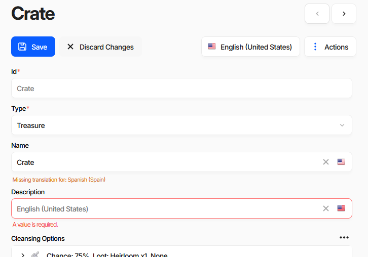
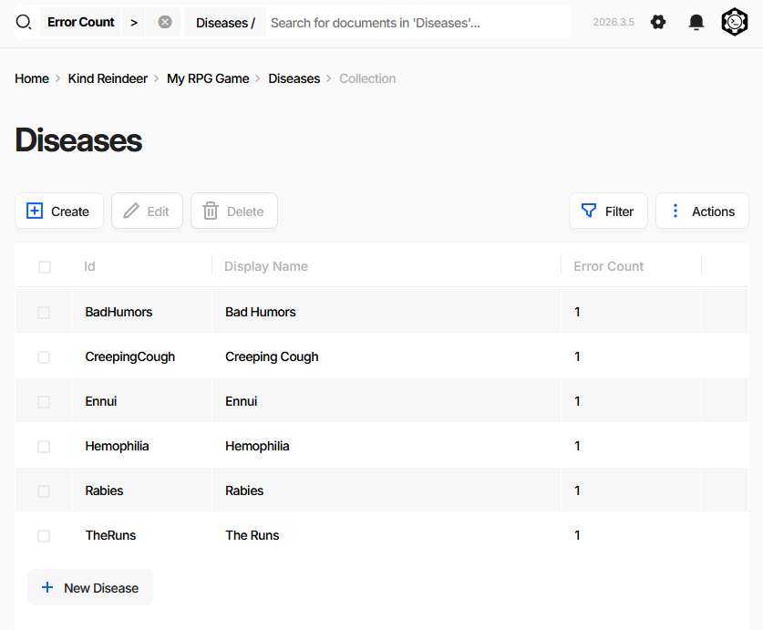
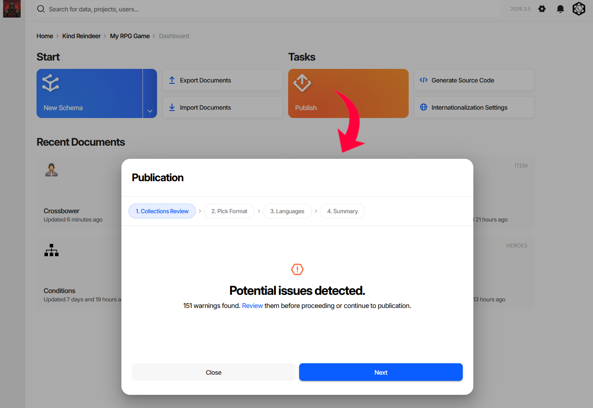
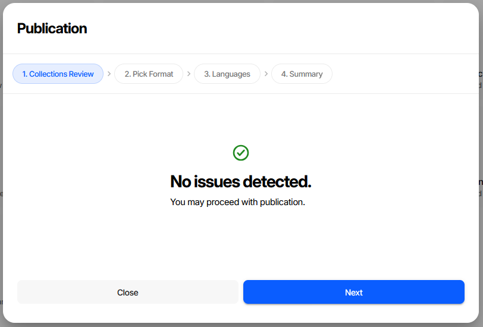
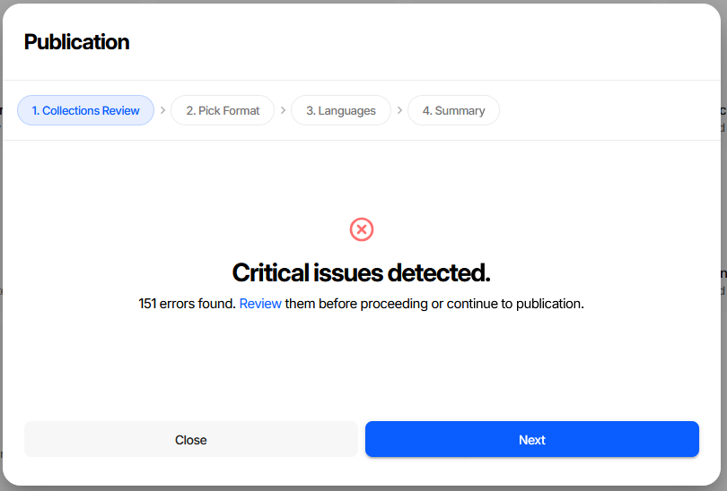
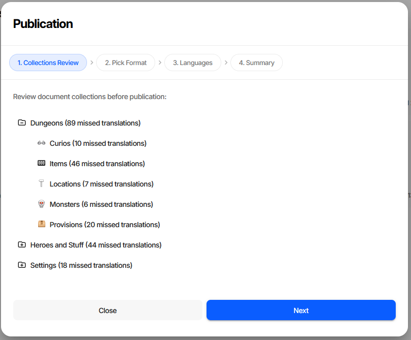

Validation
==========

Charon validates game data at several points in the editing lifecycle: while a document is being edited,
on every save, on import, before publication, and on demand via ``DATA VALIDATE``. The editor surfaces
problems where you will run into them; the CLI exposes the same engine through a flag system you can tune
for bulk workflows such as CI pipelines or large data migrations.

.. contents:: On this page
   :local:
   :depth: 2

----

Where Validation Appears in the Editor
--------------------------------------

Three places, in the order you normally meet them:

- **The document form** - per-field errors while editing and after a rejected save.
- **A collection's error view** - the list of documents in one collection that currently have errors.
- **The Publication wizard** - a project-wide review of every collection before you ship.

Errors in the Document Form
^^^^^^^^^^^^^^^^^^^^^^^^^^^

Two kinds of message appear under a field, and they behave differently:

- **Red - an error.** ``A value is required.`` in the screenshot. The server rejects the save until it is
  fixed, or until you explicitly bypass validation.
- **Orange - a warning.** ``Missing translation for: Spanish (Spain)``. Checked in the browser only, never
  blocks a save. See :doc:`Internationalization (i18n) <internationalization>` for filling these in.

When a save is rejected, the **Save** button changes to **Save Anyway** and shows a badge with the number
of errors. Clicking it again writes the document with checks turned off - repairs still run, but nothing is
reported. Use it for work in progress you intend to fix later; the document keeps its error count and shows
up in the views below until it is fixed.

Keyboard shortcuts on the Save button:

+-------------------------+----------------------------------------------+
| Shortcut                | Action                                       |
+=========================+==============================================+
| :kbd:`Ctrl` + :kbd:`S`  | Save                                         |
+-------------------------+----------------------------------------------+
| :kbd:`Ctrl` + click     | Save & close                                 |
+-------------------------+----------------------------------------------+
| :kbd:`Shift` + click    | Save ignoring errors                         |
+-------------------------+----------------------------------------------+

Saving a document runs ``repair``, ``repairRequiredWithDefaults`` and all six integrity checks.
It does **not** run ``checkTranslations`` - that is why a missing translation is only a warning here.

Finding Documents with Errors
^^^^^^^^^^^^^^^^^^^^^^^^^^^^^

Every collection has a built-in errors view: the document list with an **Error Count** column, filtered to
``Error Count > 0``.

The fastest way to reach it is the Publication wizard - clicking a collection in the review tree opens that
collection already filtered this way. The filter chip stays visible in the search bar, so you can clear it
to return to the full list.

Error counts come from a background pass over the whole database using ``AllIntegrityChecks`` **plus**
``checkTranslations``. This is a wider profile than the one used when saving, so a document can be clean at
save time and still be counted here - untranslated text being the usual reason.

Reviewing Before Publication
^^^^^^^^^^^^^^^^^^^^^^^^^^^^

**Publish** on the dashboard opens the Publication wizard. Its first step, *Collections Review*, is a
project-wide validation report.

The step opens with a summary in one of three states. Above is the middle one - **warnings**, meaning
missing translations only. Publication will succeed; the shipped data will have gaps in the affected
languages.

**No issues** - nothing to fix, proceed.

**Critical issues** - real integrity errors: broken references, missing required values, format problems.
Fix these before publishing. Generated code and game-side loaders assume the data satisfies the schema, so
a dangling reference or a missing required value usually shows up at runtime as a null reference or a
failed load rather than as anything visible in the editor.

**Review** replaces the summary with a per-collection tree:

Each node is annotated with what was found: ``N issues`` counts integrity errors, ``N missed translations``
counts untranslated text. Collections with nothing wrong are marked with a check. Clicking a collection
opens its errors view, described above.

.. warning::
   Publication is never blocked - **Next** stays enabled in all three states. Treat the two severities
   differently. *Missed translations* ship as visible gaps in the affected languages: undesirable, but the
   game runs. *Critical issues* are broken data that will most likely crash the game or fail to load, and
   should be fixed before publishing rather than after. To enforce a clean state automatically, run
   ``DATA VALIDATE --output err`` in CI; see `Exit Code Behaviour`_.

**CLI equivalent**

``DATA EXAMINE`` returns the same per-collection statistics that populate the review tree:

.. code-block:: bash

   dnx dotnet-charon -- DATA EXAMINE --dataBase "gamedata.json"

``DATA VALIDATE`` returns the individual errors behind those counts:

.. code-block:: bash

   dnx dotnet-charon -- DATA VALIDATE \
     --dataBase "gamedata.json" \
     --validationOptions checkRequirements checkFormat checkUniqueness \
                         checkReferences checkSpecification checkConstraints checkTranslations \
     --output out --outputFormat json

----

When Validation Runs
--------------------

+-------------------------------------------+---------------------------------------------+
| Trigger                                   | Default preset                              |
+===========================================+=============================================+
| Document save (UI / API CREATE or UPDATE) | ``DefaultForCreate`` / ``DefaultForUpdate`` |
+-------------------------------------------+---------------------------------------------+
| Document save with *Save Anyway*          | repairs only, no checks                     |
+-------------------------------------------+---------------------------------------------+
| ``DATA IMPORT``                           | ``DefaultForBulkChange``                    |
+-------------------------------------------+---------------------------------------------+
| ``DATA I18N IMPORT``                      | ``DefaultForBulkChange``                    |
+-------------------------------------------+---------------------------------------------+
| ``DATA VALIDATE`` (on demand)             | ``AllIntegrityChecks``                      |
+-------------------------------------------+---------------------------------------------+
| Error counts and publication review       | ``DefaultForBackgroundValidation``          |
+-------------------------------------------+---------------------------------------------+

What the presets expand to:

+------------------------------------+-------------------------------------------------------------+
| Preset                             | Flags                                                       |
+====================================+=============================================================+
| ``AllIntegrityChecks``             | the six ``check*`` flags, **without** ``checkTranslations`` |
+------------------------------------+-------------------------------------------------------------+
| ``DefaultForCreate`` /             | ``repair``, ``repairRequiredWithDefaults``,                 |
| ``DefaultForUpdate``               | ``AllIntegrityChecks``                                      |
+------------------------------------+-------------------------------------------------------------+
| ``DefaultForBulkChange``           | ``repair``, ``deduplicateIds``,                             |
|                                    | ``repairRequiredWithDefaults``,                             |
|                                    | ``resolveConflictingUnions``                                |
+------------------------------------+-------------------------------------------------------------+
| ``DefaultForBackgroundValidation`` | ``AllIntegrityChecks``, ``checkTranslations``               |
+------------------------------------+-------------------------------------------------------------+

.. warning::
   ``DefaultForBulkChange`` contains **no integrity checks**. By default ``DATA IMPORT`` and
   ``DATA I18N IMPORT`` repair what they can and report nothing - broken references or missing required
   values land in the data silently. Pass ``--validationOptions`` explicitly, or follow the import with a
   ``DATA VALIDATE`` run, whenever the input is not fully trusted.

All defaults can be overridden with ``--validationOptions`` on the relevant command.

----

Validation Flags
----------------

Flags are combined to form a validation profile. Pass multiple flags as space-separated values:

.. code-block:: bash

   dnx dotnet-charon -- DATA VALIDATE --dataBase gamedata.json \
       --validationOptions checkRequirements checkReferences checkFormat

Integrity check flags
^^^^^^^^^^^^^^^^^^^^^

These flags **report errors** without modifying data.

``checkRequirements``
   Every property marked **Not Null** or **Not Empty** must have a value.

``checkFormat``
   Values must match the declared data type format - e.g. ``Date`` must be ISO 8601,
   ``Number`` must not be a string, ``PickList`` value must be in the defined list.

``checkUniqueness``
   Properties marked **Unique** or **Unique In Collection** must have no duplicates.

``checkReferences``
   Every :doc:`Reference <../gamedata/datatypes/all/reference>` and
   :doc:`ReferenceCollection <../gamedata/datatypes/all/reference_collection>` must point to a
   document that exists.

``checkSpecification``
   Values must satisfy constraints declared in the :doc:`Specification <../gamedata/schemas/specification>`
   field of the schema or property (used by extension editors and code-generation plugins).

``checkConstraints``
   Structural invariants: valid pick-list values, formula syntax, collection size limits
   defined via ``Size`` on the property.

``checkTranslations``
   Every :doc:`LocalizedText <../gamedata/datatypes/all/localized_text>` field must have a
   translation for each language declared in Project Settings. Detects untranslated strings
   before shipping. Not part of ``AllIntegrityChecks`` - request it explicitly.

Repair flags
^^^^^^^^^^^^

Repair flags **automatically fix** certain problem classes before integrity checks run.
They modify the data in-place (or within the import transaction).

``repair``
   Master switch - without it the repair pass is skipped entirely and the other repair flags
   have no effect.

``deduplicateIds``
   If multiple documents in the same collection share the same ``Id``, each duplicate gets
   a new auto-generated Id.

``repairRequiredWithDefaults``
   A missing required field is filled with the property's **Default Value** if one is defined.

``eraseInvalidValues``
   A field whose value cannot be parsed as the declared data type is set to ``null``.

``resolveConflictingUnions``
   Fixes malformed :doc:`Union <../gamedata/schemas/schema_types>` values: a union with two or more
   variants set keeps the **last** variant in schema order and drops the rest; an empty union with no
   variant set is erased to ``null``.

----

Validation Report Format
------------------------

Both ``DATA VALIDATE`` and ``DATA IMPORT`` can emit a structured validation report:

.. code-block:: json

   {
     "records": [
       {
         "id": "<document-id>",
         "schemaId": "<schema-id>",
         "schemaName": "<schema-name>",
         "errors": [
           {
             "path": "<json-pointer to field>",
             "message": "<human-readable description>",
             "code": "<machine-readable error code>"
           }
         ]
       }
     ]
   }

Documents with no errors are omitted. An empty ``records`` array means the data is valid.

----

Exit Code Behaviour
-------------------

The exit code is ``1`` **only when** the report contains errors **and** ``--output`` is set
to ``err`` (standard error). In all other cases the exit code is ``0``, even if the report
file contains errors.

This design makes it easy to use validation in CI:

.. code-block:: bash

   # Fail the pipeline if there are any integrity errors
   dnx dotnet-charon -- DATA VALIDATE --dataBase gamedata.json \
       --validationOptions checkRequirements checkReferences checkFormat \
       --output err
   # Exit code 1  →  CI step fails

   # Write report to a file without failing the step
   dnx dotnet-charon -- DATA VALIDATE --dataBase gamedata.json \
       --output validation_report.json --outputFormat json
   # Exit code 0  →  CI step passes; inspect the file separately

----

Common Recipes
--------------

Skip all checks (import prototype data)
^^^^^^^^^^^^^^^^^^^^^^^^^^^^^^^^^^^^^^^^

.. code-block:: bash

   dnx dotnet-charon -- DATA IMPORT --dataBase gamedata.json --input prototype.json \
       --validationOptions none

The UI equivalent is the *Ignore consistency errors in imported data* checkbox in the import wizard.

Auto-repair + full check on import
^^^^^^^^^^^^^^^^^^^^^^^^^^^^^^^^^^^^

.. code-block:: bash

   dnx dotnet-charon -- DATA IMPORT --dataBase gamedata.json --input data.json \
       --validationOptions repair deduplicateIds repairRequiredWithDefaults \
                          checkRequirements checkReferences checkFormat

Fix union conflicts after schema refactor
^^^^^^^^^^^^^^^^^^^^^^^^^^^^^^^^^^^^^^^^^^

.. code-block:: bash

   dnx dotnet-charon -- DATA IMPORT --dataBase gamedata.json --input data.json \
       --validationOptions repair resolveConflictingUnions

Check for untranslated strings
^^^^^^^^^^^^^^^^^^^^^^^^^^^^^^^^

Reproduces what the publication review counts as *missed translations*:

.. code-block:: bash

   dnx dotnet-charon -- DATA VALIDATE --dataBase gamedata.json \
       --validationOptions checkTranslations --output out --outputFormat json

Gate a build on a clean publication review
^^^^^^^^^^^^^^^^^^^^^^^^^^^^^^^^^^^^^^^^^^^

.. code-block:: bash

   dnx dotnet-charon -- DATA VALIDATE --dataBase gamedata.json \
       --validationOptions checkRequirements checkFormat checkUniqueness \
                           checkReferences checkSpecification checkConstraints \
       --output err

----

Dry Run vs Validate
-------------------

- ``DATA VALIDATE`` checks the **current state** of the database.
- ``DATA IMPORT --dryRun`` simulates the full import pipeline inside a transaction, then
  rolls back. Use this to preview the post-import state and catch referential errors before
  committing. The UI equivalent is the *Perform a dry run and don't persist changes* checkbox.

See also
--------

- :doc:`Publishing Game Data <../gamedata/publication>`
- :doc:`Internationalization (i18n) <internationalization>`
- :doc:`Importing and Exporting Data <import_export>`
- :doc:`DATA VALIDATE Command <commands/data_validate>`
- :doc:`DATA EXAMINE Command <commands/data_examine>`
- :doc:`DATA IMPORT Command <commands/data_import>`
- :doc:`Schema Types <../gamedata/schemas/schema_types>`
- :doc:`Property <../gamedata/properties/property>`
