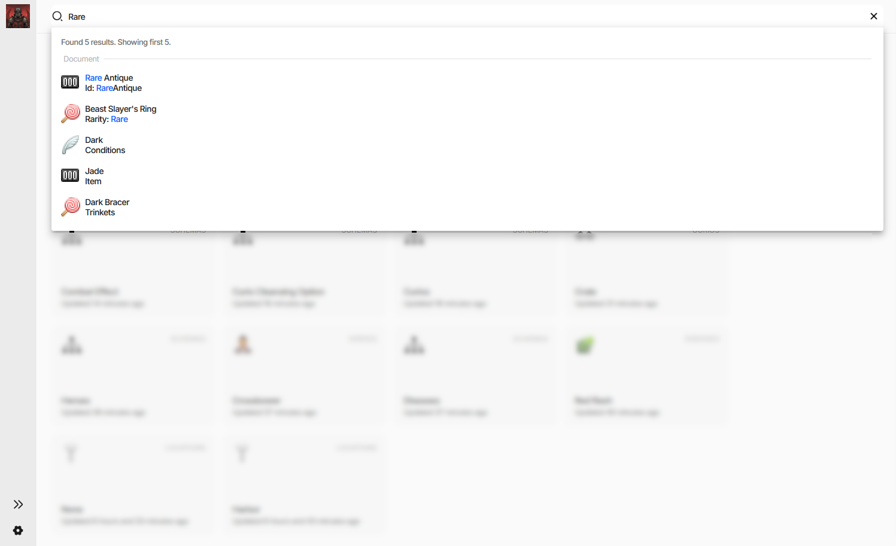
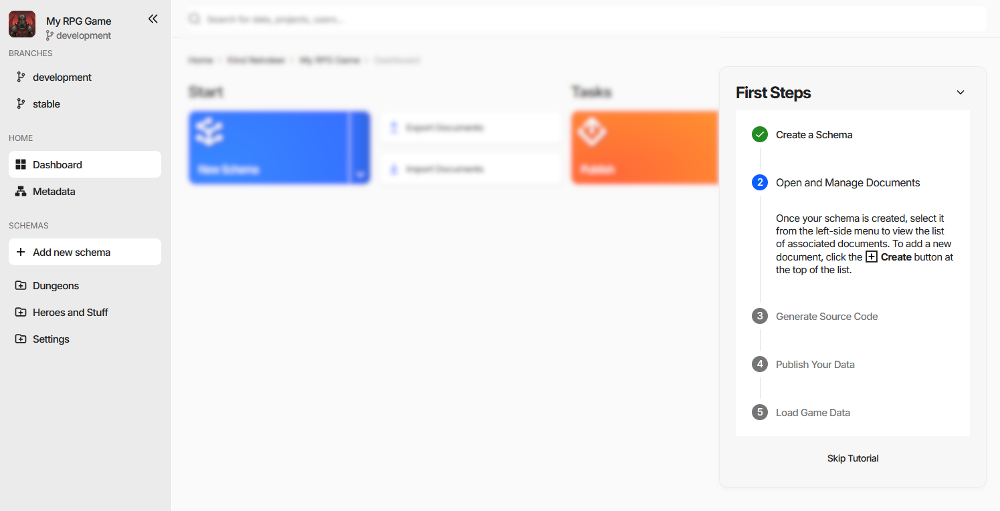

Basic Navigation and User Interface Overview
============================================

The editor is the same in every edition - the standalone application, the Unity and Unreal Engine plugins,
and the web editor. This page is a tour of what is on the screen; the pages it links to explain the work
done there.

.. contents:: On this page
   :local:
   :depth: 2

----

The Editor Window
-----------------

.. figure:: ./dashboard.png

Three regions, and they stay put:

- **The side navigation** on the left - branches, the dashboard, and every schema in the project.
- **The search field** across the top.
- **The working area** in the middle - the dashboard, a document collection, or a document form, with a
  breadcrumb above it that tracks where you are.

----

Side Navigation
---------------

From the top:

- **The project** - its icon, its name, and the branch currently open.
- **Branches** - the other branches of the project, one click to switch. Web editor only, see
  :doc:`Workspaces, Projects, and Branches <../web/workspaces_and_projects>`.
- **Home** - the **Dashboard**, and **Metadata**, which is the list of schemas.
- **Schemas** - every schema that is visible in the menu, arranged into the folders its **Group** field
  names, plus **Add new schema**.
- **Project Settings** at the bottom.

Installed :doc:`extensions <../advanced/extensions/overview>` can add entries of their own here, either in the
**Home** group or in a section of their own.

The ``«`` button collapses the whole panel to a narrow rail of icons, and ``»`` brings it back - worth doing
on a laptop screen when a collection has many columns.

----

Dashboard
---------

The landing page of a project, and what the side navigation returns to.

- **Start** - create a schema, export, import.
- **Tasks** - publish, generate source code, internationalization settings.
- **Recent Documents** - what you had open lately, newest first, each card naming the collection it belongs
  to.

In the web editor the dashboard also shows which teammates are in the project at the same time.

----

Global Search
-------------

The field at the top searches the whole project rather than the current page.

It matches documents on their display text **and** on their field values - the screenshot finds an item
called *Rare Antique* and, separately, a ring whose *Rarity* field is set to *Rare*. Results are grouped by
what they are, the header says how many were found, and the matched part of each hit is highlighted. In the
web editor the same field also finds projects and users.

Inside a collection the field narrows its scope to that collection and gains filtering; see
:doc:`Finding Documents <filling_documents>`.

.. note::
   The screenshot also shows the side navigation collapsed to its icon rail.

----

First Steps
-----------

A new project opens with a guide docked to the right of the dashboard.

Five steps - create a schema, open and manage documents, generate source code, publish, load the game data -
each ticked off as you do it, with the current one expanded into instructions. The header chevron collapses
the card, **Skip Tutorial** dismisses it for good.

----

The Working Area
----------------

Selecting a schema in the side navigation opens its **document collection**, a grid of every document of
that schema. Opening one of those documents replaces the grid with the **document form**.

Those two screens are where nearly all the work happens, and each has a page of its own:
:doc:`Filling Documents <filling_documents>` and :doc:`Editing a Document <document_form>`.

----

Tips and Keyboard Shortcuts
---------------------------

- **Jump to a referenced document** - hold :kbd:`Ctrl` and click any reference value to open the referenced
  document's form. This works on references throughout the UI.
- **Move between documents without going back** - :kbd:`Alt/⌘+←` and :kbd:`Alt/⌘+→` walk the collection
  from inside the form, filters and sorting included.
- **Reorder or copy an embedded document** - inside a document form, drag a collection entry by its panel
  header to move it, or hold :kbd:`Ctrl` while dropping to copy it. See
  :doc:`Editing a Document <document_form>`.
- The collection grid and the document form have shortcuts of their own, listed on their pages.

See also
--------

- :doc:`Creating Document Type (Schema) <creating_schema>`
- :doc:`Filling Documents <filling_documents>`
- :doc:`Editing a Document <document_form>`
- :doc:`Publishing Game Data <publication>`
- :doc:`Generating Source Code <generating_source_code>`
