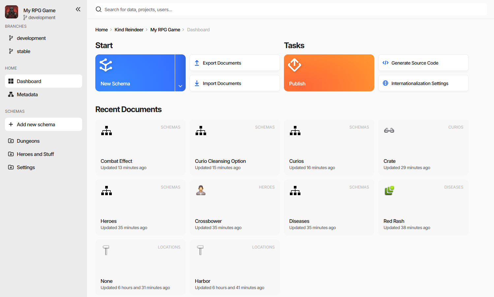
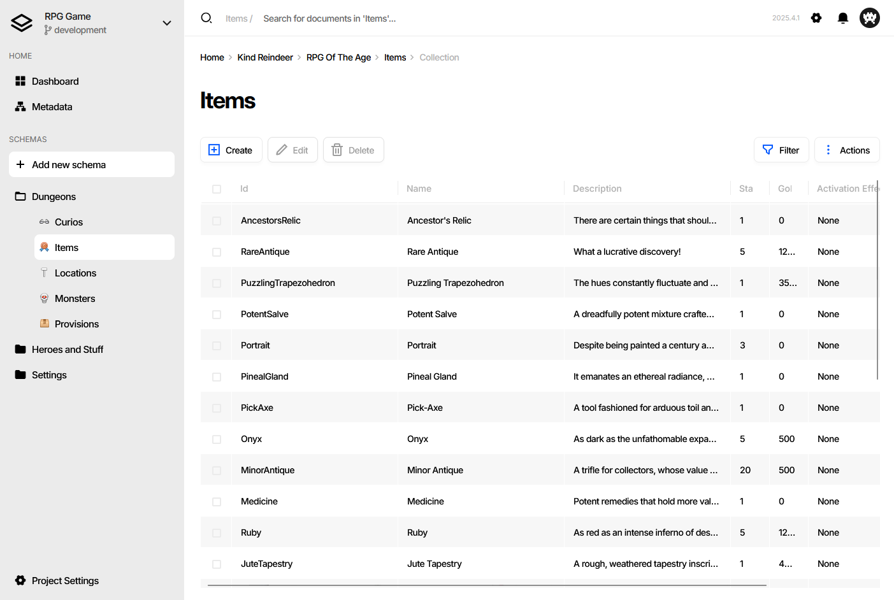
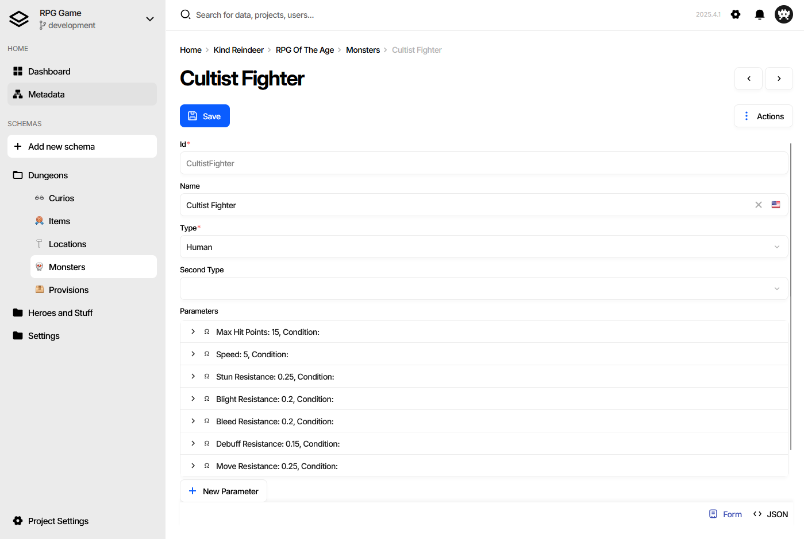

Basic Navigation and User Interface Overview
============================================

The UI consists of a left-side menu displaying all schemas of the game data, a middle working area with a dashboard/document list or document form, and a headline on the top with the project name and settings button. Depending on the installation, the UI may also include a user menu.  

Dashboard
---------

The dashboard is a central hub in the game data's user interface that provides quick access to frequently used features. It includes quick action buttons, such as creating a new schema, export, import, as well as a list of recently visited documents.  
Additionally, in the case of a web application, the dashboard may display the presence of online members who are currently working in the same project.  

Document Collection
-------------------
The document collection page is place where user can view a list of all the documents of a specified schema. This page allows users to filter, sort, and customize the list to their liking, making it easier to find the specific document they need.  

Document Form
-------------
The document form page provides a specific edit form for a selected document. Here, users can view, edit, and save their game data documents in a structured and organized manner. The form allows users to input data into fields that correspond to the schema's properties. The document form page provides a user-friendly interface for updating and modifying game data.  

Tips and Keyboard Shortcuts
---------------------------

A few useful interactions that are easy to miss:

- **Duplicate a document** - hold :kbd:`Ctrl` and drag-and-drop the document within its
  collection. Dropping without :kbd:`Ctrl` moves it instead.
- **Copy between collections** - drag-and-drop a document into another collection of the same
  schema type.
- **Jump to a referenced document** - hold :kbd:`Ctrl` and click any reference value to open
  the referenced document's edit form. This works on all references throughout the UI.

See also
--------

- :doc:`Creating Document Type (Schema) <creating_schema>`
- :doc:`Filling Documents <filling_documents>`
- :doc:`Editing a Document <document_form>`
- :doc:`Publishing Game Data <publication>`
- :doc:`Generating Source Code <generating_source_code>`
