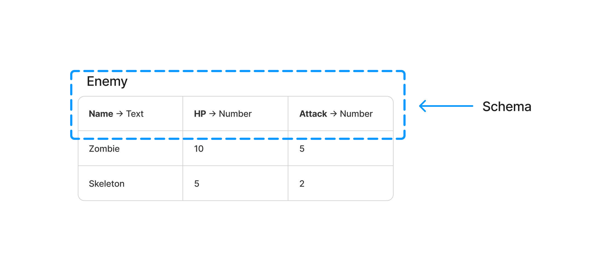
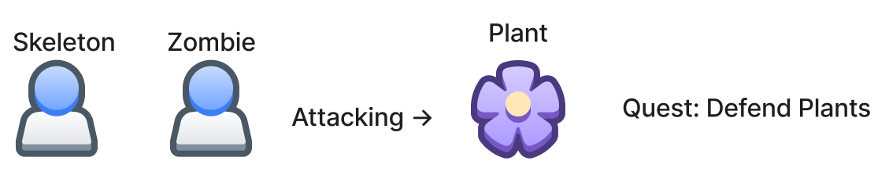
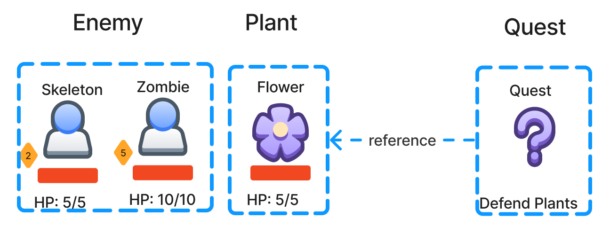
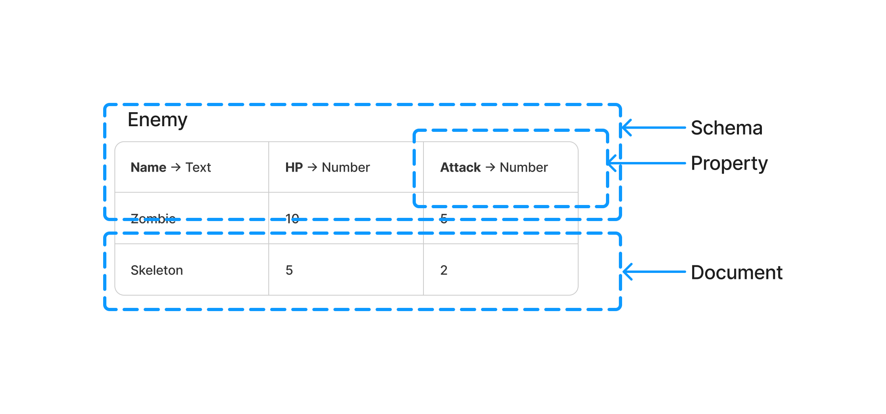

Creating Document Type (Schema)
===============================

Schema
------

Schema is essential for organizing and defining game data in a structured framework. In the context of game data modeling, a schema serves as a blueprint or template that establishes the structure and properties of a particular type of data entity in a game. It defines the columns or fields that represent the various attributes of the entity, similar to how a table has columns or a spreadsheet has cells.

Benefits of Structured Data
---------------------------

Data Organization
^^^^^^^^^^^^^^^^^

The organization of game data into logical entities and attributes is facilitated by the schema. This blueprint or template defines the structure, properties, and relationships of different entities and attributes within the game data, ensuring efficient storage, retrieval, and management.

Data Validation
^^^^^^^^^^^^^^^

The integrity and adherence to predefined rules of the game data are ensured through the validation capabilities of the schema. Constraints and validations, such as data types, allowed values, and dependencies, can be defined, preventing errors and inconsistencies in the game data.

Data Consistency
^^^^^^^^^^^^^^^^

Consistency across the game data is achieved through the standardized structure and rules provided by the schema. It enforces a consistent naming convention, attribute definitions, and relationships between entities, thereby enhancing coherence and simplifying collaboration.

Data Interoperability
^^^^^^^^^^^^^^^^^^^^^

Interoperability and integration with external systems or tools are facilitated by a well-defined schema. By establishing a common language and structure, the schema enables seamless data exchange and collaboration with localization tools, analytics platforms, and asset pipelines.

Analyzing Game Requirements
---------------------------

This step involves analyzing the game requirements to understand the design and functionality of the game. It includes studying the game design document and identifying key features, gameplay mechanics, and data elements that need to be captured and represented in the game.

Identifying Entities and Relationships 
--------------------------------------

In this step, entities and their relationships within the game are identified. Entities can be objects, characters, locations, items, quests, or any other significant element in the game. Relationships define how these entities are connected or interact with each other.

Defining Schemas and Properties
-------------------------------

This step involves defining schemas to represent the structure and properties of the game data. A schema serves as a blueprint or template for a specific type of data entity, specifying its properties, attributes, and relationships. Properties describe the characteristics and attributes of an entity, such as its name, description, stats, or any other relevant information.

.. toctree::
   :caption: Data Types
   :titlesonly:
   :glob:

   /datatypes/data_types
   /datatypes/*
