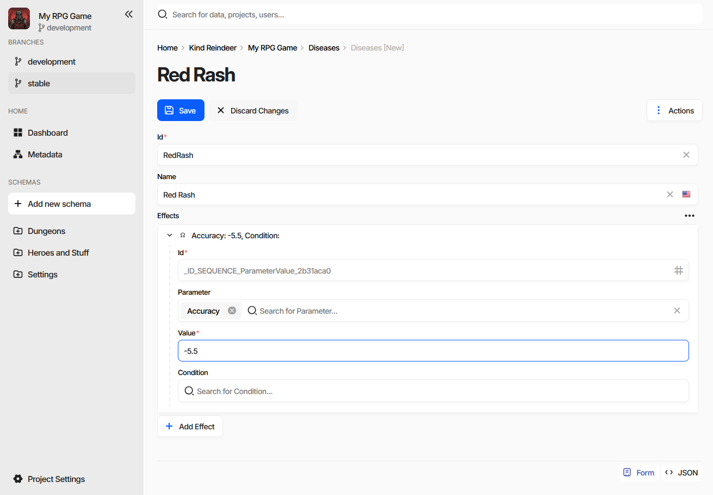
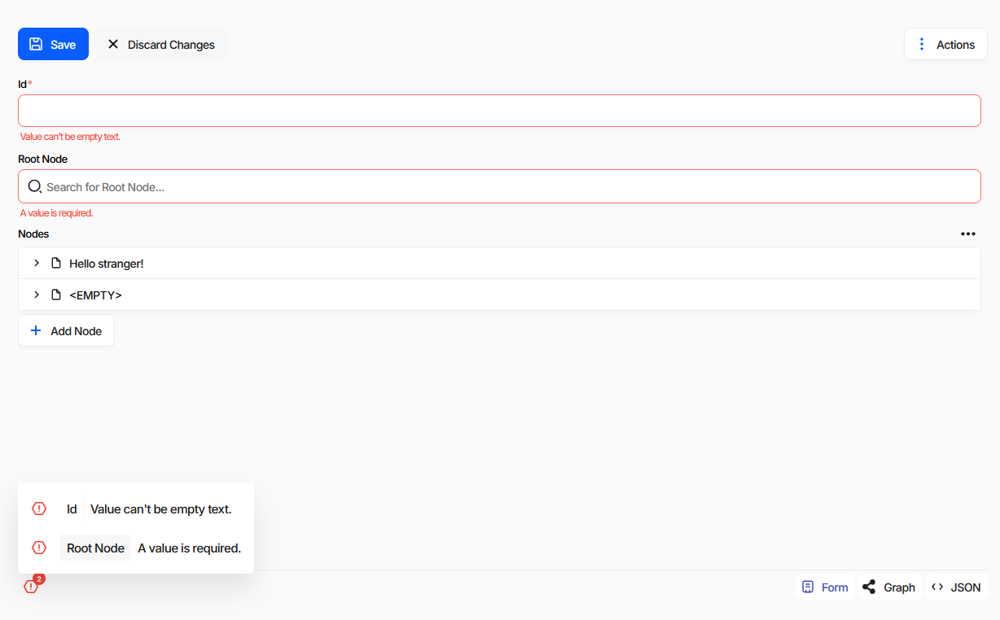
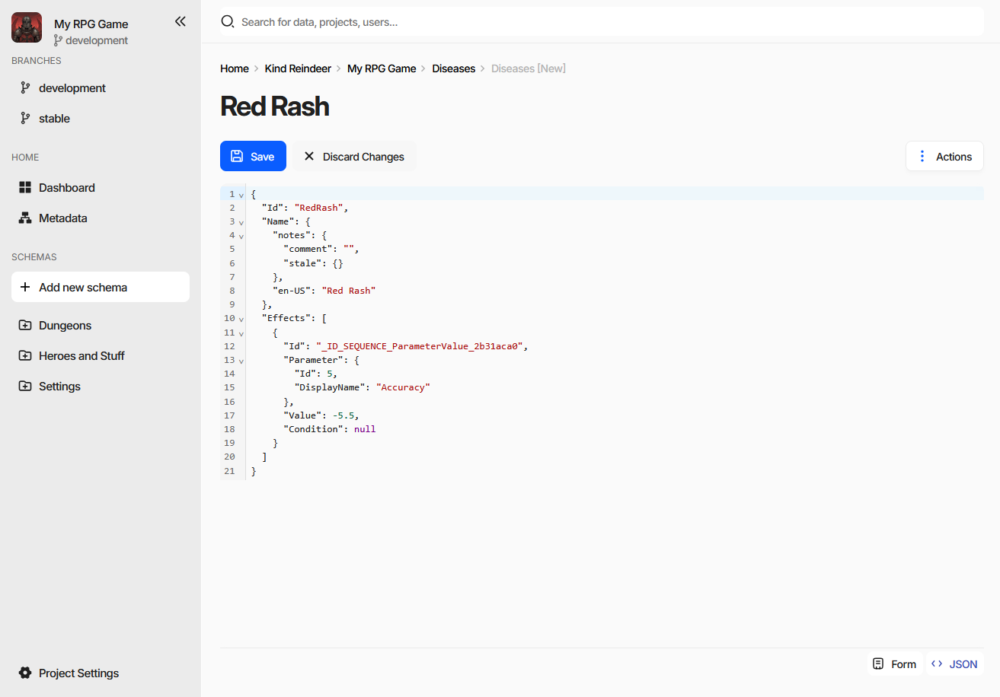
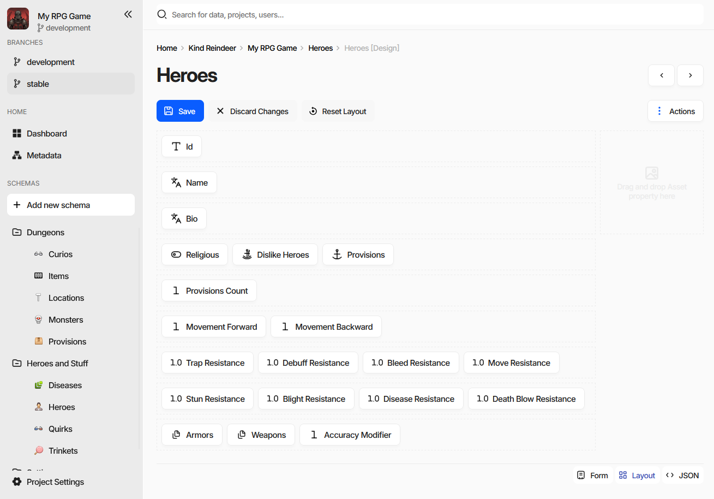
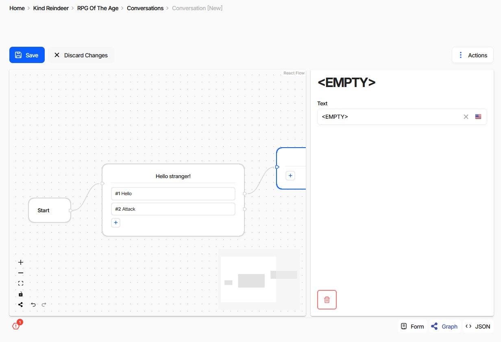
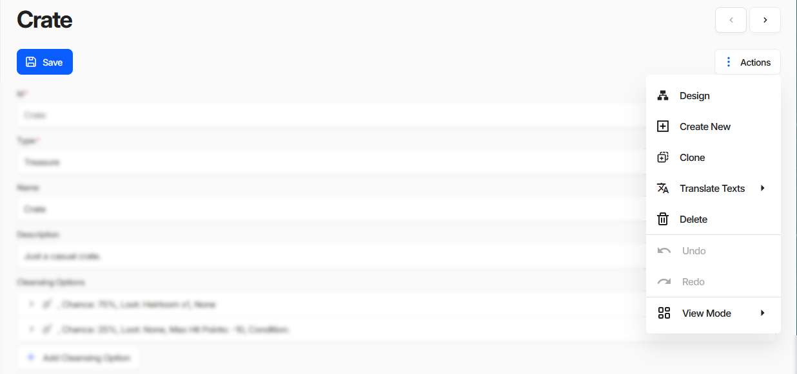

Editing a Document
==================

The document form is the full editor for a single document. The grid on the collection page is faster for
short values, but everything that does not fit a table cell - embedded collections, localized text, long
descriptions - is edited here.

.. contents:: On this page
   :local:
   :depth: 2

----

Opening the Form
----------------

From the :doc:`collection page <filling_documents>`: ``Create`` for a new document, ``Edit`` for the
selected one, or :kbd:`Ctrl` + click on a row. Elsewhere in the editor, :kbd:`Ctrl` + click on any reference
value opens the form of the referenced document.

The heading is the document's rendered :doc:`display text <schemas/display_text_template>`, not its ``Id``,
so it changes as you type. ``Save`` and ``Discard Changes`` sit above the fields, ``Actions`` on the right,
and the view mode switch in the bottom right corner.

Moving Between Documents
^^^^^^^^^^^^^^^^^^^^^^^^

The ``‹`` and ``›`` buttons next to the heading open the previous and the next document without going back
to the collection - :kbd:`Alt/⌘+←` and :kbd:`Alt/⌘+→` do the same. They follow the order of the list the
form was opened from, filters and sorting included, so reviewing a filtered set is a matter of pressing one
key repeatedly.

They are disabled on the first and the last document, and when the form was reached in a way that has no
position in a list - by following a reference, for instance.

----

Fields
------

Each field is the editor of the property's :doc:`data type <datatypes/list>` - a text box, a number field,
a date picker, a reference search box, and so on. A red asterisk after the label marks a required property.

- **Localized text** carries a flag button that switches the language being edited. See
  :doc:`Internationalization <../advanced/internationalization>`.
- **References** are search boxes; typing filters candidate documents by their display text.
- **Embedded documents and collections** appear as expansion panels with an ``Add`` button below them, so a
  whole subtree is edited in place without leaving the document.

Reordering and Reusing Embedded Documents
^^^^^^^^^^^^^^^^^^^^^^^^^^^^^^^^^^^^^^^^^

The panels of an embedded collection can be dragged by their header:

- **within the same collection** - the entries swap places, which is how the order of a collection is
  changed;
- **into another collection of the same schema** - anywhere on the form - the entry moves out of the first
  one and into the second;
- **holding** :kbd:`Ctrl` - the entry is copied instead of moved. The copy is a clone with its identifiers
  cleared, so it becomes a new document rather than a second appearance of the same one.

Only collections of the same schema accept each other's entries, and nothing can be dragged while the form
is read-only. This works on the collection fields of a form; the grid on the
:doc:`collection page <filling_documents>` is not a drop target.

----

Saving
------

``Save`` writes the document and makes it visible to everyone else; ``Discard Changes`` reverts it to the
last saved state. Both appear only when something has changed.

.. list-table::
   :header-rows: 1
   :widths: 45 55

   * - Action
     - Shortcut
   * - Save
     - :kbd:`Ctrl/⌘+S`
   * - Save and return to the collection
     - :kbd:`Ctrl/⌘` + click on ``Save``
   * - Save ignoring validation errors
     - :kbd:`Shift` + click on ``Save``
   * - Undo / Redo
     - :kbd:`Ctrl/⌘+Z` / :kbd:`Ctrl/⌘+Y`

.. note::
   There is no three-way merge. If two people save the same document, the last save wins. In practice
   collisions are rarer than that sounds, because only the fields you actually changed are written - two
   people working on different properties of the same document do not overwrite each other.

----

Validation Errors
-----------------

Fields that fail validation are outlined in red with the reason under them, and a counter appears in the
bottom left corner. Clicking it lists every problem in the document with the field it belongs to.

``Save`` still works. When the document has errors the button becomes ``Save Anyway`` and carries a badge
with their number.

.. note::
   **Broken data is allowed while you work on it.** Empty required fields, references to documents that do
   not exist yet, formulas that do not parse - none of it blocks a save, here or in the CLI. Half-finished
   data is a normal state during development.

   The tolerance ends at publication: generated code and the game-side loaders assume the data satisfies the
   schema. See :doc:`Validation <../advanced/validation>` and the review step of the
   :doc:`Publication wizard <publication>`.

----

View Modes
----------

The switch in the bottom right corner changes how the document is presented. The same modes are listed under
``Actions`` → ``View Mode``. Two of the four are conditional - they appear only where they mean something.

.. list-table::
   :header-rows: 1
   :widths: 20 80

   * - Mode
     - Available
   * - Form
     - Always.
   * - JSON
     - Always.
   * - Layout
     - Only when the document being edited is a schema.
   * - Graph
     - Only when an extension provides a custom editor for the schema.

JSON
^^^^

The document as it is actually stored, in an editor with syntax highlighting and folding.

It is editable: changes made here go through the same save as the form. When the game data is read-only the
JSON is shown as plain text instead. Useful for pasting a document in whole, for checking what a localized
text or a reference really holds, and for reading the structure that
:doc:`import and export <../advanced/import_export>` expect.

Layout
^^^^^^

Layout mode is not a way to view data - it edits the *schema*, deciding how that schema's properties are
arranged on the document form. It is therefore offered only while editing a schema, which the breadcrumb
marks as ``[Design]``.

Each property is a chip. Drag chips to reorder them and to group several onto one row. The area on the right
takes an *Asset* property, which is then displayed beside the form instead of in it. ``Reset Layout``
returns the schema to the default one-property-per-row arrangement.

Every document of that schema uses the layout from then on, so it is worth arranging the schemas your team
fills most often - related fields side by side beat scrolling through forty rows.

Graph
^^^^^

Graph mode belongs to :doc:`extensions <../advanced/extensions/overview>`. When an extension registers a custom
editor for a schema, that editor is shown here; without one the mode does not appear at all. Writing one is
:doc:`Implementing a Schema Editor <../advanced/extensions/implementing_schema_editor>`.

The screenshot is a conversation editor extension: dialogue nodes on a canvas, links between them as edges,
and the selected node's fields in the panel on the right. It edits the same document as the form - the nodes
are the entries of an embedded document collection - so the two modes can be switched between freely, and
the error counter keeps working in both.

----

The Actions Menu
----------------

.. list-table::
   :header-rows: 1
   :widths: 25 75

   * - Entry
     - What it does
   * - ``Design``
     - Opens the schema of this document in the schema editor. Hidden when the document already is a schema.
   * - ``Create New``
     - Opens an empty form for the same schema.
   * - ``Clone``
     - Opens a copy of the current document as a new one.
   * - ``Translate Texts``
     - Machine-translates the localized text of this document - everything, only what is missing, or only
       what is marked stale. Requires the machine translation feature, see
       :doc:`Internationalization <../advanced/internationalization>`.
   * - ``Delete``
     - Deletes the document and returns to the collection.
   * - ``Undo`` / ``Redo``
     - Step through the changes made since the form was opened.
   * - ``View Mode``
     - The same modes as the switch in the corner.

Schema forms replace ``Design`` with ``Show advanced options``, which reveals the rarely used fields of a
schema and its properties.

----

When the Form Is Read-Only
--------------------------

The editing buttons are hidden and a banner explains why. There are three of them:

- **the game data is read-only** - insufficient permissions, a subscription plan limit, or a data source
  that is read-only to begin with;
- **you do not have permission to edit this document**, see
  :doc:`Roles and Permissions <../web/permission_and_roles>`;
- **the document is protected from modifications** and cannot be edited at all.

----

See also
--------

- :doc:`Filling Documents <filling_documents>`
- :doc:`Creating Document Type (Schema) <creating_schema>`
- :doc:`Data Types <datatypes/list>`
- :doc:`Internationalization <../advanced/internationalization>`
- :doc:`Validation <../advanced/validation>`
- :doc:`Publishing Game Data <publication>`
