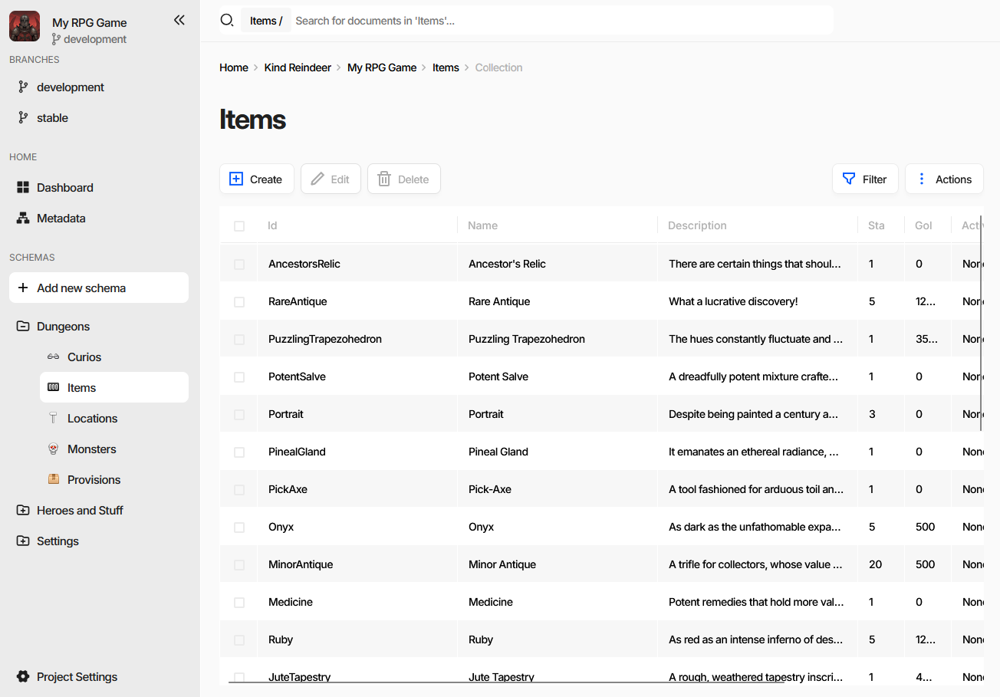
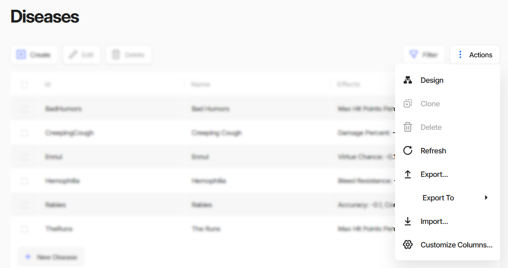
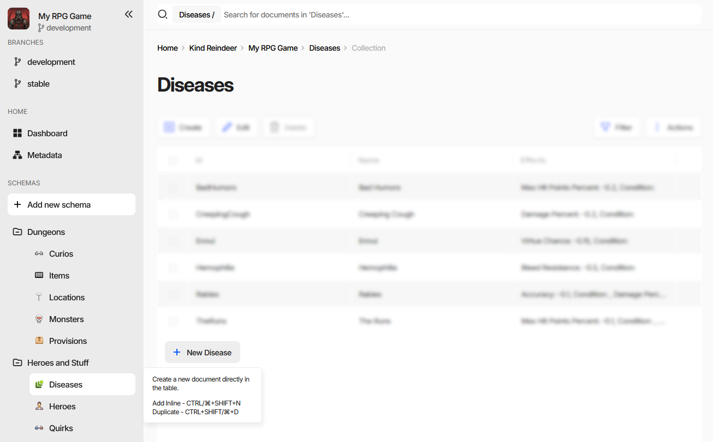
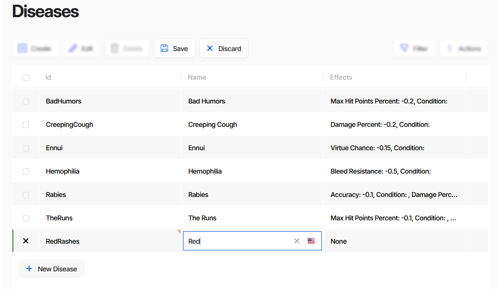
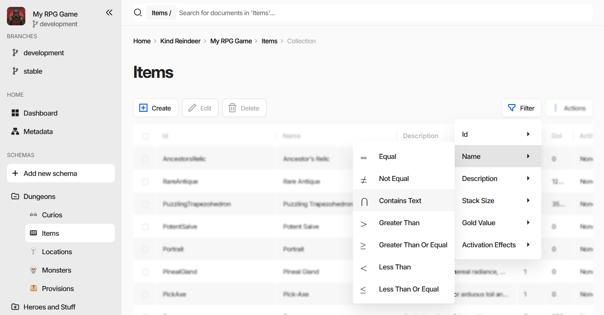
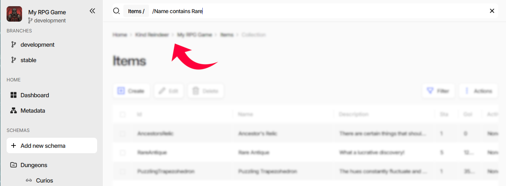
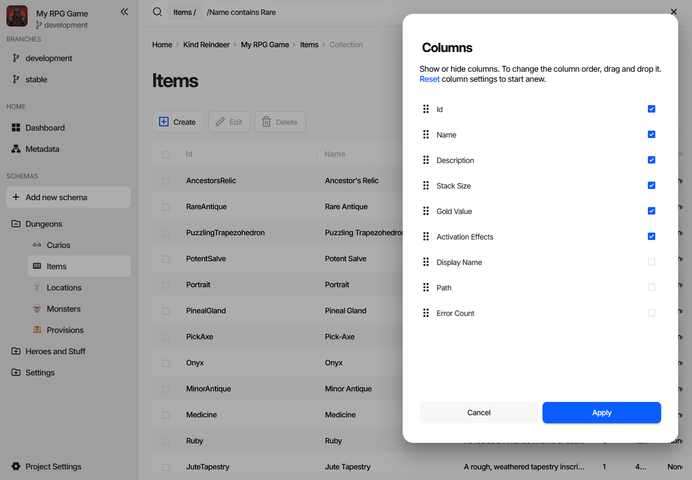
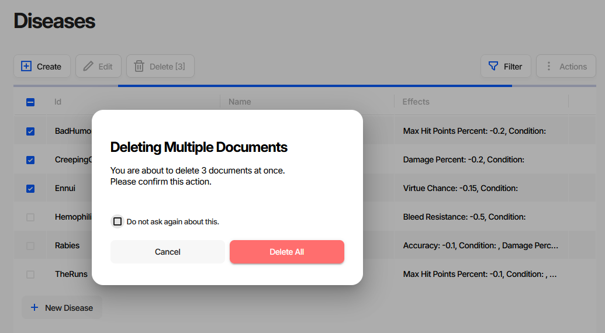
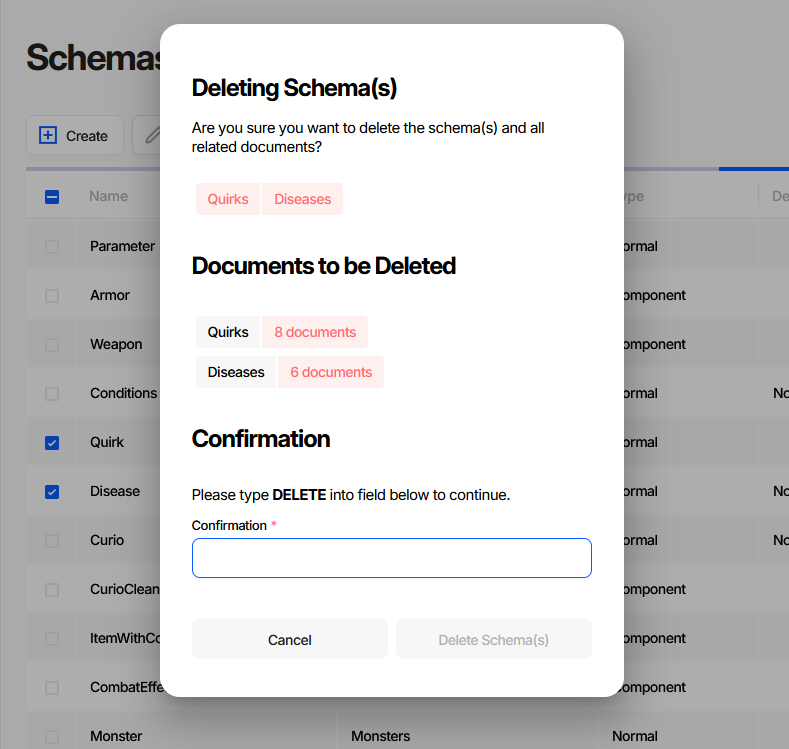

Filling Documents
=================

Schemas describe what a document looks like. The collection page is where documents are actually typed in -
a spreadsheet-like grid where rows are documents and columns are schema properties. Most day-to-day data
entry never leaves it; larger batches arrive through import instead.

.. contents:: On this page
   :local:
   :depth: 2

----

Where Documents Live
--------------------

Every schema appears in the left side menu, grouped the way its **Group** field says. Selecting one opens
its collection page.

The page has four parts:

- **The search field** at the top, scoped to the current collection - the chip in front of it (``Items /``)
  shows the scope. It does plain-text search and holds filters, see `Finding Documents`_.
- **The toolbar** with ``Create``, ``Edit``, and ``Delete``. ``Save`` and ``Discard`` join them as soon as
  something is changed. When the game data is read-only, ``Edit`` reads ``View`` and the editing buttons are
  hidden.
- **The grid**, one row per document. It is virtualized, so a collection of any size scrolls in a single page.
- **Filter** and **Actions** on the right.

.. note::
   In the web editor the avatars of teammates viewing the same collection appear next to the ``Filter``
   button, and the grid marks the fields they are editing.

----

The Actions Menu
----------------

Everything that is not a per-document edit lives in ``Actions``.

.. list-table::
   :header-rows: 1
   :widths: 25 75

   * - Entry
     - What it does
   * - ``Design``
     - Opens the schema of this collection in the schema editor. This is where columns come from - see
       `Changing What the Columns Are`_.
   * - ``Clone``
     - Copies the selected document and opens the copy for editing.
   * - ``Delete``
     - Same as the toolbar button, see `Deleting Documents`_.
   * - ``Refresh``
     - Fetches the latest version of the collection from the server.
   * - ``Export...``
     - Opens the export wizard with this collection preselected.
   * - ``Export To``
     - Exports the collection straight to a JSON, BSON, Message Pack, or spreadsheet file, skipping the
       wizard.
   * - ``Import...``
     - Opens the import wizard.
   * - ``Customize Columns...``
     - Picks which properties are shown as columns, see `Choosing Columns`_.

Extensions installed in the project add their own entries below the separator.

----

Creating Documents
------------------

``Create`` opens an empty :doc:`document form <document_form>` for the collection's schema. Fill in the fields, press ``Save``, and
the new document appears in the grid.

For entering many short documents in a row, stay in the grid instead. The ``+ New <Schema>`` button under the
last row adds a row in place:

The row appears immediately but is not written to the database until you save it, exactly like any other
grid edit.

----

Editing in the Grid
-------------------

Double-click a cell, or select it and press :kbd:`Enter`, to edit it in place. The editor that opens matches
the property's :doc:`data type <datatypes/list>` - a text box, a number field, a date picker, a reference
picker, and so on. Arrow keys and :kbd:`Tab` move between cells.

Edits stay local until they are saved. Changed cells and their rows are marked, and ``Save`` and ``Discard``
appear in the toolbar:

- ``Save`` writes the changes and makes them visible to everyone else. With rows selected it saves only
  those rows; with nothing selected it saves everything that changed.
- ``Discard`` reverts to the last saved state, following the same selection rule.
- When a changed document fails validation, ``Save`` becomes ``Save Anyway`` and carries a badge with the
  number of errors. Charon stores the document anyway.

.. note::
   **Broken data is allowed while you work on it.** A reference pointing at a document that does not exist
   yet, a required field still empty, a formula that does not parse - none of that stops a save, in the
   editor or in the CLI. Half-finished data is a normal state during development, and a tool that refuses
   it forces you to invent placeholder values just to close a form.

   The tolerance ends at publication. Generated code and the game-side loaders assume the data satisfies
   the schema, so anything the :doc:`Publication wizard <publication>` reports as a critical issue should be
   fixed before shipping, not after. See :doc:`Validation <../advanced/validation>` for the checks, the two
   severities, and how to gate a build on a clean review.

.. list-table::
   :header-rows: 1
   :widths: 45 55

   * - Action
     - Shortcut
   * - Create a document in the form
     - :kbd:`Ctrl/⌘+Alt+N`
   * - Add a row inline
     - :kbd:`Ctrl/⌘+Shift+N`
   * - Duplicate the selected document
     - :kbd:`Ctrl/⌘+Shift+D`
   * - Open the edit form
     - :kbd:`Ctrl` + click on the row
   * - Edit a cell in place
     - double click, or :kbd:`Enter`
   * - Save
     - :kbd:`Ctrl/⌘+S`
   * - Save ignoring validation errors
     - :kbd:`Shift` + click on ``Save``
   * - Undo / Redo
     - :kbd:`Ctrl/⌘+Z` / :kbd:`Ctrl/⌘+Y`

----

Finding Documents
-----------------

The search field above the grid does two things: plain-text search over the collection, and structured
filtering by property.

Filtering by Column
^^^^^^^^^^^^^^^^^^^

``Filter`` is a shortcut that writes the first half of a filter for you. Pick a property, then a comparison:

Choosing **Name** → **Contains Text** types ``/Name contains`` - with a trailing space - into the search
field and puts the cursor at the end of it. Type the value and press :kbd:`Enter`:

The finished filter becomes a chip in front of the search field and the grid narrows to the matching rows.
Repeat to add more filters - they all apply together. Removing a chip removes that filter.

Properties of an embedded document open a submenu, and the path written into the field points inside the
document: ``/Stats/Hp > 10``.

Writing Filters by Hand
^^^^^^^^^^^^^^^^^^^^^^^

The menu only saves typing. The same filter can be typed straight into the search field as
``[property] [operator] [value]`` followed by :kbd:`Enter`. Quote the value if it contains spaces - single
quotes, double quotes, and backticks all work:

.. code-block:: text

  /Name contains "Ancestor Relic"
  /StackSize >= 5
  /GoldValue != 0

.. list-table::
   :header-rows: 1
   :widths: 30 30 40

   * - Comparison
     - From the menu
     - Also accepted
   * - Equal
     - ``=``
     - ``==``, ``equal``
   * - Not Equal
     - ``!=``
     - ``<>``, ``notequal``
   * - Contains Text
     - ``contains``
     - ``like``
   * - Greater Than
     - ``>``
     - ``greaterthan``
   * - Greater Than Or Equal
     - ``>=``
     - ``greaterthanorequal``
   * - Less Than
     - ``<``
     - ``lessthan``
   * - Less Than Or Equal
     - ``<=``
     - ``lessthanorequal``
   * - One of a set
     - \-
     - ``in``

Whatever is left in the field that is not a complete filter is used as plain-text search.

Sorting and Column Width
^^^^^^^^^^^^^^^^^^^^^^^^

Click a column header to sort by that column, click again to reverse the direction. Column widths are
dragged from the right edge of the header.

----

Choosing Columns
----------------

``Actions`` → ``Customize Columns...`` decides which properties become columns and in which order.

Tick a property to show it, drag it by the handle to move it, then press ``Apply``. **Reset** returns the
grid to the schema's own order.

Three extra columns are offered besides the schema's properties: **Display Name** - the document's rendered
:doc:`display text <schemas/display_text_template>`, **Path**, and **Error Count**, the number of
:doc:`validation <../advanced/validation>` issues found in the document.

----

Changing What the Columns Are
-----------------------------

``Customize Columns...`` can only pick from properties the schema already has. To add a property, rename one,
or change its data type, use ``Actions`` → ``Design``: it opens the schema of the current collection in the
schema editor. Saving there updates the grid.

See :doc:`Creating Document Type (Schema) <creating_schema>` and :doc:`Schema <schemas/schema>` for the
fields of that form.

----

Deleting Documents
------------------

Tick the rows and press ``Delete`` - the button carries the number of selected documents. Deleting more than
one asks for confirmation first:

**Do not ask again about this** stores the answer in your personal preferences for the project, so later
multi-document deletions run without the dialog.

.. note::
   Deleting a document does not clean up references to it, and the deletion is not blocked by them. They
   stay behind as broken references, which :doc:`validation <../advanced/validation>` reports - the quickest
   way to find everything that pointed at the removed document. Like any other invalid data, they are
   tolerated while you work and should be resolved before publishing.

----

Deleting a Schema
-----------------

Deleting a schema is a different operation with a much wider blast radius, and it is done from the schema
list (**Metadata** in the side menu), not from a collection page.

The dialog lists everything the deletion takes with it:

- **the schemas themselves**, as chips at the top;
- **Properties to be Deleted** - properties of *other* schemas that point at the ones being deleted. A
  reference, a reference collection, an embedded document, or a document collection of a deleted schema
  cannot outlive it, so the property is removed from that schema and its values from every document of it;
- **Documents to be Deleted** - how many documents each deleted schema takes down.

.. warning::
   That cascade cannot be undone from the UI. The ``Delete Schema(s)`` button stays disabled until you type
   ``DELETE`` into the confirmation field.

.. tip::
   Take a :doc:`backup <../advanced/backup_restore>` before deleting a schema that other schemas reference.

----

Bringing Data In From Files
---------------------------

Typing is one way to fill a collection. The other two are the import wizard and a plain drag and drop:

- ``Actions`` → ``Import...`` opens the wizard, which chooses between adding, replacing, and updating
  documents.
- Dragging a file onto the grid starts the same import for the current collection.
- ``Actions`` → ``Export To`` → ``Spreadsheet (.xlsx)``, followed by a drop of the edited file back onto the
  grid, makes a round trip through Excel or Google Sheets - still the fastest way to do bulk numeric
  balancing.

:ref:`Structure requirements for imported files <CommandLine_Import_Structure>` and the full walkthrough of
both wizards are in :doc:`Importing and Exporting Data <../advanced/import_export>`.

----

Automating from the CLI
-----------------------

Every grid operation has a command line equivalent, which is what CI jobs and generator scripts use.

.. code-block:: bash

  # list documents of a collection
  dnx dotnet-charon -- DATA LIST \
    --dataBase "c:\my app\gamedata.json" \
    --schema Item

  # create one document from a file
  dnx dotnet-charon -- DATA CREATE \
    --dataBase "c:\my app\gamedata.json" \
    --schema Item \
    --input "c:\my app\item.json"

  # update one document
  dnx dotnet-charon -- DATA UPDATE \
    --dataBase "c:\my app\gamedata.json" \
    --schema Item \
    --input "c:\my app\item.json"

  # delete one document
  dnx dotnet-charon -- DATA DELETE \
    --dataBase "c:\my app\gamedata.json" \
    --schema Item \
    --id "AncestorsRelic"

For bulk changes use :doc:`DATA IMPORT <../advanced/commands/data_import>` instead of a loop over
``DATA CREATE``.

See also
--------

- :doc:`Basic Navigation and User Interface Overview <basics>`
- :doc:`Editing a Document <document_form>`
- :doc:`Creating Document Type (Schema) <creating_schema>`
- :doc:`Importing and Exporting Data <../advanced/import_export>`
- :doc:`Validation <../advanced/validation>`
- :doc:`Publishing Game Data <publication>`
- :doc:`Generating Source Code <generating_source_code>`
