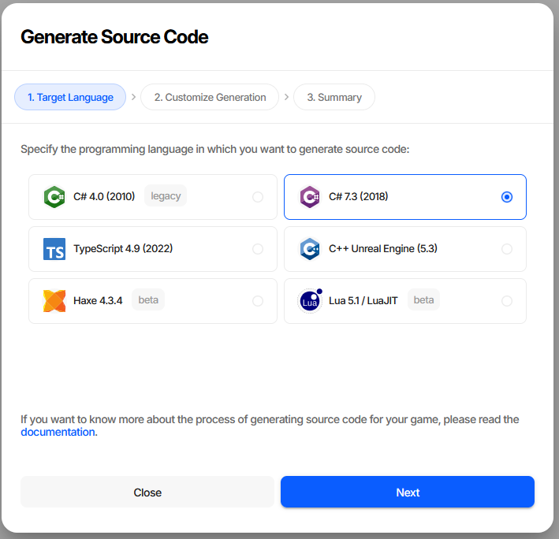
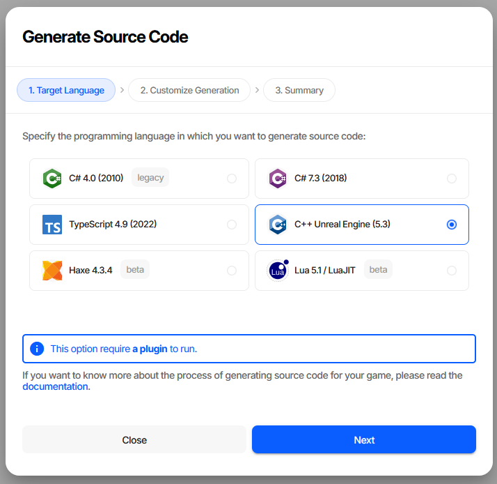
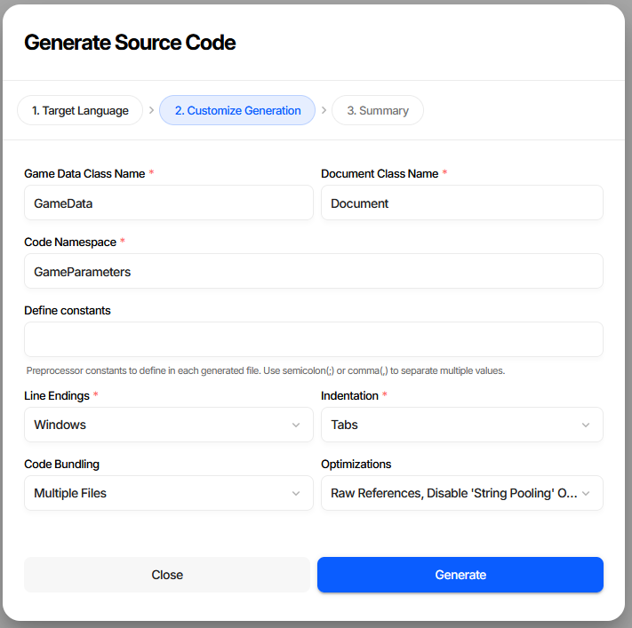
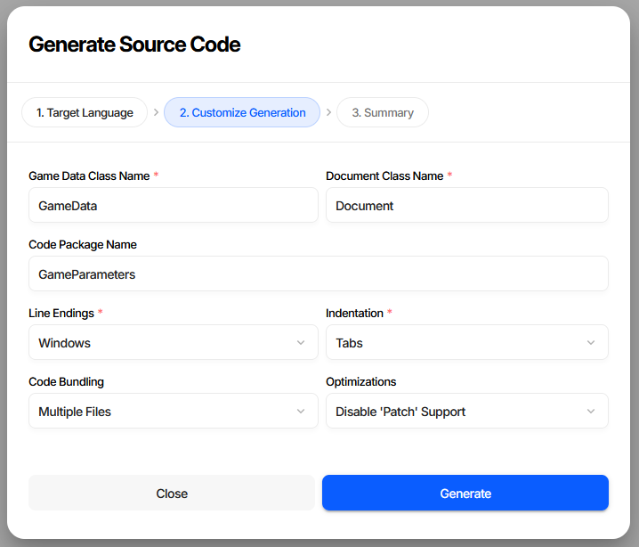
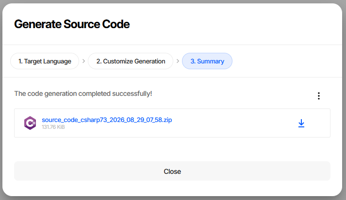
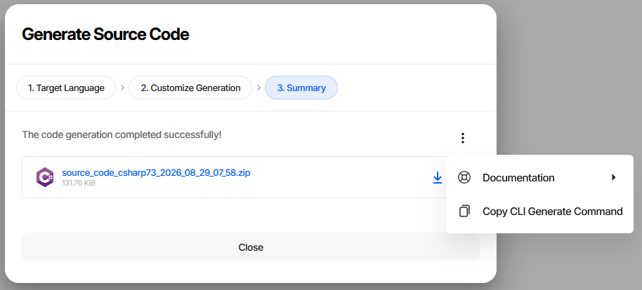

Generating Source Code
======================

Generated source code is how game data reaches the game. Charon reads the schemas and produces classes,
enums, and a loader for the target language, so the game accesses data through typed members instead of
parsing JSON by hand.

It runs in three places: the wizard in the editor, a button in the Unity and Unreal Engine plugins, and the
``GENERATE`` commands in the CLI. All three produce the same code from the same options.

.. contents:: On this page
   :local:
   :depth: 2

----

Language Support Tiers
----------------------

The source code generation system is organized into three support tiers:

- **Tier 3 (Basic):** Schema types/enums are generated, basic game data class, localization language
  selection, document references, and built-in JSON reader.
- **Tier 2 (Advanced):** Includes all Tier 3 features, plus: formulas parsed into AST (no interpreter),
  built-in Json/MessagePack reader, full game data class with helper functions/classes, and union types.
  Supported by **Haxe**.
- **Tier 1 (Complete):** Includes all Tier 2 features, plus: full formulas support (ASP interpreter),
  patching during load support, and language idiomatic features. Supported by **C# 4.0**, **C# 7.3**,
  **TypeScript**, and **UE C++**.

.. csv-table:: Features
   :file: source_code_features.csv
   :header-rows: 1

----

The Generation Wizard
---------------------

**Generate Source Code** on the dashboard opens the wizard. **Project Settings** → **Source Code** has the
same button.

Step 1. Target Language
^^^^^^^^^^^^^^^^^^^^^^^

Each entry names the language version the generated code targets. Markers say what to expect: *legacy* on
C# 4.0, which exists for old Unity versions, and *beta* on Haxe and Lua.

Two targets need something on the game side, and the wizard says so when they are selected:

- **C++ Unreal Engine** requires the Charon plugin - the generated code depends on its runtime module.
- **C# 4.0** requires the `C# Eval() <https://assetstore.unity.com/packages/tools/visual-scripting/c-eval-56706>`_
  library if the data uses :doc:`formulas <datatypes/all/formula>`.

Step 2. Customize Generation
^^^^^^^^^^^^^^^^^^^^^^^^^^^^

.. list-table::
   :header-rows: 1
   :widths: 25 75

   * - Field
     - Meaning
   * - **Game Data Class Name**
     - Name of the root class the game loads and then reads collections from. Must be a valid identifier.
   * - **Document Class Name**
     - Name of the base class every document type inherits from.
   * - **Code Namespace**
     - Namespace the generated types are placed in. Reads **Code Package Name** for Haxe, is required for
       the two C# targets, and is absent for TypeScript, UE C++, and Lua, which have no equivalent.
   * - **Define constants**
     - Preprocessor constants written into each generated file, separated by ``;`` or ``,``. Offered for the
       C# targets and UE C++.
   * - **Line Endings**
     - Windows or Unix. Worth matching to whatever the repository already stores, so regeneration does not
       produce a diff on every line.
   * - **Indentation**
     - Tabs, 2 spaces, or 4 spaces.
   * - **Code Bundling**
     - One file for everything, or a file per type. UE C++ is always multiple files.
   * - **Optimizations**
     - A multi-select, described below.

Which fields appear depends on the target. Haxe, for instance, has a package name instead of a namespace and
no preprocessor constants:

Optimizations
"""""""""""""

Two of these add work at load time and seven remove code from the output. Everything removed is code the game
would otherwise carry unused, so on a large project the difference in compile time and binary size is worth
having - but each one takes a feature away, and the loader will not warn you at runtime.

.. list-table::
   :header-rows: 1
   :widths: 34 66

   * - Option
     - Effect
   * - Eager Reference Resolution
     - Resolves and validates every reference while loading, instead of on first access. Costs load time,
       and turns a broken reference into a failure at startup rather than mid-game.
   * - Raw References
     - Drops the helper members that follow a reference to the referenced document, keeping the raw
       reference accessors only.
   * - Raw Localized Texts
     - Drops the helpers that return the text for the current language, keeping accessors that hand back
       the whole set of translations.
   * - Raw Composite Types
     - Drops the parsed accessors for text properties carrying a vector, rectangle or tags editor. The
       property keeps its original name and string type instead of moving to a ``<Name>Raw`` companion.
   * - Disable 'String Pooling' Optimization
     - Stops reusing identical short strings while loading. Slightly faster, more memory.
   * - Disable JSON Serialization
     - Omits the JSON reader. Only safe if the game ships Message Pack data.
   * - Disable MessagePack Serialization
     - Omits the Message Pack reader. Only safe if the game ships JSON.
   * - Disable 'Patch' Support
     - Omits the patch-application code, which is a large part of the output and is used for
       :doc:`modding <../advanced/modding>` and :doc:`patching <../advanced/patch_diff>`.
   * - Disable 'Document Id' Enums Generation
     - Omits the enums listing the ids of every document known at generation time. Cuts compile time
       noticeably on big projects, at the cost of losing the compile-time-checked id constants.

String pooling and the two serializer options are not available for Lua. Raw composite types is not
available for Unreal Engine C++, which always behaves as if it were on - a ``UPROPERTY`` cannot be
renamed, so those properties keep their name and get a separate ``GetParsed...`` accessor instead.

Step 3. Summary
^^^^^^^^^^^^^^^

The result is a zip named after the target and the moment it was generated. Download it and unpack it into
the game project.

The ``...`` menu carries **Copy CLI Generate Command**, which puts the equivalent command line on the
clipboard with every option filled in exactly as the wizard was configured. It is the fastest way to move a
configuration that works into a build script; **Documentation** links to the reference for the language just
generated.

----

From the Unity and Unreal Engine Plugins
----------------------------------------

Both plugins generate code with a single button, without the wizard.

- **Unreal Engine** generates immediately, using default settings. There are no customization options in the
  plugin at the moment. See :doc:`Creating Game Data <../unreal_engine/creating_game_data>`.
- **Unity** works the same way, except the options live in the Inspector of the game data asset - set them
  there, then press the button. See :doc:`Unity Overview <../unity/overview>`.

Either way, regenerate after changing the structure of the data - adding a property, renaming a schema - and
not after merely editing values.

----

From the CLI
------------

One ``GENERATE`` command per language, taking the same options as the wizard:

.. code-block:: bash

  dnx dotnet-charon -- GENERATE CSHARPCODE \
    --dataBase "c:\my app\gamedata.json" \
    --outputDirectory "c:\my app\scripts" \
    --namespace "MyGame.Parameters" \
    --gameDataClassName GameData \
    --splitFiles \
    --clearOutputDirectory

.. list-table::
   :header-rows: 1
   :widths: 45 55

   * - Wizard field
     - CLI parameter
   * - Game Data Class Name
     - ``--gameDataClassName``
   * - Document Class Name
     - ``--documentClassName``
   * - Code Namespace / Code Package Name
     - ``--namespace``
   * - Define constants
     - ``--defineConstants``
   * - Line Endings
     - ``--lineEndings``
   * - Indentation
     - ``--indentation``
   * - Code Bundling
     - ``--splitFiles``
   * - Optimizations
     - ``--optimizations``

The CLI has two parameters the wizard has no use for, because it writes into a directory rather than a zip:
``--outputDirectory`` for the destination, and ``--clearOutputDirectory`` to delete the previously generated
files first. The second one only removes files carrying the ``<auto-generated>`` marker, so hand-written
code in the same directory survives.

Regenerating from CI on every change to the data keeps the code and the data from drifting apart - see
:doc:`CI/CD <../advanced/cicd>`.

See also
--------

- :doc:`Publishing Game Data <publication>`
- :doc:`Working with Source Code (C# 4.0) <working_with_csharp_code_4_0>`
- :doc:`Working with Source Code (C# 7.3) <working_with_csharp_code_7_3>`
- :doc:`Working with Source Code (TypeScript) <working_with_type_script_code>`
- :doc:`Working with Source Code (UE C++) <working_with_uecpp_code>`
- :doc:`Working with Source Code (Haxe) <working_with_haxe_code>`
- :doc:`Working with Source Code (Lua) <working_with_lua_code>`
- :doc:`Command Line Interface (CLI) <../advanced/command_line>`
- :doc:`GENERATE CSHARPCODE Command <../advanced/commands/generate_csharp_code>`
- :doc:`GENERATE TYPESCRIPTCODE Command <../advanced/commands/generate_typescript_code>`
- :doc:`GENERATE UECPP Command <../advanced/commands/generate_uecpp_code>`
- :doc:`GENERATE HAXE Command <../advanced/commands/generate_haxe_code>`
- :doc:`GENERATE LUA Command <../advanced/commands/generate_lua_code>`
