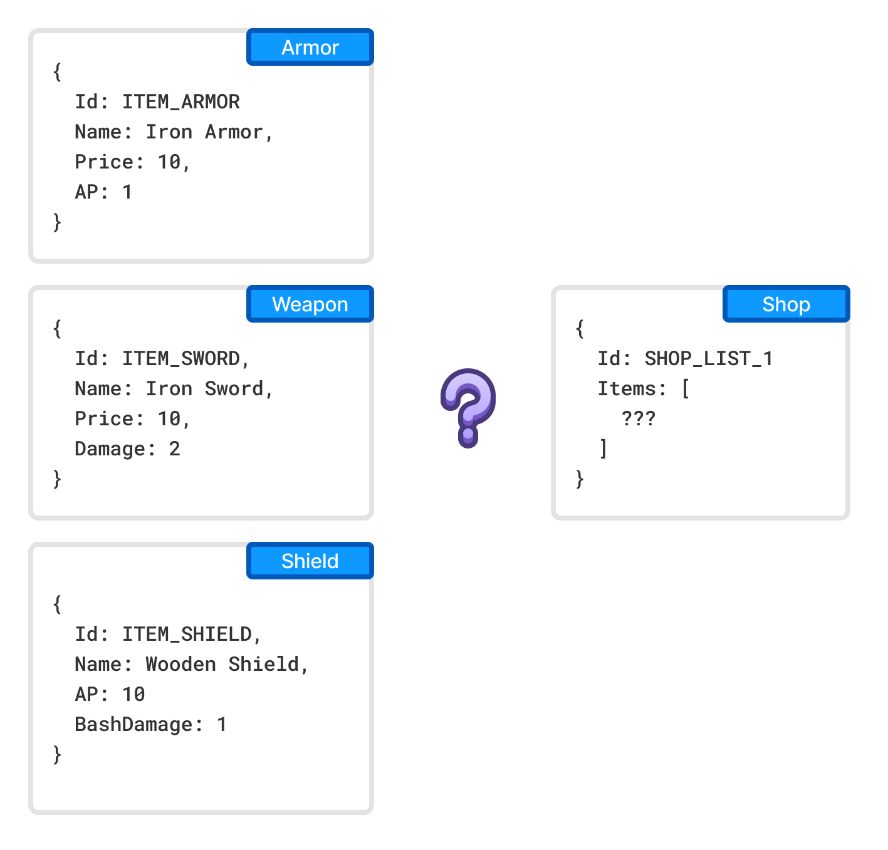

Implementing Inheritance
========================

Inheritance is a familiar tool for programmers when working with shared behavior or data. Unfortunately, it is not natively supported in Charon. However, you can achieve similar functionality using alternative approaches.

For example, imagine you have three different document types: `Armor`, `Weapons`, and `Shields`. You want to include all these items in a `Store` list of sellable goods. In traditional inheritance, you could create a base type to unify these documents and refer to it. Without inheritance, here are three possible approaches:

1. Composition
---------------

Extract the shared data from all sellable item types into a separate document type called `Item`. Each sellable document (e.g., `Armor`, `Weapons`, `Shields`) should include an embedded `Item` document containing store-relevant information. In the `Store` list of sellable goods, you can store references to `Item` documents.

.. figure:: ./inheritance_composition.png

2. Merging
----------

Alternatively, combine the three document types (`Armor`, `Weapons`, and `Shields`) into a single document type called `Item`. This document will contain fields for all three original types, along with an additional `Type` field to specify the item's category. The `Store` list can then store references to these unified `Item` documents.

3. Aggregation
--------------

As a less elegant alternative, introduce a `ShopItem` type with fields referencing all possible document types (`Armor`, `Weapons`, and `Shields`). In each `ShopItem` document, only one of these fields will be filled, depending on the item's type. The `Store` list can then reference `ShopItem` documents.

.. figure:: ./inheritance_aggregation.png

Conclusion
----------

Each of these methods has its trade-offs in terms of simplicity, flexibility, and performance. Choosing the right approach depends on your application's requirements and the expected complexity of your data model.

See also
--------

- :doc:`Creating Document Type (Schema) <creating_schema>`
- :doc:`Filling Documents <filling_documents>`
- :doc:`Publishing Game Data <publication>`
- :doc:`Generating Source Code <generating_source_code>`