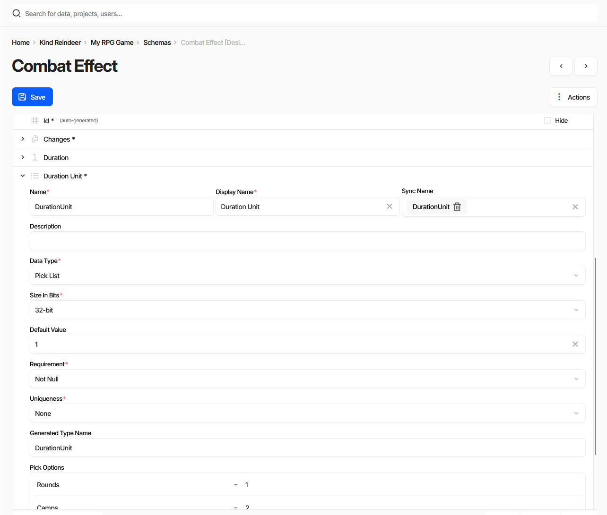
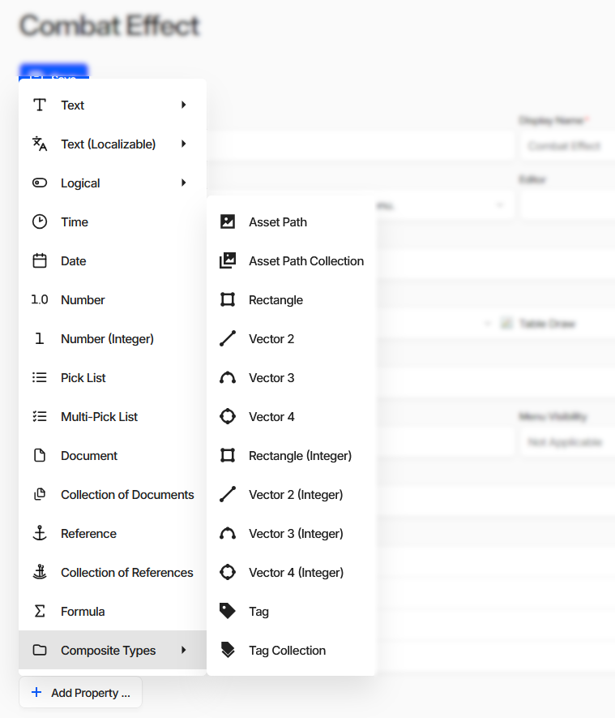

Schema Property
===============

Properties define which fields a document will contain.

Where Properties Are Edited
---------------------------

Properties live inside the :doc:`schema <../schemas/schema>` form, as a list under **Properties**. Expanding
a row opens the fields of that property.

The screenshot has ``Actions`` → ``Show advanced options`` turned on. Which fields are shown also depends on
the **Data Type** - *Pick Options* below only appears for pick lists, *Size In Bits* only for the types that
are stored as a number.

Adding a Property
-----------------

``Add Property ...`` asks for the data type first:

The menu is the list of :doc:`data types <../datatypes/list>`, plus a **Composite Types** submenu of
ready-made shapes - vectors, rectangles, asset paths, and tags. Those are not extra data types: each one
adds a property whose structure is already filled in for that shape.

Name
----

The **Name** of a property is used as an alternative identifier to the `Id` and is also used in generated source code as the name of the resulting field/property. Therefore, it must be a valid C-style identifier: it should start with a letter and include only Latin letters, digits, or underscores.

Property names are also used as the name of the fields when storing or exporting data. It is recommended to use PascalCase and singular form for property names.

Display Name
------------

The **Display Name** is used in the UI and can contain any characters. There are no restrictions on alphabet or character set.

Description
-----------

The **Description** helps other users understand the purpose of the property. It is shown in the UI and is also included as a documentation comment in the generated source code for the corresponding field/property.

Sync Name
---------

Some properties describe data types that are common across multiple schemas.  
For example, a ``PickList`` property might benefit from shared pick options used in several schemas.  
These synced properties are referred to as :doc:`Shared Properties <shared_property>`.

Data Type
---------

Each property has a data type, which determines what kind of data can be entered into the document's field, how it is stored on disk, and how it is represented at runtime.  
The editor UI will attempt to validate input based on the selected data type but does not strictly enforce it.  
At runtime, game data loading code will validate the data types and may fail if the document is malformed.

Requirement
-----------

Specifies whether a value must be provided for the field. Possible values include:

- **None** – No requirement to fill in the property. It can be absent from the document both on disk and at runtime. Typically represented as a nullable or optional type in supported source code languages.
- **Not Null** – A value must be provided. For the ``Text`` data type, an empty string is considered a valid value.
- **Not Empty** – The field must contain a non-empty value for ``Text`` or have at least one item for ``Collection`` data types.

Uniqueness
----------

Specifies uniqueness constraints for field values across documents. Useful to ensure certain values, such as names, are only used once.

- **Unique** – The value must be unique across all documents.
- **Unique In Collection** – The value must be unique within the scope of the current collection.

Default Value
-------------

Defines the default value to use for newly created documents or to populate existing documents when a new required property is added.  
The default must be a properly formatted value consistent with the specified data type.

Size In Bits
------------

The in-memory size of the value, for the data types stored as a number - integers and pick lists. It decides
the width of the type used in the generated source code, so narrowing it is a way to keep large collections
small.

Generated Type Name
-------------------

The name this property's type gets in the generated source code. Leave it empty and Charon picks the name
itself. It matters for the types that become a type of their own - the enum behind a pick list, for instance.

Pick Options
------------

The list of allowed values of a ``Pick List`` or ``Multi-Pick List``, each a name paired with the number it
is stored as. In generated code they become an enumeration or the nearest equivalent the target language
has, so the names must be valid identifiers.

Specification
-------------

Additional parameters that do not have a field of their own, written as a URL query string and read by the
editor UI and by the code generators. See :doc:`Specification <../schemas/specification>`.

Id Property
-----------

Each document includes a required :doc:`Id <id_property>` property, which has specific constraints and must be present and valid.

See also
--------

- :doc:`Schema <../schemas/schema>`
- :doc:`Id Property <id_property>`
- :doc:`Shared Property <shared_property>`
- :doc:`All Data Types <../datatypes/list>`
- :doc:`Creating Document Type (Schema) <../creating_schema>`
- :doc:`Editing a Document <../document_form>`