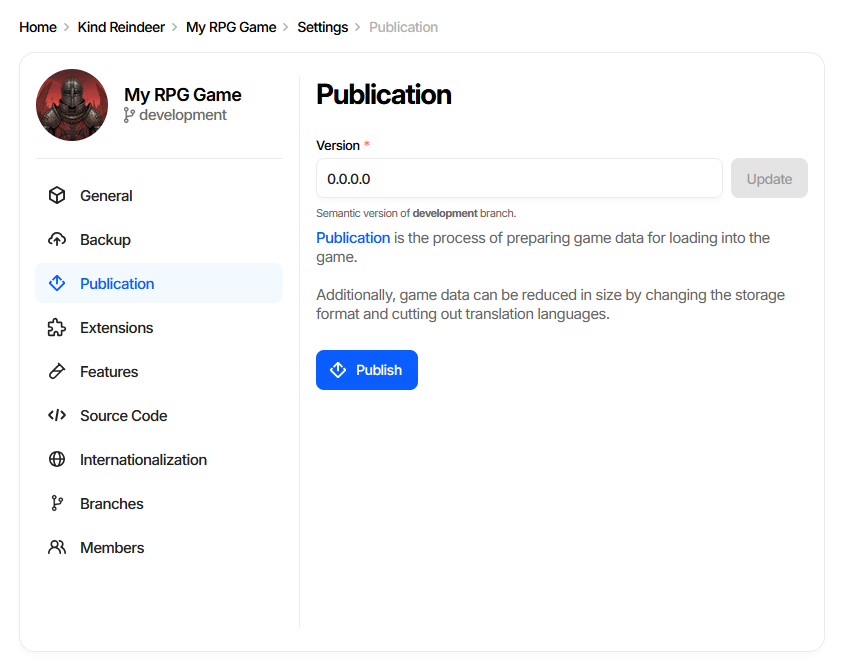
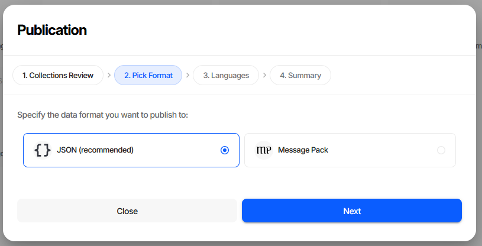
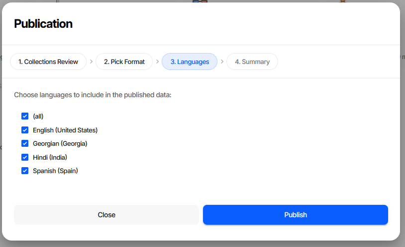
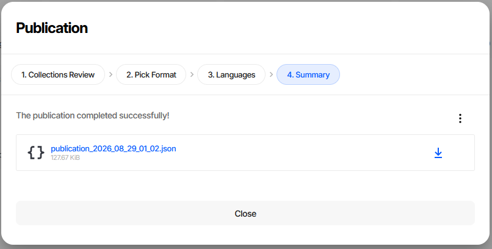
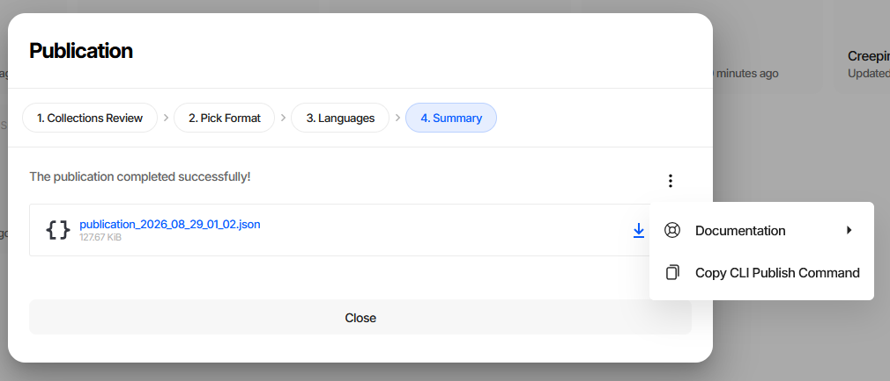
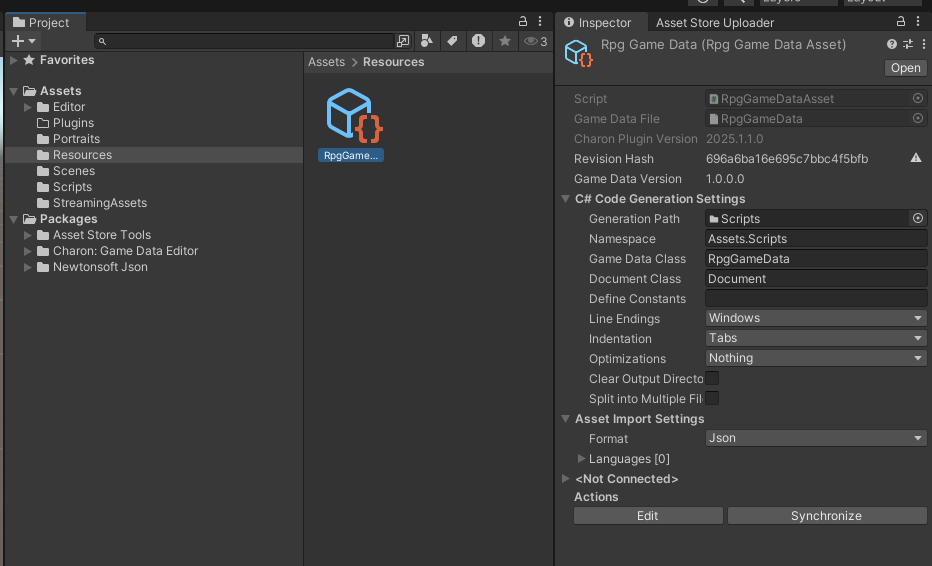
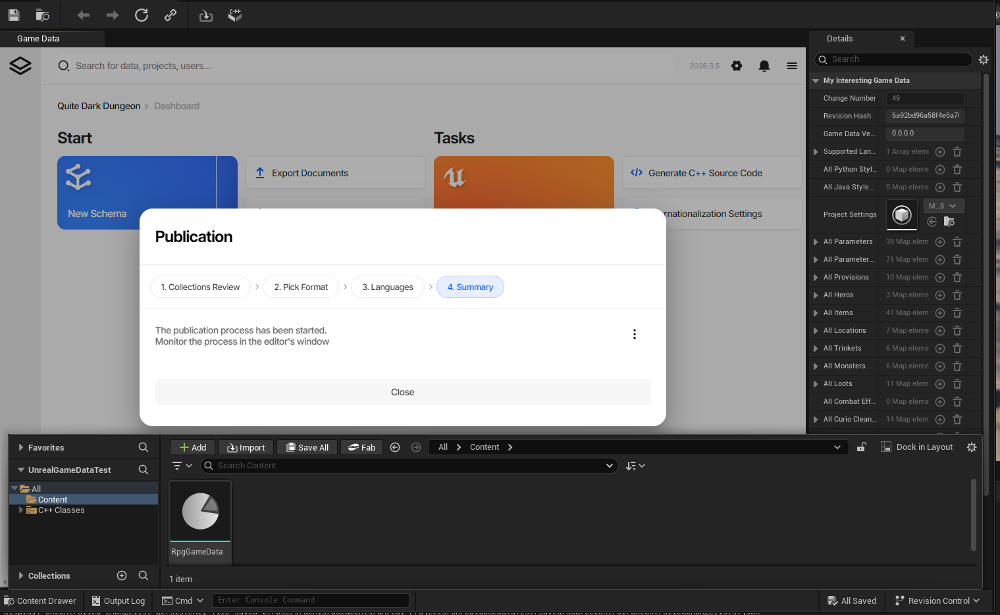

Publishing Game Data
====================

Publication turns your working game data into a game-ready file. Localization for the languages you did
not select is stripped out, and the result is written as ``JSON`` or ``MessagePack`` that the
:doc:`generated code <generating_source_code>` can load directly.

This is the last step of the content pipeline, and where it ends depends on where you run it from: in the
web editor you download a file, while the Unity and Unreal Engine plugins import the result into the engine
for you and regenerate the source code in the same pass.

.. contents:: On this page
   :local:
   :depth: 2

----

Data Version
------------

**Project Settings** → **Publication** carries a **Version** field - a semantic version for the game data
itself, separate from the Charon tool version and from your game's build number. It identifies the data
snapshot, which is what you quote when a designer asks which data a shipped build was made from.

The accepted shape is three dot-separated numbers, an optional fourth, and an optional ``-suffix``, up to
16 characters - ``1.4.0``, ``1.4.0.2`` and ``1.4.0-rc1`` are all valid. The hint under the field names the
branch being edited, because every branch carries its own version.

**Update** saves the change and stays disabled until the field is edited. Editing requires the **Designer**
role or higher.

The version lives on the project settings document, so it travels with the data - into backups, ordinary
exports, and the published file alike.

At runtime the generated game data class exposes it as ``GameDataVersion``, next to ``RevisionHash``
and ``ChangeNumber``. It is read straight out of the project settings document while the file is
deserialized, so the game can log or display which data snapshot it loaded:

.. code-block:: csharp

   Debug.Log($"Game data version: {gameData.GameDataVersion}");

In Unreal Engine the same value is a ``BlueprintReadOnly`` property on the game data object, so it can
be read from Blueprints without any C++ code. ``GameDataVersion`` is generated for **C# 7.3** and
**UE C++** only - the C# 4.0, TypeScript, Haxe and Lua targets do not expose it.

**CLI equivalent**

.. code-block:: bash

   dnx dotnet-charon -- DATA UPDATEPROJECTSETTINGS \
     --dataBase "https://charon.live/view/data/MyGame/develop/" \
     --property Version \
     --value "1.4.0" \
     --credentials "$CHARON_API_KEY"

Stamping the version from CI just before the publish step keeps every shipped file traceable to the build
that produced it; see :doc:`CI/CD <../advanced/cicd>` for a worked example and
:doc:`DATA UPDATEPROJECTSETTINGS <../advanced/commands/data_update_project_settings>` for the full
parameter list.

----

Publishing from the Editor
--------------------------

**Publish** on the dashboard opens the Publication wizard.

.. figure:: ../advanced/validation_publish_window.png

Step 1. Collections Review
^^^^^^^^^^^^^^^^^^^^^^^^^^

A validation pass over every collection, so you find out about broken data before it reaches the game rather
than after.

.. figure:: ../advanced/validation_publish_issues_window.png

``N issues`` counts integrity errors, ``N missed translations`` counts untranslated text. Clicking a
collection opens it filtered to just the documents with errors.

Publication is never blocked - **Next** stays enabled whatever the review finds - but the two severities
deserve different treatment. Missing translations ship as visible gaps in the affected languages. Integrity
errors are broken data: generated code assumes the data satisfies the schema, so a dangling reference or a
missing required value usually surfaces at runtime as a null reference or a failed load. Fix those before
publishing.

See :doc:`Validation <../advanced/validation>` for the full description of this step and how to reproduce it
in CI.

Step 2. Pick Format
^^^^^^^^^^^^^^^^^^^

+------------------+----------------------------------------------------------------------+
| Format           | When to use                                                          |
+==================+======================================================================+
| JSON             | Default. Readable, diffable, debuggable - keep it unless load time   |
| *(recommended)*  | or file size is a measured problem.                                  |
+------------------+----------------------------------------------------------------------+
| Message Pack     | Compact binary. Smaller files and faster parsing, at the cost of not |
|                  | being human-readable.                                                |
+------------------+----------------------------------------------------------------------+

Both formats carry the same data and are loaded by the same generated code, so switching later costs
nothing but a re-publish.

Step 3. Languages
^^^^^^^^^^^^^^^^^

Tick **(all)** to publish every language, or select individual ones. Languages left unticked are stripped
from the output entirely - this is how you keep a Japanese-only build from shipping the German strings.

At least one language is required. **Publish** on this step starts the process.

Step 4. Summary
^^^^^^^^^^^^^^^

The published file is offered as a download, named after the date and time of publication and annotated
with its size.

The **⋮** menu has **Copy CLI Publish Command**, which puts the exact CLI equivalent of the choices you just
made on the clipboard. It is the quickest way to move a publication you configured by hand into a build
script.

----

Publishing from a Game Engine Plugin
------------------------------------

The Unity and Unreal Engine plugins embed the same editor and the same wizard. The difference is the last
step: instead of handing you a file to download, the plugin imports the published data into the engine's
own asset format and regenerates the source code. Step 4 says *"The publication process has been started.
Monitor the process in the editor's window"* rather than showing a download link.

Unity
^^^^^

The published data is imported into the game data ``.asset`` file as a BLOB in the format chosen during
publication - JSON or Message Pack - and the C# source code is regenerated. At runtime the generated code
reads the game data out of that BLOB, so the ``.asset`` is the only thing your build needs to ship.

The Inspector for the asset holds the settings the process uses:

- **Asset Import Settings** - ``Format`` and ``Languages``, the same two choices as wizard steps 2 and 3.
- **C# Code Generation Settings** - output path, namespace, class names, indentation and the rest of the
  code generation options.
- **Actions** - **Edit** opens the editor UI, **Synchronize** re-runs publication and code generation with
  the settings above.

Use **Synchronize** whenever the data structure changes: it republishes the data and regenerates the C#
code in one step, which is what keeps the asset and the code in agreement.

See :doc:`Unity Plugin Overview <../unity/overview>` for installation and the rest of the plugin.

Unreal Engine
^^^^^^^^^^^^^

The published data is imported into the game data ``.uasset`` and stored in Unreal's own binary format -
the screenshot shows it in the **Details** panel as ordinary Unreal properties - and the C++ source code is
regenerated. Nothing about the intermediate JSON survives into the packaged game.

Because the data is converted into Unreal's representation on import, the format step of the wizard has
nothing to decide and is disabled; the language selection still applies.

See :doc:`Unreal Engine Plugin Overview <../unreal_engine/overview>` for installation and the rest of the
plugin.

Where the data ends up
^^^^^^^^^^^^^^^^^^^^^^

+-----------------+--------------------------+---------------------------+---------------------------+
| Target          | Output                   | Stored as                 | Format choice             |
+=================+==========================+===========================+===========================+
| Web editor      | downloaded file          | JSON or MessagePack file  | yours                     |
+-----------------+--------------------------+---------------------------+---------------------------+
| Unity           | game data ``.asset``     | BLOB in the chosen format | yours                     |
+-----------------+--------------------------+---------------------------+---------------------------+
| Unreal Engine   | game data ``.uasset``    | Unreal's binary format    | fixed                     |
+-----------------+--------------------------+---------------------------+---------------------------+

In every case the source code is generated from the same schema, so game code written against it does not
change when you switch targets.

----

Publishing from the CLI
-----------------------

Publication is ``DATA EXPORT`` with ``--mode publication``:

.. code-block:: bash

   dnx dotnet-charon -- DATA EXPORT \
     --dataBase ".\gamedata.json" \
     --mode publication \
     --languages {en-US} \
     --output ".\StreamingAssets\gamedata_pub.json" \
     --outputFormat json

Key parameters:

- ``--mode publication`` - keeps the system schemas and the project settings document that the
  generated code needs, and strips localization for the languages you did not select. Without it the
  export omits the system schemas and the generated code cannot load it.
- ``--languages`` - the languages to include, in braces. Omit the parameter to publish all languages.
- ``--outputFormat`` - ``json`` or ``msgpack``, matching the wizard's format step.

.. tip::
   Rather than assembling this by hand, configure the publication once in the wizard and use
   **Copy CLI Publish Command** on the Summary step.

Publishing on every commit is the usual way to keep a build pipeline in sync with the data; see
:doc:`CI/CD <../advanced/cicd>` for a worked example, and :doc:`DATA EXPORT <../advanced/commands/data_export>`
for the other export modes.

See also
--------

- :doc:`Validation <../advanced/validation>`
- :doc:`Generating Source Code <generating_source_code>`
- :doc:`Working with Source Code (C# 4.0) <working_with_csharp_code_4_0>`
- :doc:`Working with Source Code (C# 7.3) <working_with_csharp_code_7_3>`
- :doc:`Working with Source Code (TypeScript) <working_with_type_script_code>`
- :doc:`Unity Plugin Overview <../unity/overview>`
- :doc:`Unreal Engine Plugin Overview <../unreal_engine/overview>`
- :doc:`Command Line Interface (CLI) <../advanced/command_line>`
- :doc:`DATA EXPORT Command <../advanced/commands/data_export>`
- :doc:`DATA UPDATEPROJECTSETTINGS Command <../advanced/commands/data_update_project_settings>`
