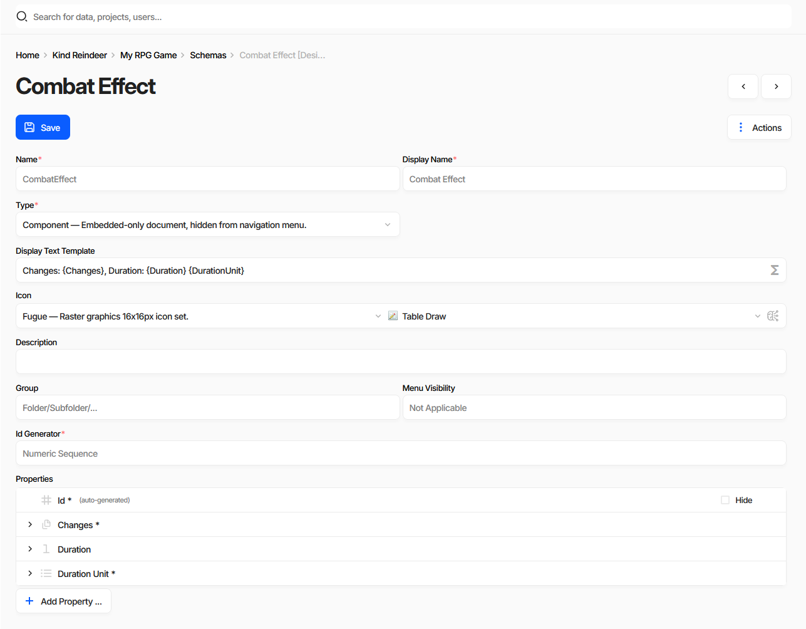

Schema
======

A **Schema** defines the structure of a specific type of game data entity. It acts as a blueprint that outlines the fields (properties) associated with the entity, much like columns in a database table or cells in a spreadsheet. Schemas are central to organizing and modeling structured game data.

Where Schemas Are Edited
------------------------

A schema is a document like any other, edited in the same :doc:`document form <../document_form>` as game
data. Open it with ``Actions`` → ``Design`` from a collection page, or from **Metadata** in the side menu;
the breadcrumb marks the form as ``[Design]``.

The screenshot has ``Actions`` → ``Show advanced options`` turned on, which reveals the rarely used fields.
Without it the form is shorter.

Schema documents also have a ``Layout`` view mode, which arranges these properties on the document form that
editors will use. See :doc:`Editing a Document <../document_form>`.

Name
----

The **Name** of a schema is used as an alternative identifier to the `Id` and is also used in generated source code as the name of the resulting class. Therefore, it must be a valid C-style identifier: it should start with a letter and include only Latin letters, digits, or underscores.

Schema names are also used as the name of the collection when storing or exporting data. It is recommended to use PascalCase and singular form for schema names.

Display Name
------------

The **Display Name** is used in the UI and can contain any characters. There are no restrictions on alphabet or character set.

Type
----

The **Type** setting defines how instances (documents) of this schema are created and managed:

- **Normal**: Standard behavior. Documents can be created in the root collection, embedded in other documents, or may be absent entirely.
- **Component**: These documents can only be embedded within other documents. They do not appear in the main navigation menu.
- **Settings**: A singleton-style schema. Only one root-level document can exist, and it cannot be embedded in other documents.

Display Text Template
---------------------

The :doc:`Display Text Template <display_text_template>` defines how documents of this schema are presented in the UI when a textual representation is needed-e.g., in dropdowns, reference lists, or relationship views.

Icon
----

The **Icon** is displayed next to the schema name in the navigation menu or selection dialogs within the UI.

Description
-----------

The **Description** helps other users understand the purpose of the schema. It is shown in the UI and is also included as a documentation comment in the generated source code for the corresponding class.

Group
-----

The **Group** defines the hierarchical path of the schema in the left-hand navigation menu. It behaves similarly to a folder path, with sections separated by the `/` character.

Menu Visibility
---------------

This flag determines whether the schema appears in the left-hand navigation menu in the UI.

Id Generator
------------

The **Id Generator** setting defines how the :doc:`Id Property <../properties/id_property>` is managed for this schema. If set to `None`, the Id property must be configured manually.

Properties
----------

A list of :doc:`Properties <../properties/property>` that define the fields associated with this schema.
Each row expands into the property's own fields, ``Add Property ...`` appends a new one, and the bin icon
removes it.

An Id property managed by the schema's **Id Generator** is marked *(auto-generated)* and offers a **Hide**
checkbox, which keeps the field out of the document form for editors who never need to see it. The checkbox
writes ``Display=Hidden`` into the property's :doc:`Specification <specification>`.

See also
--------

- :doc:`Display Text Template <display_text_template>`
- :doc:`Property <../properties/property>`
- :doc:`Id Property <../properties/id_property>`
- :doc:`Shared Property <../properties/shared_property>`
- :doc:`Specification <specification>`
- :doc:`All Data Types <../datatypes/list>`
- :doc:`Creating Document Type (Schema) <../creating_schema>`
- :doc:`Editing a Document <../document_form>`