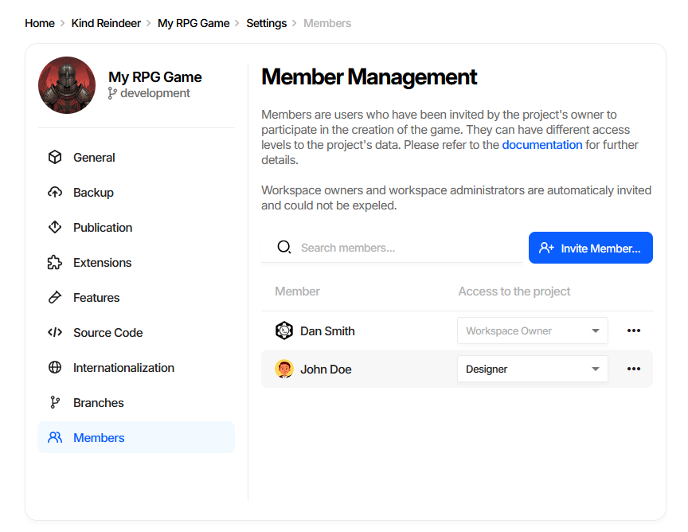
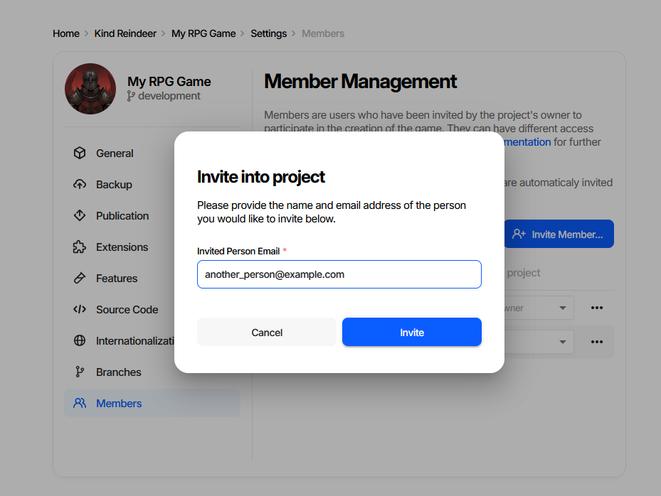

Roles and Permissions
=====================

Access to a project in the web editor is granted per member, as one of four roles. The roles are cumulative:
each one can do everything the roles above it can, plus more. Two further roles come from the workspace and
are not assigned per project.

.. contents:: On this page
   :local:
   :depth: 2

----

Where Roles Are Assigned
------------------------

Open **Project Settings** → **Members**.

The **Access to the project** column is a drop-down per member - changing it takes effect immediately. The
``...`` menu at the end of the row expels the member from the project.

Only an **Administrator** can change roles or invite people. Workspace owners and workspace administrators
are members of every project in the workspace automatically, and cannot be expelled or demoted from here.

----

What Each Role Can Do
---------------------

.. list-table::
   :header-rows: 1
   :widths: 40 12 12 12 12

   * - Capability
     - Viewer
     - Editor
     - Designer
     - Admin
   * - View documents
     - yes
     - yes
     - yes
     - yes
   * - Export data
     - yes
     - yes
     - yes
     - yes
   * - View project settings
     - yes
     - yes
     - yes
     - yes
   * - Edit documents
     - \-
     - yes
     - yes
     - yes
   * - Import data
     - \-
     - yes
     - yes
     - yes
   * - Change document structure (schemas and properties)
     - \-
     - \-
     - yes
     - yes
   * - Change project settings, including the game data version
     - \-
     - \-
     - \-
     - yes
   * - Create and restore backups
     - \-
     - \-
     - \-
     - yes
   * - Invite members and change their roles
     - \-
     - \-
     - \-
     - yes

Delete or transfer a project is a workspace-level action, available to the **Workspace Owner** and to
**Workspace Administrators** only. Within a project they have everything an Administrator has.

.. note::
   The four project roles map onto the permission levels the API and the CLI use - ``view``, ``edit``,
   ``design``, and ``administer``. A feature that requires ``design`` is available to Designers and
   Administrators, and so on.

----

Inviting a Member
-----------------

**Invite Member...** on the Members page asks for an email address.

The invited person appears in the list right away with the invitation state next to them - *sent*,
*email sent*, or *declined* - and picks up their role as soon as they accept. New members start as Viewers
unless you change the drop-down.

The number of members a project can have depends on the subscription plan; the page warns when the limit is
reached.

----

Which Role to Give
------------------

- **Viewer** - people who need to read the data but not change it: QA, external partners, anyone consuming
  an export.
- **Editor** - the default for content work. Fills documents, imports spreadsheets, cannot change the shape
  of the data.
- **Designer** - the people who model the data. Adding a property or a schema affects everyone's generated
  code, which is why it is a separate role rather than part of editing.
- **Administrator** - a small number of people. Backups, restores, project settings, and the member list.

----

See also
--------

- :doc:`Workspaces, Projects, and Branches <workspaces_and_projects>`
- :doc:`Overview <overview>`
- :doc:`Backup and Restore <../advanced/backup_restore>`
- :doc:`Publishing Game Data <../gamedata/publication>`
- `Web-based Application <https://gamedevware.com?ref=documentation>`_
